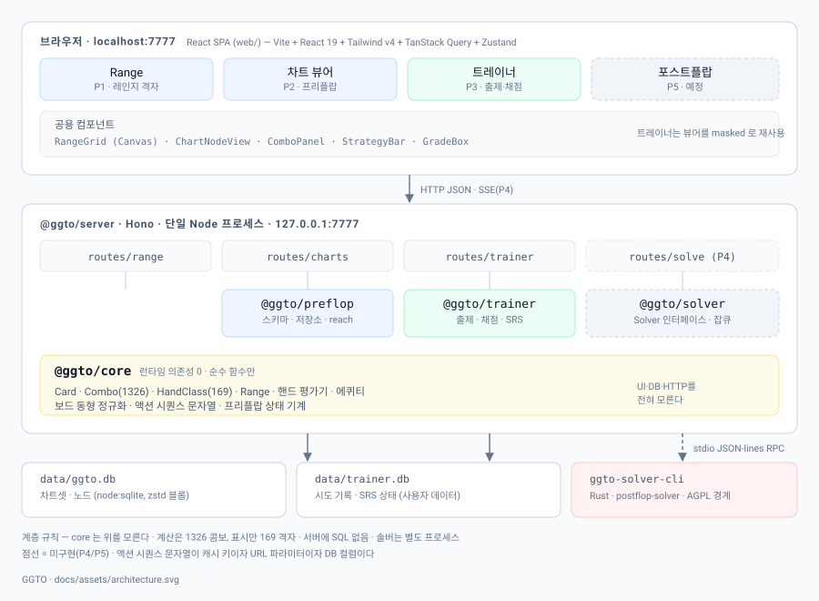
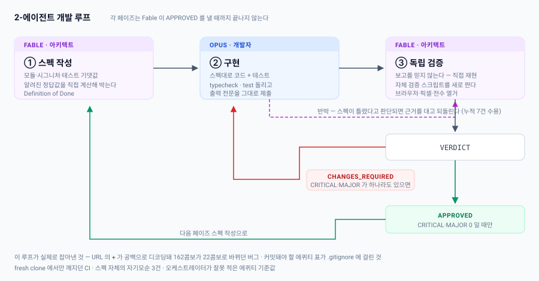

# GGTO

**goldggongchi + GTO.** 개인용 텍사스 홀덤 GTO 학습 도구 — 프리플랍 차트 조회, 포스트플랍 솔루션 탐색, 그리고 트레이너를 내 PC에서 로컬 웹앱으로.

> 상용 서비스의 솔루션을 가져다 쓰지 않는다. 시드 차트는 이 저장소의 생성기가 CFR+ 로 직접 푼 것이고, exploitability 를 계산해 게이트로 건다. 출처를 `source` 에 기록할 수 없는 데이터는 넣지 않는다.

---

## 지금 상태

| 페이즈 | 내용 | 상태 |
|---|---|---|
| **P0** | `@ggto/core` — 카드/콤보(1326)/레인지/파서/핸드 평가기/에퀴티/보드 동형/액션 시퀀스/프리플랍 상태 기계 | ✅ 승인 |
| **P1** | Hono 서버 + `RangeGrid` (Canvas 169 격자) | ✅ 승인 |
| **P2** | 프리플랍 차트 — SQLite 스키마, `ggto-json` v1, 임포터 CLI, 시드 생성기, 차트 뷰어 | ✅ 승인 |
| **P3** | 트레이너 — 스팟 출제, EV loss 채점, SRS, 세션 리포트 | ✅ 승인 |
| **P3M** | 모바일 UX — 반응형 격자, 터치 타겟 44px, 하단 액션 바, LAN 접속 | 🔍 검증 중 |
| **P4** | 포스트플랍 솔버 — Rust `postflop-solver` 데몬 + 잡 큐 + 캐시 | ⏳ 스파이크 완료 |
| **P5** | 포스트플랍 탐색 UI — 액션 트리, 런아웃 히트맵 | ⏳ |
| **P6** | 트레이너 v2 — 포스트플랍 스팟, 리크 분석 | ⏳ |

`npm test` 전부 통과 · 타입체크 strict · 런타임 의존성은 core 에 0개.
(테스트 개수는 여기 적지 않는다 — 페이즈마다 낡는다. `npm test` 의 마지막 줄이 현재 수치다.)

---

## 빠른 시작

```bash
npm install        # prepare 훅이 core/protocol 을 먼저 빌드한다 (Node 24 필요)
npm run seed       # 2-max 푸시/폴드 45 차트 생성 → data/ggto.db 임포트 (최초 1회, 1분 안)
# npm run gen:charts  # 전체 사다리 2~9-max x 앤티 3종 x 스택 15단 = 360 차트 (수 시간, --resume)
npm run build
npm start          # http://localhost:7777
```

`data/` 는 gitignore 대상이라 클론 직후에는 비어 있다. `npm run seed` 가 CFR+ 로 차트를 다시 풀어서 채운다 — 결정적이라 어느 머신에서 돌려도 `content_hash` 가 같다.

```bash
npm run ci            # typecheck → test → build → bench → smoke  (Rust 없이도 exit 0)
npm run bench:strict  # 성능 예산 강제 (유휴 머신에서만 의미 있음)
npm run check:mobile  # 375x812 실제 레이아웃 검사 + 스크린샷 (Chrome 필요, ci 밖)
npm run check:desktop # 1280x720 / 1500x1000 회귀 게이트
```

### 포스트플랍 솔버 (P4, 선택)

솔버는 **옵션**이다. Rust 툴체인이 없으면 `/api/solve*` 만 503 이고 뷰어·트레이너는 그대로 돈다 (D24).

```bash
# 1) rustup GNU 호스트 (MSVC 불필요 — rust-mingw 가 링커를 번들한다)
curl -sSL -o rustup-init.exe https://static.rust-lang.org/rustup/dist/x86_64-pc-windows-gnu/rustup-init.exe
./rustup-init.exe -y --default-host x86_64-pc-windows-gnu --profile minimal --default-toolchain 1.98.1

npm run build:solver  # windows-sys 게이트 → cargo build --locked --release
npm run ci:solver     # build:solver → cargo test + 통합 테스트 → 데몬 벤치
```

`cargo` 가 PATH 에 없으면 `~/.cargo/bin` 을 자동으로 본다 (`GGTO_CARGO` 로 지정도 가능).

```bash
npm run solve -- --board Ks7h2h --oop "22+,A2s+,K9s+,QTs+,ATo+,KJo+"                  --ip "TT-22,AJs-A2s,KTs+,QJs,AQo-ATo" --pot 20 --stack 80                  --sizings simple --target 0.5 --yes --line ""
```

같은 명령을 다시 치면 연산 없이 `cached` 다. 보드를 `Kd7s2s` 로 바꿔도 **같은 해시**로 히트한다
(슈트 동형 정규화, D5·D6). `--line` 의 문법은 core 액션 문자열이다 (`B6.6-C/Qc`, D3).

| 환경변수 | 기본 | 뜻 |
|---|---|---|
| `GGTO_SOLVER_BIN` | `solver/ggto-solver-cli/target/release/ggto-solver-cli(.exe)` | 솔버 바이너리 |
| `GGTO_SOLVE_MEMORY_BYTES` | 8GB | 동시 실행 잡의 **예상 메모리 합** 상한 |
| `GGTO_SOLVE_CACHE_BYTES` | 20GB | `data/solves/` 총량 (넘으면 LRU 축출) |
| `GGTO_SOLVER_LOADED_BYTES` | 2GB | 조회 데몬이 메모리에 올려 두는 결과의 합 |

### 휴대폰에서 쓰기

앱은 **모바일 우선**이다 (375px 한 열 스택, 답 버튼은 엄지가 닿는 하단 고정 바). 휴대폰에서 PC 의 서버에 붙으려면:

```bash
npm run build && npm run start:lan
```

`start:lan` 은 **이 PC 의 사설 LAN 주소 하나에만** 바인드한다 (`0.0.0.0` 이 아니다). 사설 = RFC1918 `10/8` · `172.16/12` · `192.168/16`, IPv6 ULA `fc00::/7`, 그리고 Tailscale 류 오버레이 `100.64/10`. 기동하면 `[ggto] 휴대폰에서: http://192.168.x.x:7777` 이 찍힌다 — 그 주소를 휴대폰 브라우저에 치면 된다.

> ⚠️ **이 서버에는 인증이 없다.** LAN 에 열면 그 네트워크의 **모든 기기**가 트레이너 기록을 읽고 쓸 수 있다. 신뢰하는 홈 네트워크에서만 쓰라. 기본 `npm start` 는 `127.0.0.1` 에만 바인드한다 (D19).

**"같은 Wi‑Fi" 라고 다 사설 대역인 것은 아니다.** 이 레포를 만든 PC 는 유일한 IPv4 가 공인 `61.82.129.232/26` 이었다 — NAT 공유기 뒤가 아니라 인터넷에 직접 붙어 있었고, 거기서 `0.0.0.0` 바인드는 LAN 개방이 아니라 **인터넷 개방**이었다. 그래서 대역 판정은 코드가 한다:

- 사설 주소가 하나도 없으면 `start:lan` 은 **기동을 거부**하고 발견된 주소·대역을 찍는다.
- `GGTO_HOST` 에 공인 IP 나 `0.0.0.0`(공인 IP 가 붙어 있을 때) 을 줘도 서버가 **거부**한다.
- 그래도 열려면 `GGTO_ALLOW_PUBLIC=1` 을 따로 줘야 하고, 그때는 노출 주소를 경고로 찍는다. **권장하지 않는다.**

먼저 확인할 것 (Windows PowerShell):

```powershell
Get-NetIPAddress -AddressFamily IPv4 | Select-Object IPAddress, InterfaceAlias
Get-NetConnectionProfile | Select-Object InterfaceAlias, NetworkCategory
```

주소가 `192.168.*` / `10.*` / `172.16~31.*` 이고 `NetworkCategory` 가 **Private** 이면 `start:lan` 을 써도 된다. 공인 주소뿐이거나 카테고리가 **Public** 이면 쓰지 마라 — 방화벽에서 Public 프로필을 허용하는 순간 인터넷에 열린다. 그런 회선에서 휴대폰을 붙이려면 NAT 공유기를 두거나 Tailscale 류 오버레이(`100.64/10`) 를 쓰라.

### 환경변수

| 변수 | 기본값 | 뜻 |
|---|---|---|
| `PORT` | `7777` | 서버 포트 |
| `GGTO_HOST` | `127.0.0.1` | 바인드 주소. 공인 IP(또는 공인 IP 가 있는 PC 의 `0.0.0.0`) 는 거부한다 (D19) |
| `GGTO_ALLOW_PUBLIC` | (없음) | `1` 이면 공인 IP 바인드 거부를 푼다. **인증 없는 서버가 인터넷에 열린다** |
| `GGTO_DATA_DIR` | `<repo>/data` | `ggto.db`·`trainer.db`·`charts/` 가 있는 곳 |
| `WEB_DIST` | `<repo>/web/dist` | 서빙할 프론트 빌드 |
| `GGTO_CHROME` | Windows 표준 경로 탐색 | `check:mobile`/`check:desktop` 이 띄울 Chrome |

---

## 아키텍처



### 어기면 안 되는 규칙

- **계산은 1326 콤보, 표시만 169 격자.** 169 인덱스를 받아 *계산*하는 함수는 어디에도 없다. 이걸 섞으면 블로커 효과를 표현할 수 없다.
- **`@ggto/core` 는 UI·DB·HTTP·파일을 모른다.** 런타임 의존성 0.
- **액션 시퀀스 문자열이 캐시 키이자 URL 파라미터이자 DB 컬럼이다.** 파서/포매터는 core 에 하나뿐.
- **솔버는 별도 프로세스.** `postflop-solver` 가 AGPL-3.0 이라 프로세스 경계가 곧 라이선스 경계다.
- 서버에 SQL 없음. 웹은 `core`/`protocol` 만 import.

전체 목록과 각 결정의 근거는 [`docs/DECISIONS.md`](docs/DECISIONS.md).

---

## 어떻게 만들어지고 있나

두 개의 에이전트가 역할을 나눠 돌린다. 스펙을 쓰고 판정하는 쪽과 구현하는 쪽이 분리돼 있고, **검수자가 `APPROVED` 를 낼 때까지 페이즈가 끝나지 않는다.**



검수자는 구현자의 보고를 믿지 않는다 — 테스트를 직접 다시 돌리고, 자체 검증 스크립트를 새로 짜고, 브라우저 캔버스 픽셀을 샘플링하고, 전수 열거로 정답을 재계산한다. 구현자는 스펙이 틀렸다고 판단되면 근거를 대고 반박할 수 있다 (누적 7건 수용됨).

이 구조가 실제로 잡아낸 것들:

- URL 의 리터럴 `+` 가 공백으로 디코딩돼 **에러 없이** 162콤보 레인지를 22콤보로 바꾸던 버그
- 커밋되어야 할 20분짜리 에퀴티 표가 `.gitignore` 의 `data/` 패턴에 걸려 있던 것 (`git clone` 하면 CI 가 깨진다)
- fresh clone 에서만 재현되는 CI 실패 — stale `dist` 위에서는 통과하던 것
- 스펙 자체의 자기모순 3건, 그리고 오케스트레이터가 잘못 적은 에퀴티 기준값

에이전트 정의는 [`.claude/agents/`](.claude/agents/) 에 있다. 다른 PC 에서 이어받으려면 [`docs/HANDOFF.md`](docs/HANDOFF.md).

---

## 시드 차트는 어디서 오나

공개된 프리플랍 차트 데이터셋 중 쓸 수 있는 것이 사실상 없다. 오픈소스 **솔버**는 있지만 (TexasSolver, wasm-postflop, HeadsUpSolver), **차트 데이터**는 출처·스택·레이크·사이즈가 기록돼 있지 않다. 파라미터를 모르는 차트는 어느 조건의 정답인지 알 수 없어서, 그걸로 트레이닝하면 틀린 걸 외우게 된다.

그래서 `tools/chart-gen` 이 직접 푼다. **MTT 푸시/폴드 2~9-max × 앤티 3종(없음 / BB 앤티 1bb /
전원 0.125bb) × 스택 3~20bb 15단**, CFR+ 로 수렴시키고 **정확도를 실제로 계산해 게이트로 건다.**

| 검증 | 결과 |
|---|---|
| ε-균형 `epsilonBb = max_i gain_i` | 게이트 **0.005bb** 미만. 못 넘으면 그 차트는 **출하하지 않는다** (D34) |
| HU(2-max) 회귀 | 같은 반복수에서 기존 HU 솔버와 전략·EV L∞ **1e-14** (독립 구현 두 개) |
| 독립 솔버 대조 (fictitious play — CFR+ 아님) | 집계 레인지 6/6 일치, EV L∞ 0.0003bb |
| HoldemResources 무앤티 Nash 표 | 2,010 셀 중 **2,007 일치** (나머지 3은 임계값 ±0.2bb 경계) |
| 2-way 169 에퀴티 표 | 전수 계산 (몬테카를로 아님) |
| 3-way 169³ 에퀴티 표 | 트리플당 10만 샘플 MC (전수는 1,100 코어시간, D32). 알려진 정답 7개와 ±0.5%p |
| 멀티웨이 절단 (콜러 ≤ 2, D31) | `truncationGainBb` 를 차트마다 **측정**해 파일에 적고 0.02bb 초과면 미출하 |

`chart_set.source.params` 에 생성 파라미터·정확도·게임값·절단 이득·**한계 문장**이 전부 기록된다
(칩 EV 만 — ICM 아님, 푸시/폴드만, 콜러 최대 2명, 번칭 없음, 스택 동일).

---

## 프로젝트 구조

```
packages/core       @ggto/core       순수 도메인. 의존성 0
packages/protocol   @ggto/protocol   API 타입·상수
packages/server     @ggto/server     Hono 라우터, 정적 서빙, 진입점
packages/preflop    @ggto/preflop    스키마·저장소·ggto-json·도달 레인지
packages/trainer    @ggto/trainer    스팟·채점·SRS
web/                @ggto/web        Vite + React 19 + Tailwind v4
tools/chart-gen     차트 생성기 (CFR+, 2~9-max 푸시/폴드 + 에퀴티 표 생성)
tools/chart-import  ggto-json → SQLite (--aliases 로 은퇴 차트 정리)
tools/trainer-migrate  은퇴 차트를 참조하는 트레이너 기록 이전 (npm run trainer:migrate)
tools/shots         headless Chrome 레이아웃 검사 + 스크린샷 (ci 밖)
scripts/            start-lan 등 운영 스크립트
docs/specs/         페이즈별 정본 스펙
docs/reviews/       검수 판정 이력
docs/DECISIONS.md   되돌리면 안 되는 결정과 근거
```

---

## 라이선스와 출처

- 이 저장소의 코드는 개인 프로젝트다.
- **P4 부터 쓰는 [`postflop-solver`](https://github.com/b-inary/postflop-solver) 는 AGPL-3.0-or-later.** 개인 로컬 사용에는 의무가 발동하지 않지만, 배포하거나 네트워크로 열면 솔버와 링크된 부분이 AGPL 이 된다. 별도 Cargo 프로젝트 + 별도 프로세스로 격리하는 이유다.
- 프리플랍 차트 데이터는 출처·라이선스·파라미터를 `chart_set.source` 에 기록할 수 없으면 넣지 않는다. 상용 서비스(GTO Wizard 등)에서 추출한 데이터는 "무료 구간" 이어도 쓰지 않는다.
