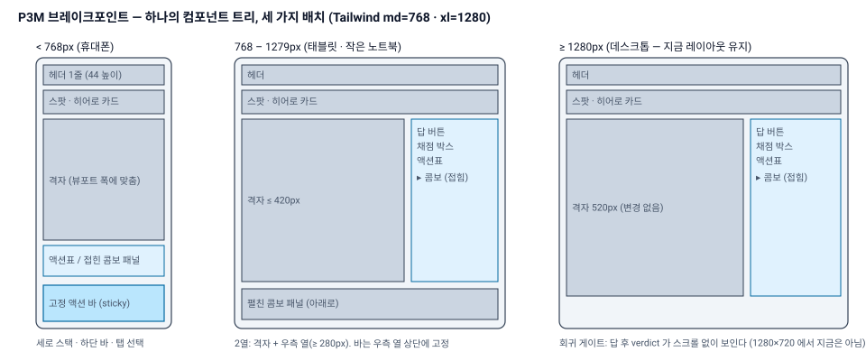
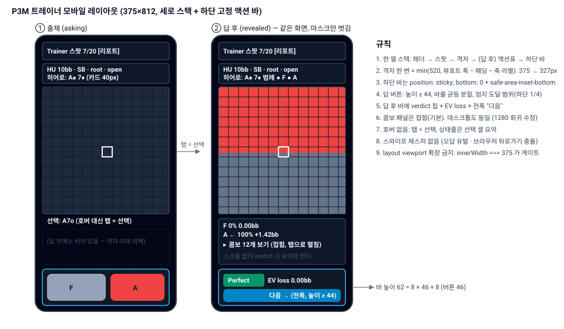

# P3M 스펙 — 모바일 UX (트레이너 1순위) · 다이어그램 규칙 · 다른 PC 에서 이어받기

작성: ggto-architect, 2026-09-12 (P3 R1 리뷰와 같은 날). 대상: ggto-dev.
전제: `docs/specs/P3.md` (R2), `docs/reviews/P3-round1.md` (MINOR 1·2·8 이 여기로 이월), `DESIGN.md` 1절(프론트 스택)·6.5. **시작 조건: P3 APPROVED** (P3 R2 의 MAJOR 3건은 이 문서와 무관하게 먼저 닫는다).
**이 문서는 설계 전제를 하나 바꾼다**: 지금까지 UI 는 "데스크톱 브라우저, 마우스" 전제였다. 사용자는 **대부분 휴대폰으로** 쓴다. 따라서 (1) 375px 폭에서 모든 화면이 성립해야 하고, (2) 호버가 없고, (3) 트레이너의 답 버튼은 한 손 엄지로 눌러야 하며, (4) 휴대폰이 PC 의 서버에 **접속할 수 있어야** 한다 (지금은 `127.0.0.1` 바인드라 불가능하다 — 7절).

## 0. 목표와 완료 그림

휴대폰(같은 Wi‑Fi) 브라우저에서 `http://<PC-IP>:7777/trainer`:
1. 세션 폼이 한 열로 뜨고 모든 토글이 손가락으로 눌린다. "세션 시작" 은 전폭 버튼.
2. 출제 화면: 위에서부터 **헤더 1줄 → 스팟 1줄 + 히어로 카드 → 격자(화면 폭에 맞춤) → 하단 고정 바의 답 버튼**. 스크롤 없이 격자와 답 버튼이 한 화면에 있다. 격자를 탭하면 그 셀이 선택되고 상태줄에 클래스 이름이 뜬다 (호버 없음).
3. 답 후 **같은 화면**: 격자에 전략 레이어, 하단 바가 `Perfect · EV loss 0.00bb` + 전폭 "다음" 으로 바뀐다. 액션표는 격자 아래. 콤보 12개 목록은 접혀 있다. **verdict 는 스크롤 없이 보인다.**
4. 세션 리포트와 30d 리포트는 표가 아니라 **카드 목록**이다 (375px 에서 7열 표는 성립하지 않는다).
5. 데스크톱(≥ 1280px)은 **지금과 같다** — 단 답 후 verdict 가 1280×720 에서도 스크롤 없이 보인다 (P3 R1 MINOR 1).

**만들지 않는 것**: PWA/홈 화면 설치, 오프라인, 스와이프 제스처, 다크/라이트 테마 전환, 세로/가로 회전 전용 레이아웃(가로는 데스크톱 규칙을 따른다), 인증(7절 참고), 트레이너 기록 동기화(9절), 새 npm 의존성.

## 1. 현상 — 실측 (P3 R1, headless Chrome 375×812 DPR 2 `mobile:true` + Browser 도구 `preset: mobile`)

스크린샷: `docs/reviews/assets/mobile-*.png` (range / charts / charts-selected-full / trainer-form / trainer-masked(-full) / trainer-revealed(-full) / report-30d).

| 화면 | 깨지는 것 | 근거 |
|---|---|---|
| Range · Charts · Trainer(출제/답 후) | **layout viewport 가 562px 로 넓어진다** (`window.innerWidth === 562`): `RangeGrid` 가 520px 고정이라 `width=device-width` 인데도 브라우저가 페이지를 0.67배로 축소해 맞춘다. 가로 스크롤은 없지만 **모든 글자·버튼이 2/3 크기**다. 11px 축 라벨 → 실효 7.3px, 14px 답 버튼 → 실효 9px | `mobile-shot.mjs` 측정 `innerWidth 562, canvas 520`; `mobile-trainer-masked.png` |
| Trainer 출제 | 답 버튼 `F (1)`·`A (2)` 가 **50×28 / 54×28** (실효 33×19). 44×44 미달. 격자 아래 y=801 (실효 534) — 엄지 범위이긴 하나 너무 작다 | 측정표 `smallSample` |
| Trainer 답 후 | 답 버튼 y=1173, 채점 박스 y=**1213**, "다음" y=**1321** (문서 높이 1373) — verdict 와 "다음" 이 **화면 밖**. 콤보 12개 목록이 격자와 채점 박스 사이에 끼어 있다 | `mobile-trainer-revealed-full.png` |
| 데스크톱 1280×720 (회귀) | 같은 이유로 답 버튼 y=765, 채점 박스 y=805 — **뷰포트 720 밖**. 개발 스크린샷(1500px)에서만 옆에 붙는다 | Browser 도구 실측 (`gradeBoxTopAbs 805, gridBottomAbs 705`) |
| Trainer 세션 폼 | 폭은 375 로 정상. 체크박스 13×13 (라벨 포함 행 높이 28). 헤더 탭 `세션`/`리포트 30d` 20px 높이, `← Charts` 16px | `mobile-trainer-form.png` |
| 리포트 30d / 세션 리포트 | 7열 표가 375px 에서 **열이 겹친다**: `attempts`/`ev`/`mean bb` 가 `161816180.061` 로 붙어 읽히고, 헤더 `mean bb` 가 `bb/100` 위에 겹친다 | `mobile-report-30d.png` |
| Charts | 포지션/라인/다음 버튼 24px 높이, 모드 버튼 20px. `select` 는 29px. 격자는 위와 같이 축소 | `mobile-charts.png` |
| Range | 입력 상자 `w-[32rem]` 고정 → 뷰포트 초과. Parse 버튼 34px | `mobile-range.png` |
| 전 페이지 | `hover: —` 상태줄 — 터치에는 호버가 없어 **영원히 비어 있다**. 셀 탭은 `onClick` 으로 선택되지만 선택 결과가 상태줄에 안 나온다 | `ChartNodeView.tsx` `hoveredText` |
| 전 페이지 | verdict 칩 대비 Minor `amber-50/amber-500` **2.07**, Perfect 3.58, Mistake 3.35, "다음" `sky-50/sky-600` 3.84, 본문 `slate-500` 4.24, `slate-600` 2.66 — 14px 이하 텍스트의 WCAG AA(4.5) 미달 | 5절 표 |
| 접속 | 서버가 `127.0.0.1` 에만 바인드 (`main.ts HOST`) → 휴대폰은 접속 자체가 불가능 | `packages/server/src/main.ts` |

## 2. 툴체인·제약

| 항목 | 지정 |
|---|---|
| 브레이크포인트 | Tailwind 기본 `md` = 768px, `xl` = 1280px 만 쓴다. 커스텀 브레이크포인트 금지 |
| 새 npm 의존성 | **없음**. `ResizeObserver`·`matchMedia('(pointer: coarse)')`·`env(safe-area-inset-bottom)` 은 브라우저 내장 |
| 스크린샷·레이아웃 검사 도구 | `tools/shots/` 워크스페이스가 아닌 **스크립트 디렉터리** (`tools/shots/mobile.mjs`, `tools/shots/desktop.mjs`): headless Chrome + CDP, Node 24 전역 `WebSocket`/`fetch` 만 (P2·P3 리뷰 스크래치의 `shot.mjs`/`drive.mjs`/`mobile-shot.mjs` 를 레포로 옮긴 것). Chrome 경로는 `GGTO_CHROME` 환경변수, 기본은 Windows 표준 경로 2개 탐색. `npm run check:mobile` 로 실행. **`ci` 에는 넣지 않는다** (Chrome 은 개발 환경 의존) |
| 서버 바인드 | `GGTO_HOST` 환경변수 (7절). 기본값 `127.0.0.1` 유지 |
| 도메인 코드 | `packages/*` 는 **건드리지 않는다** (7절 `main.ts` 의 host 만 예외). P3M 은 `web/src` + `tools/shots` + 문서다 |

## 3. 반응형 전략

결정 (대안과 이유):
- **격자는 스케일, 탭 전환 아님.** 한 변 = `min(520, 컨테이너 폭 − 18(축 라벨))` 을 13 의 배수로 내림. 375px 에서 패딩 `p-4` → 375 − 32 − 18 = 325 → **325px (셀 25px)**. `RangeGrid` 의 `size` prop 을 그대로 쓰고, 컨테이너 폭은 `ResizeObserver` 훅 `useContainerWidth()` 로 잰다. 캔버스는 이미 DPR 을 처리하므로 DPR 2~3 에서 선명하다. 세로 스택 대신 격자를 탭 뒤로 숨기는 안은 기각 — 트레이너는 격자를 보면서 답해야 한다.
- **한 열 스택 (< 768)**: 헤더 → 스팟 → 격자 → 액션표/접힌 콤보 패널 → 하단 바. **2열 (768~1279)**: 격자 ≤ 420px + 우측 열 ≥ 280px. **데스크톱 (≥ 1280)**: 지금 배치 (격자 520 + `w-96`). 페이지 패딩 `p-4 md:p-6`.
- **layout viewport 확장 금지**: 어떤 요소도 뷰포트 폭을 넘지 않는다 (`w-[32rem]` 류 고정 폭 금지, `min-w-0`, 긴 문자열은 `break-all`). 게이트: 375 에서 `window.innerWidth === 375 && document.documentElement.scrollWidth === 375`.
- **`index.html` viewport**: `width=device-width, initial-scale=1, viewport-fit=cover` (safe-area 를 쓰려면 `viewport-fit=cover` 가 필요하다). `user-scalable` 은 막지 않는다 (접근성).
- **콤보 패널은 접힘이 기본** — 모바일·데스크톱 공통, 트레이너·뷰어 공통. 헤더 한 줄 `▸ 콤보 12개` 를 탭하면 격자 **아래**에 펼쳐진다 (우측 열에 넣지 않는다). 이것이 P3 R1 MINOR 1 (1280×720 에서 verdict 가 밀려나는 문제) 의 수정이다. `ChartNodeView` 의 `hidePanel` 은 `panel: 'side' | 'below-collapsed'` 로 바뀐다.
- **169 축 라벨과 셀 라벨**: 셀 라벨 폰트 `max(9, round(step × 0.34))`. step < 28 이면 라벨을 **랭크 두 글자만** (`A7`) 그린다 — 수티드/오프수트는 대각선 위/아래로 정해지므로 정보 손실이 없고, 범례 한 줄 (`위 = 수티드 · 아래 = 오프수트`) 을 격자 아래에 둔다. `drawGrid` 에 `compactLabels: boolean` 인자 추가, 기존 데스크톱 호출은 `false`.

## 4. 터치 인터랙션

- **호버 대체**: 상태줄은 `hover: …` 가 아니라 **`선택: <셀 요약>`** 이다 — 호버가 있는 장치(`(hover: hover)`)에서는 호버 중 셀을, 아니면 선택 셀을 보여준다. 문구의 접두는 `선택:` 하나로 통일 (테스트가 `hover:` 문자열을 더는 기대하지 않는다). 탭 = `onClick` 선택 (이미 동작) — 터치 시작 시 `onMouseMove` 가 호버를 먼저 바꾸는 부작용을 막기 위해 `pointer: coarse` 에서는 `onHover` 를 붙이지 않는다.
- **터치 타겟 44×44**: `< md` 에서 모든 `button`/`a`/`input`/`select`/`label` 의 히트 영역 ≥ 44×44 CSS px (`min-h-11` + 충분한 패딩; 인라인 링크는 블록 버튼으로). 격자 셀(25px)은 예외 — 대신 선택 결과가 상태줄에 ≥ 14px 로 나온다.
- **트레이너 하단 고정 바** (`data-testid="action-bar"`): `position: sticky; bottom: 0`, 불투명 배경, `padding-bottom: env(safe-area-inset-bottom)`, 높이 ≥ 64px. 출제 중: 답 버튼들이 바를 **균등 분할** (`flex-1`, 높이 48px, 16px 굵은 글씨, 색 = `actionColors`, 글자 `slate-950` — 대비 red 5.36 / green 8.85 측정). 답 후: 왼쪽에 verdict 칩 + `EV loss x.xxbb`, 아래 전폭 **"다음 →"** (48px). 데스크톱(≥ md)에서는 바가 아니라 우측 열 상단의 같은 컴포넌트다 (하나의 `AnswerBar` 컴포넌트, 배치만 CSS).
  - **엄지 범위 판단**: 맞다. 375×812 세로에서 하단 1/4 (y ≥ 609) 이 한 손 엄지 도달 범위이고, 답 버튼과 "다음" 이 거기 있어야 20문제를 한 손으로 돈다. 격자는 보기만 하므로 위에 있어도 된다.
  - **오탭 방지**: 답 → 공개 전환 직후 같은 자리에 "다음" 이 나타나면 두 번 탭한 손가락이 verdict 를 못 보고 넘긴다. "다음" 은 공개 후 **500ms 동안 비활성** (`disabled` + 흐림). 답 버튼은 답 후 비활성 유지 (P3 8.2).
- **키보드 `1..n`** 유지 (데스크톱). **스와이프 없음** — 좌우 스와이프는 브라우저 뒤로가기와 충돌하고 오답을 만든다.
- **탭 지연**: `touch-action: manipulation` 을 버튼·캔버스에 줘 300ms 더블탭 지연을 없앤다.

## 5. 텍스트 크기·대비 (WCAG AA)

- 본문 ≥ 14px, 데이터(모노) ≥ 12px, 축 라벨 ≥ 11px — **실효 크기 기준** (3절의 viewport 확장 금지가 전제).
- 대비 (배경 `slate-950 #020617`, 실측):

| 용도 | 지금 | 비율 | 판정 | 바꿀 것 |
|---|---|---|---|---|
| 본문 회색 | `slate-400` | 7.87 | OK | 유지 |
| 보조 문구 | `slate-500` | 4.24 | **미달** | 12px 이하 텍스트에는 `slate-400`. `slate-500` 은 18px+ 에만 |
| 비활성/구분 | `slate-600` | 2.66 | **미달 (텍스트)** | 텍스트로 쓰지 않는다. 비활성 버튼은 `slate-400` + `opacity` 대신 명시 색 |
| Perfect 칩 | `emerald-50 / emerald-600` | 3.58 | 미달 | `emerald-950 / emerald-400` (≥ 7) |
| Minor 칩 | `amber-50 / amber-500` | **2.07** | 미달 | `amber-950 / amber-400` |
| Mistake 칩 | `orange-50 / orange-600` | 3.35 | 미달 | `orange-950 / orange-400` |
| Blunder 칩 | `red-50 / red-600` | 4.41 | 미달 | `red-50 / red-700` 또는 `red-950 / red-400` |
| "다음" | `sky-50 / sky-600` | 3.84 | 미달 | `sky-950 / sky-400` |
| 답 버튼 | `slate-950 / actionColors` | 5.36 (red) · 8.85 (green) | OK | 유지. 보라 폴백 `#a855f7` 도 측정해 4.5 이상 확인 |
| 격자 라벨 | `#e2e8f0 / base` · `#0b1220 / fill` | 11.9 · 4.98 | OK | 유지. `labelDim #64748b / #111827` 3.73 은 레인지 밖 셀이라 허용 (정보성 아님) |

새 색은 개발 에이전트가 **같은 공식으로 측정해 표로 보고**한다 (리뷰어 스크립트와 같은 relative-luminance 공식). 색 이름은 `web/src/lib/palette.ts` 하나에 모은다 (`GradeBox`·`SessionForm`·`ReportPanel` 의 흩어진 클래스 문자열 제거).

## 6. 페이지별 요구

### 6.1 Trainer (1순위)
- 헤더 1줄 (`h-11`): 좌 `Trainer` + 탭 `세션`/`리포트`, 우 `스팟 7/20`. `← Charts` 는 탭 줄의 아이콘 버튼(44×44).
- 스팟 줄: 차트 이름 · 포지션 · seq · 팟 · 카테고리 를 **한 줄로 줄임** (`truncate`), 그 아래 히어로 카드 두 장 **40×56px**.
- 격자 (3절), 상태줄 `선택: A7o`.
- 답 후: 격자 아래 액션표 (`GradeBox` 의 표 부분), 그 아래 `▸ 콤보 12개` 접힘, 하단 바 (4절).
- 리포트 탭·세션 리포트: 6.4.

### 6.2 Charts
- 컨트롤 줄들 (`select`, 포지션, 라인, 다음, 모드) 전부 `min-h-11`, 줄바꿈 허용. `select` 는 전폭.
- 격자 (3절), 우측 패널(콤보/리치)은 `< md` 에서 격자 아래, 콤보 패널은 접힘 기본.
- reach 모드의 포지션 행도 44px.

### 6.3 Range
- 입력 `w-full` (고정 `w-[32rem]` 제거), Parse `min-h-11`. 콤보 패널은 격자 아래.

### 6.4 리포트 (세션·30d)
- `< md`: `AggRow` 를 **카드**로: 1행 라벨(굵게), 2행 `attempts N · ev N · mean 0.062bb · bb/100 6.2 · mixed 0%`, 3행 verdict 칩들. `≥ md`: 지금 표.
- 리크·SRS 줄은 그대로.

### 6.5 세션 폼
- 차트셋·카테고리 체크박스 → 전폭 **토글 행** (`label` 블록 `min-h-11`, 체크 아이콘). 문제 수 입력 `inputmode="numeric"`, 전폭 "세션 시작" (48px).

## 7. 휴대폰에서 접속 — `GGTO_HOST` (DECISIONS D19)

- `packages/server/src/main.ts`: `HOST = process.env.GGTO_HOST ?? '127.0.0.1'`. 값이 루프백이 아니면 기동 로그에 **경고 한 줄** (`인증이 없다 — 신뢰하는 LAN 에서만`) 과 `os.networkInterfaces()` 의 IPv4 주소들로 `http://<ip>:7777` 목록을 찍는다. 스크립트 `npm run start:lan` = `GGTO_HOST=0.0.0.0 npm start` (Windows 에서도 되도록 `cross-env` 를 쓰지 않고 `node -e` 래퍼나 `scripts/start-lan.mjs` 로).
- 설계 근거: DESIGN 1절 "127.0.0.1 바인드, 인증 없음" 은 유지 (기본값). LAN 노출은 **명시적 opt-in** 이고 문서에 위험을 적는다. Tailscale 류는 사용자 선택이며 스펙 밖.
- DoD: 같은 Wi‑Fi 의 휴대폰에서 `/trainer` 20문제 완주 (리뷰어는 `resize_window` 로 대신하되, 개발 에이전트는 실기기 스크린샷 1장 `P3M-phone-*.png` 를 첨부 — 없으면 이유).

## 8. 테스트 · DoD

### 8.1 `web/test` (jsdom — 레이아웃은 못 잰다, 로직만)
- `gridSizeFor(containerWidth)`: `375−32 → 325`, `768 → 520`, `300 → 273` (13 의 배수, 하한 13×15=195).
- `compactLabels`: step 25 → 라벨 `A7`, step 40 → `A7o` (`drawGrid` 의 `fillText` 인자 검사).
- 상태줄: 선택 셀이 있으면 `선택: A7o …`, 호버 없는 환경(`matchMedia` 모킹 `pointer: coarse`)에서 `onMouseMove` 가 상태를 바꾸지 않는다.
- `AnswerBar`: 출제 중 버튼 = actions 순서, 답 후 verdict + "다음", "다음" 은 공개 후 500ms 비활성 (`vi.useFakeTimers`).
- 리포트: `< md` 모킹 시 `report-card-*` 렌더, `≥ md` 시 표.
- D8 UI: 출제 화면 **및** 답 후 화면 `document.body.textContent` 에 `정답`/`오답` 없음 (P3 R1 MINOR 2).

### 8.2 `npm run check:mobile` (`tools/shots/mobile.mjs`, headless Chrome CDP, 375×812 DPR 2 `mobile:true`) — 리뷰어가 Browser 도구 `resize_window preset:"mobile"` 로 같은 것을 본다
각 항목이 assert 이고 실패하면 exit 1:
1. `/`, `/charts?set=<첫 셋>`, `/trainer` (폼·출제·답 후·세션 리포트·30d): `window.innerWidth === 375`, `document.documentElement.scrollWidth === 375`.
2. 캔버스 폭 `325` (또는 컨테이너에 맞는 13 의 배수), 축 라벨 폰트 ≥ 11px.
3. 모든 `button, a, input, select, [role=button]` 의 `getBoundingClientRect()` 높이·폭 ≥ 44 (캔버스 제외). 위반 목록을 출력.
4. 출제 화면: `action-bar` 의 `bottom ≤ innerHeight`, `top ≥ innerHeight × 0.6`, 답 버튼 높이 ≥ 48.
5. 답 후: `grade-verdict` 와 `next-spot` 이 **스크롤 0 에서** 뷰포트 안 (`top ≥ 0 && bottom ≤ innerHeight`).
6. 리포트: 카드 렌더, 어떤 요소도 `right > 375` 아님.
7. 스크린샷 `docs/reviews/assets/P3M-mobile-{range,charts,trainer-form,trainer-masked,trainer-revealed,session-report,report-30d}.png`.

### 8.3 데스크톱 회귀 게이트 (`tools/shots/desktop.mjs`, 1280×720 **과** 1500×1000)
1. 캔버스 520px, 우측 열 격자 옆 (`grade-box.left > canvas.right`).
2. 답 후 `grade-verdict`·`next-spot` 이 스크롤 0 에서 뷰포트 안 — **1280×720 에서도** (P3 R1 MINOR 1).
3. 뷰어: 셀 클릭 → 콤보 패널이 접힘 헤더로 나타나고 펼치면 격자 아래. reach 모드 패널 동작 (P2 R1 MINOR 3 테스트 유지).
4. 기존 web 테스트 90 + 신규 전부 통과, `npm run ci` exit 0. 스크린샷 `P3M-desktop-1280-revealed.png`, `P3M-desktop-1500-revealed.png` 를 P3 스크린샷과 나란히.

### 8.4 Definition of Done
1. `npm run ci` exit 0 + fresh clone `clone → install → seed → ci` exit 0 (P3 R2 DoD 1 과 동일).
2. `npm run check:mobile` exit 0 (로그 첨부), `tools/shots/desktop.mjs` exit 0.
3. 8.1 테스트 존재 (이름에 절 번호 `P3M 3`/`4`/`5`/`6.4`/`8.1`).
4. 5절 대비 표를 새 색으로 다시 측정해 첨부 (전부 ≥ 4.5).
5. 7절: `GGTO_HOST` + `start:lan` + 기동 로그 + README 한 단락 (위험 고지). 실기기 스크린샷 1장 또는 사유.
6. 9절 핸드오프 항목 (H1~H5) 처리 표.
7. 10절 다이어그램 규칙 적용: `DESIGN.md` 2절 아키텍처 ASCII 블록 → `docs/assets/architecture.svg` 참조로 교체 (파일은 이미 있다), D18·D19 기록.
8. 새 의존성 0. `packages/*` 변경은 `main.ts` host 뿐 (diff 로 증명).

## 9. 다른 PC 에서 이어받기 (요구 3)

P3 R1 에서 `git clone → npm install → npm run ci → npm run seed` 를 실제로 돌렸다 (`docs/reviews/P3-round1.md` 표). 결과와 필요한 것:

| # | 항목 | 상태 | 할 일 |
|---|---|---|---|
| H1 | **CRLF** — Windows 기본 `core.autocrlf=true` 에서 픽스처 JSON 이 CRLF 로 체크아웃되어 `seed` 후 `fixtures.test` 실패 | **깨짐** (P3 R1 MAJOR 3) | `.gitattributes` `* text=auto eol=lf` + renormalize. P3 R2 에서 닫는다 |
| H2 | Node 버전 고정 | `engines` 없음. `node:sqlite`·`zstdCompressSync` 는 Node 24 필요 | 루트 `package.json` `"engines": { "node": ">=24" }` + `.node-version` (`24`) + `npm install` 시 경고가 아니라 실패하도록 `.npmrc` `engine-strict=true` |
| H3 | `data/` 재생성 | `npm run seed` **6초**, 결정적 — 해시 6/6 동일, 파일 바이트 동일 (fresh clone 실측). `tools/chart-gen/data/equity169.json` (전수 표, 250KB) 는 **커밋돼 있어** 재계산 불필요 | 없음. README 의 "최초 1회" 문구 유지 |
| H4 | `data/trainer.db` (사용자 기록·SRS) | gitignore. **PC 마다 따로 쌓인다** | 지금은 수용한다 — 휴대폰 사용은 어차피 한 PC 의 서버로 붙는다 (7절). 옮기려면 서버를 끈 뒤 `data/trainer.db` (WAL 체크포인트 후 단일 파일) 를 복사. 익스포트/임포트 CLI 는 P3 "만들지 않는 것" 그대로 — 필요해지면 별도 스펙 |
| H5 | 스크린샷·레이아웃 검사 스크립트 | 리뷰/개발 스크래치패드에만 있다 (`shot.mjs`, `drive.mjs`, `mobile-shot.mjs`) — 다른 PC 에 없다 | 2절 대로 `tools/shots/` 로 레포에 넣는다 (Chrome 경로는 `GGTO_CHROME`) |
| H6 | Rust 툴체인 | P4 전까지 불필요. P4 는 `rustup` GNU 호스트 (`docs/specs/P2.md` 11절, `docs/spikes/P4-rust.md`) | P4 스펙에서 |
| H7 | `.claude/` | `agents/*.md`·`launch.json` 커밋됨. `settings.local.json` 은 gitignore (머신별 권한) — 맞다 | 없음 |
| H8 | `docs/assets/*.svg` | `architecture.svg`·`agent-loop.svg` 커밋됨, P3M 의 2장은 이 스펙과 함께 | 커밋 |
| H9 | 포트 충돌·기동 확인 | `npm start` 는 7777 고정, `PORT` 환경변수로 변경 가능 (`main.ts`) | README 에 `PORT`·`GGTO_DATA_DIR`·`GGTO_HOST` 환경변수 표 |

**다른 PC 절차 (README 로 옮긴다)**: `git clone` → `node --version` (24) → `npm install` (prepare 가 libs 빌드) → `npm run seed` (6초) → `npm run ci` → `npm run build && npm start` (휴대폰이면 `npm run start:lan`).

## 10. 문서 규칙 — 다이어그램은 SVG (요구 2, DECISIONS D18)

- **설계·스펙·리뷰 문서의 다이어그램 (박스·화살표·화면 배치·흐름도) 은 `docs/assets/<이름>.svg` 파일로 두고 마크다운에서 `` 로 참조한다. 코드 블록 ASCII 아트 금지.** 예외: 디렉터리 트리, 표, 수식·의사코드, 짧은 시퀀스 문자열.
- SVG 는 손으로 쓴 정적 파일 (도구 의존 없음), 폰트는 시스템 폰트 스택, 한국어 포함. 크기 ≤ 50KB.
- 적용: `DESIGN.md` 2절 아키텍처 블록 → `architecture.svg` (DoD 7). 워크스페이스 트리는 예외라 그대로. 이 문서의 3·4절이 규칙의 첫 적용이다 (`p3m-layout-breakpoints.svg`, `p3m-trainer-mobile.svg`). 앞으로 아키텍트가 쓰는 스펙도 같은 규칙.

## 11. DESIGN / DECISIONS 갱신 (개발 에이전트가 한다, 리뷰 대상)

- `DESIGN.md` 1절 프론트 행에 "**모바일 우선 사용** — 375px 한 열 스택, 터치 타겟 44px, 트레이너 하단 액션 바 (P3M)". 서버 행에 "`GGTO_HOST` opt-in LAN 바인드 (D19)". 6.5 에 "출제/해설 화면의 답 버튼은 모바일에서 하단 고정 바" 한 줄. 2절 ASCII → SVG 참조. 8절 로드맵에 **P3M 행을 P3 와 P4 사이에** 추가 (`모바일 UX — 완료 조건: check:mobile exit 0`).
- `DECISIONS.md`: **D18** 다이어그램 = SVG 파일 (10절), **D19** `GGTO_HOST` 기본 루프백 + 명시적 LAN opt-in, 인증 없음 고지 (7절), **D20** 콤보 패널 접힘 기본 + 격자 아래 배치 (모바일·데스크톱 공통, 1280 회귀의 원인 제거).

## 12. 리뷰어가 추가로 돌릴 것 (미리 알려준다)
- Browser 도구 `resize_window` `mobile`/`tablet`/`desktop` 세 프리셋 × 3 페이지 × (출제·답 후). `innerWidth`/`scrollWidth`/타겟 크기/verdict 가시성 을 JS 로 잰다 (8.2 와 같은 식).
- 하단 바에서 답 → 500ms 안에 "다음" 을 눌러도 넘어가지 않는다.
- 대비 표 재측정 (`palette.ts` 의 실제 hex 로).
- `GGTO_HOST=0.0.0.0` 기동 로그에 LAN URL 과 경고, 기본 기동은 여전히 `127.0.0.1` 만 (`netstat -ano | findstr 7777`).
- `tools/shots/*.mjs` 가 새 클론에서 `GGTO_CHROME` 만 주면 도는지.
