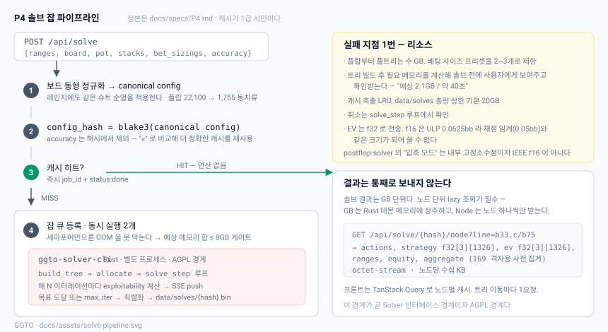
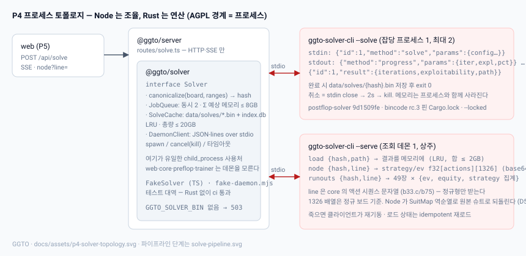

# P4 스펙 — `ggto-solver`: postflop-solver 래핑 · stdio JSON-lines RPC · 잡 큐 · 캐시 · SSE

작성: ggto-architect, 2026-09-16 (P3M R2 APPROVED 직후). 대상: ggto-dev.
전제: `DESIGN.md` 2절(계층 규칙)·3.3·3.4·5절·7절·9절, `docs/DECISIONS.md` D1·D2·D5·D6·D7·D9·D18, `docs/spikes/P4-rust.md` (R3), `docs/specs/P2.md` 11절, `docs/specs/P3.md` 3.3 (EV 기준점 `stack_delta_from_node`), `docs/specs/P3M.md` 13절 (이월 항목).
**시작 조건: P3M APPROVED — 충족** (`docs/reviews/P3M-round2.md`, 2026-09-16).

**이 문서가 바꾸는 것**: `DESIGN.md` 5.2 의 "압축 모드(f16) 기본 사용" 과 5.3 의 `base64 f16` 은 D7 과 모순이다 — **f32 로 고친다** (11절). 캐시 키 해시는 DESIGN 의 `blake3` 대신 `node:crypto` **sha256** (새 의존성 0, D21).





## 0. 목표와 완료 그림

`npm run build:solver && npm run build && npm start` 후:

1. **CLI**: `npm run solve -- --board Ks7h2h --oop "22+,A2s+,K9s+,QTs+,ATo+,KJo+" --ip "TT-22,AJs-A2s,KTs+,QJs,AQo-ATo" --pot 20 --stack 80 --sizings simple --target 0.5` 가 (a) 정규화된 보드·해시·예상 메모리·예상 시간을 찍고, (b) 진행률 줄 `iter 200/…  expl 1.23% pot  42%` 를 갱신하며, (c) 끝나면 `data/solves/<hash>.bin` 을 남기고 루트 노드 요약(OOP 액션 빈도 3줄 + 두 플레이어 EV 합 = 팟) 을 출력한다. **같은 명령을 다시 치면 연산 없이 `cached` 로 즉시 끝난다.** 보드를 `Kd7s2s` 로 바꿔도 같은 해시로 히트한다 (D5).
2. **API**: `POST /api/solve` → `{jobId, hash, cached, estMemoryBytes, estSeconds}`; `GET /api/solve/:jobId/events` (SSE) 가 `progress` → `done`; `GET /api/solve/:hash/node?line=B6.6-C` 가 `strategy`/`ev` `f32[actions][1326]` (base64) 와 169 집계를 준다 (`line` 문법은 core 액션 문자열 — 5.4, R1 개정); `DELETE /api/solve/:jobId` 가 500ms 안에 취소한다; `GET /api/solves` 가 캐시 목록을 준다.
3. **자원**: 동시 2 잡, 세 번째는 큐. 예상 메모리 합이 8GB 를 넘는 잡은 **시작 전에** 거부된다. `data/solves/` 총량이 20GB 를 넘으면 LRU 로 지운다.
4. **Rust 없이도 앱은 뜬다**: 바이너리가 없으면 `/api/solve` 만 503 `SolverUnavailable` 이고 P2/P3/P3M 기능은 전부 그대로다. `npm run ci` 는 Rust 없이 exit 0 (가짜 데몬으로 TS 쪽을 검사), `npm run ci:solver` 가 Rust 빌드 + 실제 데몬 통합 테스트다.

**만들지 않는 것**: 포스트플랍 탐색 **UI** (P5 — 이 페이즈의 프론트 변경은 0), 트레이너 포스트플랍 스팟 (P6), 자체 CFR 엔진, 멀티웨이(2인만), ICM, 런아웃 사전 솔브(배치 스케줄러), 원격 솔버, 인증. 6-max 프리플랍 차트 생성(DCFR) 도 아니다 — 스파이크 3절이 막혔고 P2 7.2 판정이 UNCERTAIN 이다.

## 1. 툴체인

| 항목 | 지정 |
|---|---|
| Rust | `rustup` **GNU 호스트** `x86_64-pc-windows-gnu`, 영구 설치 (스파이크는 스크래치패드였다). `solver/ggto-solver-cli/rust-toolchain.toml` 로 **`1.98.1`** 고정 (재현성용, bincode 대책 아님 — 스파이크 2.1) |
| 크레이트 | `solver/ggto-solver-cli/` — 레포 안의 유일한 비-TS 코드 (DESIGN 2절 트리). 바이너리 크레이트 하나. `postflop-solver` 는 **git 의존** 커밋 `9d1509fe5077d019825f833eed04b16d342dfda1` 고정, 기본 feature (`bincode`+`rayon`), `zstd` **끔** |
| bincode | 래퍼 크레이트의 **`Cargo.lock` 을 커밋** (bincode/bincode_derive `2.0.0-rc.3` 핀). 모든 빌드는 `cargo build --locked --release`. `Cargo.lock` 이 없거나 `--locked` 가 실패하면 빌드 스크립트가 exit 1 (스파이크 5절 R3 — 래퍼 방식으로 확정) |
| 린트 | `solver/ggto-solver-cli/.cargo/config.toml` 에 `[build] rustflags = ["-A", "dangerous_implicit_autorefs"]` — 환경변수 `RUSTFLAGS` 에 의존하지 않는다 (다른 PC 에서 잊는다) |
| `windows-sys` 게이트 | `scripts/solver-gate.mjs`: `cargo tree -i windows-sys --locked` 의 **3분기 판정** (스파이크 3절 R3): exit≠0 **이고** stderr 에 `did not match any packages` → 통과; exit 0 → **실패** (MSYS2 binutils 전제 발동, 빌드 중단); 그 밖의 exit≠0 → **게이트 오류로 중단**. `build:solver` 가 빌드 전에 이 게이트를 돈다. 래퍼가 `serde_json` 만 쓰면 통과한다 — `clap`·`tokio`·`windows-sys` 를 끄는 크레이트는 **금지** (인자 파싱은 `std::env::args` 손파싱) |
| Rust 의존성 | `postflop-solver`, `serde`, `serde_json`, `base64`. 그 외는 이 문서 개정 없이 추가 금지 |
| Node 워크스페이스 | `packages/solver` (`@ggto/solver`): `Solver` 인터페이스, 정규화·해시, 잡 큐, 캐시, 데몬 클라이언트. 런타임 의존성 `@ggto/core` 뿐 (+ `node:child_process`, `node:fs`, `node:crypto`, `node:sqlite`). **HTTP/React 없음** |
| 바이너리 위치 | `GGTO_SOLVER_BIN` 환경변수, 기본 `solver/ggto-solver-cli/target/release/ggto-solver-cli(.exe)`. 없으면 `SolverUnavailable` |
| npm 스크립트 | `build:solver` (게이트 → `cargo build --locked --release`), `test:solver` (`cargo test --locked` + `packages/solver` 통합 테스트 `GGTO_SOLVER_INTEGRATION=1`), `ci:solver` = `build:solver && test:solver`, `solve` = `node tools/solve/main.mjs`. **`ci` 는 바뀌지 않는다** (Rust 미설치 PC 에서도 exit 0) |
| 새 npm 의존성 | **없음** |
| 데이터 | `data/solves/<hash>.bin` (postflop-solver 직렬화) + `data/solves/index.db` (`node:sqlite`, 4절). `GGTO_DATA_DIR` 아래. gitignore |

## 2. 계층 경계 (grep 게이트, DESIGN 2절에 추가)

- `child_process` 를 import 하는 곳은 **`packages/solver/src/daemon/*` 뿐** (`scripts/`·`tools/` 는 예외). `packages/server` 는 `@ggto/solver` 의 `Solver`·`JobQueue`·`SolveCache` **인터페이스**만 쓴다.
- `postflop` 문자열이 `web/src`·`packages/core`·`packages/preflop`·`packages/trainer`·`packages/protocol` 에 없다. 솔버 크레이트 이름은 `packages/solver/src/daemon/postflopCli.ts` 한 파일에만.
- 1326 배열의 슈트 역순열은 **`@ggto/solver` 가 한다** (5.4). 서버·웹은 정규 보드를 모른다 — 응답의 `board` 는 항상 사용자가 보낸 원본 슈트다.
- AGPL 경계 = 프로세스 (D2). Rust 크레이트는 `AGPL-3.0-or-later` 로 표기하고 `solver/ggto-solver-cli/LICENSE` 를 둔다. TS 쪽은 그대로.
- EV 는 어디서나 **f32** (D7). `Float32Array` 외의 EV 컨테이너 금지. base64 디코드 후 `new Float32Array(buf.buffer, off, n)` 로 뷰만 만든다.

## 3. 도메인 정의

### 3.1 `SolveRequest` (와이어, `@ggto/protocol`) → `SolveConfig` (도메인, `@ggto/solver`)

```ts
interface SolveRequest {
  oop: string;            // 레인지 표기, core parseRange. ≤ 4000자
  ip: string;
  board: string;          // "Ks7h2h" 3..5장 붙여쓰기 (core parseCards)
  potBb: number;          // 시작 팟 (bb). 0.01 단위, (0, 10000]
  stackBb: number;        // 유효 스택 (bb). 노드 이후 남은 스택. (0, 10000]
  sizings: SizingPresetName | CustomSizings;   // 3.2
  rake?: { mode: 'none' } | { mode: 'pot'; pct: number; capBb: number };   // 기본 none
  targetExploitabilityPct?: number;  // 팟 대비 %, 기본 0.5, [0.05, 5]
  maxIterations?: number;            // 기본 1000, [10, 100000]
  compressed?: boolean;              // 기본 false — 3.4
}
```

`SolveConfig` 는 위를 **정규화**한 것: `Range` 두 개 (1326 `Float32Array`, 카드 제거 후 정규화 — P0 규칙 그대로), `board: Card[]`, 칩 단위 정수 (`chipsPerBb = 100` 고정, `potChips = round(potBb × 100)`), 사이징은 문자열 정렬·공백 제거. `SolveRequest → SolveConfig` 는 순수 함수 `buildConfig(req)` 이고 실패는 `SolveConfigError` (코드: `RangeSyntax`, `BoardSyntax`, `BoardRangeConflict`, `OutOfRange`, `EmptyRange`).

### 3.2 베팅 사이즈 프리셋 (DESIGN 5.2 — "2~3개로 제한")

| 이름 | 플랍 | 턴 | 리버 | 레이즈 | 올인 |
|---|---|---|---|---|---|
| `simple` | 33%, 75% | 75% | 75% | 2.5x | 올인 임계 `allin_threshold 1.5` (postflop-solver 기본) |
| `standard` | 33%, 66%, 125% | 50%, 100% | 50%, 100%, 200% | 2.5x, 4x | 동일 |
| `river-heavy` | 50% | 75% | 33%, 66%, 100%, 200% | 3x | 동일 |

`CustomSizings` 는 CLI 에서만 (`--sizings-flop "33%,75%" …`), 각 스트리트 bet/raise 문자열은 postflop-solver `BetSizeOptions` 문법 그대로 넘기되 **사이즈 ≤ 4개/스트리트**. API 는 프리셋 이름만 받는다 (트리 폭발 방지 = 5.2 의 UX 결정).

### 3.3 캐시 키 (D5·D6) — `canonicalConfig(cfg)` 와 `configHash`

1. `core.canonicalize(board, [oop, ip])` → `{ board: cb, ranges: [oop', ip'], perm }`. 레인지의 stabilizer 안에서 최소 보드를 고르므로 레인지가 슈트 비대칭이면 `perm` 은 항등에 가깝고 **분기 없이** 같은 코드다 (D5).
2. **정규 JSON** (키 정렬, 부동소수는 `Float32Array` 를 그대로 hex 로): `{ v: 1, board: formatCards(cb), oop: hex(oop'), ip: hex(ip'), pot, stack, sizings, rake, compressed }`. **`targetExploitabilityPct`·`maxIterations` 는 제외** — 정확도는 4.3 의 "≥" 비교로 처리한다.
3. `configHash = sha256(정규 JSON)` hex 64자 (D21). `SuitMap = perm` 은 `SolveTicket { hash, perm, canonical }` 로 호출자에게 돌아가고 캐시 행에도 저장된다 — 단 **해시에는 안 들어간다** (같은 게임의 다른 슈트 표기가 같은 해시를 받아야 한다).
4. 음성 테스트 (D6 — P0 의 테스트를 여기서 다시): `Ks7h2h + AsKs/…` 와 `Kd7s2s + AsKs/…` 는 **다른** 해시. `Ks7h2h + 대칭 레인지` 와 `Kd7s2s + 같은 레인지` 는 **같은** 해시.

### 3.4 정밀도·메모리 (D7)

- 전송·저장 EV·전략은 **f32**. postflop-solver 의 "compressed" 모드(내부 i16 고정소수점)는 `compressed: true` 를 **명시**할 때만 쓰고, 해시에 들어가며 (다른 결과다), 결과 메타에 `compressed: true` 가 남는다. 기본은 비압축 — 채점 임계 0.05bb 앞에서 정밀도를 잃지 않기 위해서다. 메모리는 5.2 게이트가 막는다.
- `estimate` 는 postflop-solver `memory_usage()` 의 (비압축, 압축) 두 값을 돌려주고 잡 큐는 요청된 모드의 값을 쓴다.

### 3.5 EV 기준점 — **P4 첫 주에 확정** (스파이크 4절 미해소 / P2 R2 UNCERTAIN 1)

스파이크는 루트에서만 `Σ ev = starting_pot` 을 확인했다. 루트에서는 "노드 이후" 와 "루트 이후" 가 같은 값이라 P3.md 3.3 의 기준점(`stack_delta_from_node`)과의 일치가 **아직 증명되지 않았다**. 프로브 (`solver/ggto-solver-cli/examples/evprobe.rs`, 레포에 **넣는다** — `cargo test` 가 부른다):

1. 턴 스팟 (스파이크와 같은 `starting_pot 200, effective_stack 900`), 1000 iter.
2. 루트 → `play(OOP bet 75%)` → IP 노드에서 `cache_normalized_weights()` → 두 플레이어 `expected_values()` 의 레인지 가중 평균 합 `S`.
3. **판정**: `S ≈ 200 + 150 = 350` (그 노드의 팟) → **노드 기준** = P3.md 3.3 과 동일, 변환은 `/chipsPerBb` 뿐. `S ≈ 200` → **루트 기준** = 변환식에 "노드 이전 히어로 투입분" 오프셋이 들어간다: `ev_node(hero) = ev_root(hero) + contributed_before_node(hero)`.
4. 판정 결과를 이 문서 3.5 에 **적고**, `SolveResultMeta.evBasis: 'stack_delta_from_node'` 를 항상 만족하도록 변환을 Rust 쪽 `node` 응답에서 끝낸다 (Node 가 오프셋을 계산하지 않는다). `cargo test` 에 "임의 내부 노드에서 Σ_players ev_node = 그 노드의 팟 (±1e-3 × pot)" 을 성질 테스트로 둔다.

허용 오차 없이 두 가설 중 하나가 **정확히** 맞아야 한다. 둘 다 아니면 BLOCKED — 리뷰어에게 즉시 보고.

### 3.5-R **판정 결과 (ggto-dev, 2026-09-16): 노드 기준 확정.**

`solver/ggto-solver-cli/examples/evprobe.rs` (레포에 있다. `cargo run --release --example evprobe`).
스파이크와 같은 스팟 — `starting_pot 200`, `effective_stack 900`, 75% 단일 사이즈, 1000 iter,
`exploitability = 0.904920 (0.4525% pot)`:

```
node                       bets       node_pot  ev0        ev1        SUM       vs node_pot  vs starting_pot
root                       [0, 0]     200       91.9298    108.0702   200.0000  +0.0000      +0.0000
root -> OOP Bet(150)       [150, 0]   350       279.5574   70.4426    350.0000  +0.0000      +150.0000
  -> IP Raise(375)         [150, 375] 725       134.0384   590.9616   725.0000  +0.0000      +525.0000
  -> IP Call (river chance)[150, 150] 500       263.0809   236.9191   500.0000  +0.0000      +300.0000
    -> river 2c            [150, 150] 500       255.1894   244.8106   500.0000  +0.0000      +300.0000
```

**`S = 그 노드의 팟` 이 다섯 노드 전부에서 오차 0.0000 으로 성립했다.** 루트 기준 가설이었다면
내부 노드에서 `S = starting_pot = 200` 이어야 하는데 +150 / +525 / +300 으로 갈라졌다.

따라서:
- 변환은 **오프셋 없이 `ev_bb = ev_chips / chipsPerBb`** 뿐이고,
- `SolveResultMeta.evBasis` 는 항상 `stack_delta_from_node` 이며 (P3.md 3.3 과 같은 정의),
- Node 쪽은 어떤 오프셋도 계산하지 않는다 (변환이 Rust `node` 응답에서 끝난다).

성질 테스트: `tests/solver.rs :: p4_3_5_ev_sum_equals_the_pot_of_that_node_at_internal_nodes`
(팟이 커진 내부 노드 ≥ 3곳에서 `|Σ ev − 노드 팟| ≤ 1e-3 × 팟` **이고** `Σ ev ≠ 루트 팟` 을 함께 단언 —
두 가설을 실제로 **구분**하는지까지 검사한다). 응답에는 이 항등식의 증인으로
`evAvgBb: [oop, ip]` 스칼라가 함께 나간다 (5.4 개정 — 1326 배열만으로는 상대 EV 가 없어 검증 불가).

**D25 로 고정**했다.

## 4. 캐시 (`SolveCache`, `packages/solver/src/cache.ts`)

### 4.1 스키마 (`data/solves/index.db`, `user_version = 1`)

```sql
CREATE TABLE solve (
  hash            TEXT PRIMARY KEY,           -- configHash
  config_json     TEXT NOT NULL,              -- 정규 JSON (3.3-2) — 재현·목록용
  board_canonical TEXT NOT NULL,              -- "2h7hKs" 류 정규 보드
  street          TEXT NOT NULL CHECK (street IN ('flop','turn','river')),
  pot_chips       INTEGER NOT NULL,
  stack_chips     INTEGER NOT NULL,
  sizings         TEXT NOT NULL,
  compressed      INTEGER NOT NULL CHECK (compressed IN (0,1)),
  exploitability  REAL NOT NULL,              -- 팟 대비 % (달성값)
  iterations      INTEGER NOT NULL,
  bytes           INTEGER NOT NULL,           -- <hash>.bin 크기
  solver          TEXT NOT NULL,              -- "postflop-solver@9d1509fe"
  ev_basis        TEXT NOT NULL CHECK (ev_basis = 'stack_delta_from_node'),
  created_at      INTEGER NOT NULL,
  last_used_at    INTEGER NOT NULL,
  elapsed_ms      INTEGER NOT NULL
);
CREATE INDEX solve_lru ON solve(last_used_at);
```

`perm`(SuitMap) 은 저장하지 않는다 — 요청마다 `canonicalize` 가 다시 계산한다 (밀리초). 저장하면 같은 해시에 여러 perm 이 대응하는 모순이 생긴다.

### 4.2 규칙

- **원자성**: 솔버는 `<hash>.bin.part` 에 쓰고 완료 후 rename. index 행은 rename **뒤에** INSERT. 기동 시 `.part` 는 지우고, index 에 없는 `.bin` 은 지우고, `.bin` 없는 행은 지운다 (`SolveCache.repair()` — 결과 로그).
- **LRU 축출**: 새 결과를 저장하기 **전에** `Σ bytes + 예상 bytes > cap` 이면 `last_used_at` 오름차순으로 삭제. 실행 중·로드 중 해시는 제외. cap 기본 **20GB**, `GGTO_SOLVE_CACHE_BYTES` 로 변경. 삭제는 로그 한 줄.
- **`last_used_at`** 갱신은 `node`/`runouts` 조회 시 (초당 1회로 스로틀).
- `DELETE /api/solves/:hash` 수동 삭제 (로드돼 있으면 `unload` 먼저).

### 4.3 히트 판정

`lookup(hash, targetPct)`: 행이 있고 `exploitability ≤ targetPct` 면 **히트** (더 정확한 캐시는 재사용). 행이 있는데 `exploitability > targetPct` 면 **재솔브** — 완료 시 행을 REPLACE (옛 `.bin` 삭제). 동시에 같은 해시가 큐에 있으면 두 번째 요청은 **같은 잡에 합류** (jobId 공유, SSE 구독자 2).

## 5. 잡 큐·데몬 (`packages/solver/src/queue.ts`, `daemon/`)

### 5.1 프로세스 모델 (D22)

- **잡당 솔버 프로세스 1개** (`ggto-solver-cli --solve`), 최대 **2**. 완료 시 `.bin` 저장 후 exit 0. 취소 = stdin close → 2s 대기 → `kill()` (Windows 는 TerminateProcess). 메모리는 프로세스와 함께 확실히 돌아온다 — 라이브러리 내부 해제에 기대지 않는다.
- **조회 데몬 1개** (`ggto-solver-cli --serve`), 상주. `load {hash, path}` 로 `.bin` 을 메모리에 올리고 (`GGTO_SOLVER_LOADED_BYTES` 기본 **2GB** LRU), `node`/`runouts` 를 답한다. 죽으면 다음 요청이 재기동하고 로드는 멱등 재로드. 부팅 시 미리 띄우지 **않는다** (바이너리 없는 PC).
- 두 종류 모두 같은 바이너리, 같은 프로토콜 (5.3). `hello` 로 프로토콜 버전을 맞춘다.

### 5.2 큐 상태와 메모리 게이트

`queued → estimating → running → saving → done | failed | cancelled`. 전이마다 이벤트 (SSE 로 그대로 나간다).

- 동시 실행 **2**. `estimating` 도 실행 슬롯을 쓴다 (트리 빌드가 메모리를 먹는다).
- **메모리 게이트**: `estimate` 가 돌려준 `memoryBytes` (요청 모드) 에 대해 `Σ(실행 중 잡의 memoryBytes) + 새 잡 ≤ 8GB` (`GGTO_SOLVE_MEMORY_BYTES`) 가 아니면 큐에서 기다린다. **단일 잡이 8GB 를 넘으면 즉시 `failed: TooLarge`** (사용자에게 사이징을 줄이라고). 조회 데몬의 로드 상한(2GB)은 별도이고 합산하지 않는다 (상한이 고정이므로).
- **사전 확인 (DESIGN 5.2)**: `POST /api/solve` 는 `estimate` 까지 **동기**로 하고 `{estMemoryBytes, estSeconds}` 를 돌려준 뒤 실행은 큐에 넘긴다. `confirm: true` 가 없으면 **estimate 만 하고 큐에 넣지 않는다** (P5 UI 가 "예상 2.1GB / 약 40초 — 실행?" 을 묻는 근거). CLI 는 `--yes` 없으면 물어본다. `estSeconds` = `iterations × 노드수 / 상수` 의 조악한 추정이라도 좋다 — **추정식과 실측 오차를 벤치에 기록** (9절).
- 잡 메타는 메모리에만 (재시작하면 사라진다). 완료 결과는 캐시가 진실이다.

### 5.3 RPC 프로토콜 — stdio JSON-lines (D23)

- 한 줄 = 하나의 JSON 객체, `\n` 종결, UTF-8. 요청 `{ "id": n, "method": "…", "params": {…} }`, 응답 `{ "id": n, "result": {…} }` 또는 `{ "id": n, "error": { "code": "…", "message": "…" } }`, 알림 (id 없음) `{ "method": "progress", "params": {…} }`. stderr 는 로그 전용 (클라이언트가 그대로 서버 로그로 흘린다, 줄 단위, 8KB 초과 시 절단).
- 이진 데이터는 **base64** 문자열 (f32 little-endian). 노드 하나가 `2 × actions × 1326 × 4B` ≈ 32KB × 4/3 = 43KB — 별도 프레이밍의 이유가 없다. 벤치(9절)에서 `node` 왕복 20ms 를 넘기면 그때 길이 프리픽스 이진 프레임을 **이 문서 개정으로** 도입한다. 지금은 금지.
- 클라이언트 (`daemon/client.ts`): 줄 버퍼(부분 줄·한 청크 여러 줄 처리), id → Promise 맵, 요청 타임아웃 (`hello` 5s, `estimate` 60s, `load` 120s, `node`/`runouts` 30s, `solve` 는 타임아웃 없음 + 진행률 침묵 **120s** 면 `failed: Stalled`), 프로세스 exit 시 대기 중 전부 reject (`DaemonExited {code, signal, stderrTail}`).

| method | params | result | 비고 |
|---|---|---|---|
| `hello` | `{}` | `{ protocol: 1, solver: "postflop-solver@9d1509fe", build: "<git sha of repo>", features: ["compressed"] }` | `protocol ≠ 1` 이면 클라이언트가 즉시 종료·에러 |
| `estimate` | `{ config }` (3.1 정규 — 칩 단위, 정규 보드) | `{ nodes, memoryBytes, memoryBytesCompressed, estSeconds }` | 트리만 빌드, 할당 안 함 |
| `solve` | `{ config, targetExploitabilityPct, maxIterations, progressEvery: 10, outPath }` | `{ iterations, exploitabilityPct, elapsedMs, bytes }` | `outPath` 는 `.part` 경로. 완료 전 `progress` 알림 `{ iter, exploitabilityPct, pct }` (`pct` = `max(iter/max, log 진행)`). 저장까지 끝나야 응답 |
| `cancel` | `{}` | `{ ok: true }` | `--solve` 프로세스만. 다음 `solve_step` 경계에서 멈추고 `error: Cancelled` 로 응답 뒤 exit 0 |
| `load` | `{ hash, path }` | `{ bytes, street, actionsRoot }` | `--serve`. 이미 로드돼 있으면 즉시 |
| `unload` | `{ hash }` | `{ ok }` | |
| `node` | `{ hash, line }` | 5.4 | `line` 은 core 정규 문자열. 비정규·미존재 → `error: NoSuchLine` |
| `runouts` | `{ hash, line }` | 5.5 | 다음 액션이 chance(턴/리버 카드) 인 노드에서만. 아니면 `error: NotChanceNode` |
| `stats` | `{}` | `{ loadedBytes, loaded: [{hash, bytes, lastUsed}] }` | |

에러 코드 (양쪽 공용, `@ggto/solver` 의 `SolverError.code`): `BadRequest`, `NoSuchLine`, `NotChanceNode`, `NotLoaded`, `TooLarge`, `Cancelled`, `Stalled`, `DaemonExited`, `ProtocolMismatch`, `SolverUnavailable`.

### 5.4 `node` 응답 (와이어 `NodeResponse`, DESIGN 5.3 을 f32 로 정정)

```ts
{
  street: 'flop' | 'turn' | 'river',
  line: string,                 // 에코 (정규형)
  board: string,                // 원본 슈트 (Node 가 역순열)
  player: 'oop' | 'ip',         // 행동할 플레이어
  potChips: number, stacksChips: [number, number],
  actions: string[],            // core formatAction — "X", "B6.6", "B15", "C", "F", "R22.5", "A" (bb 단위, D3·D10)
  strategy: string,             // base64 f32[actions][1326]  (플레이어의 콤보별 액션 빈도)
  ev: string,                   // base64 f32[actions][1326]  (stack_delta_from_node, bb)
  reach: [string, string],      // base64 f32[1326] × 2 (oop, ip) — 이 노드 도달 가중치 (정규화 후)
  equity: [string, string],     // base64 f32[1326] × 2
  aggregate: {                  // 169 격자용 — Node 가 1326 에서 집계 (P2 3.5 규칙, 도달 가중)
    strategy: number[][],       // [actions][169]
    ev: number[][],
    reach: number[][],          // [2][169]
  },
  evBasis: 'stack_delta_from_node'
}
```

**`line` 문법 (R1 개정 — 이 절과 0절·10절의 옛 예시 `b33.c` 는 D3 를 위반했고 core `formatAction` 과 모순이었다. ggto-dev 의 반박이 맞다)**:
`@ggto/core` 의 액션 문자열 그대로다. 액션 구분자 `-`, 스트리트 구분자 `/`, 액션 토큰은 `F`·`X`·`C`·`A`·`B<bb>`·`R<bb>`
(금액은 bb, `formatAmount` 정규형 — `B6.6`, `R22.5`; 포스트플랍에서 소수가 실제로 나오므로 `.` 구분자는 불가능하다).
**카드 세그먼트**는 그 스트리트에 깔린 카드 한 장 (`B6.6-C/Qc/X-B15`). 퍼센트 표기(`b33`)는 쓰지 않는다 —
geometric·all-in 사이즈를 표현할 수 없고 `Bet(chips)` 와의 대응이 깨진다. 루트는 빈 문자열. 비정규(소문자, `.` 구분자,
선행/후행 0)는 `NoSuchLine`. chance 노드에 `node` 를 물으면 `BadRequest` (`runouts` 를 써라).
카드 세그먼트가 있으므로 `line` 은 core `parseActionSequence` 의 **상위집합**이다 — 파서는 `@ggto/solver` `line.ts` 와 Rust `lines.rs` 둘이고, 두 문법이 같음을 8.1 이 고정한다.

**슈트 역순열**: 데몬은 정규 보드 기준 1326 배열을 준다. `@ggto/solver` 가 `permuteRangeSuits(arr, invertPerm(perm))` 을 **모든 1326 배열**에 적용하고, `line` 안의 카드(턴/리버 `/` 뒤 chance 표기가 있다면)와 `board` 도 역순열한다. 요청 방향은 순순열 (사용자의 `line`·카드 → 정규). 이 왕복이 항등임을 테스트한다 (8.1).

### 5.5 `runouts` 응답

`{ line, cards: [{ card: "Ah", evOop, evIp, equityOop, strategyRoot: number[] }] }` — 49(턴) 또는 48(리버) 장. 각 카드에 대해 `play(chance)` 후 루트 액션의 레인지 가중 평균 전략과 두 플레이어 평균 EV (bb, 노드 기준). 카드는 정규 보드 기준으로 계산 후 **역순열** (블로커 슈트가 뒤집힌다 — 테스트 필수). 데몬은 이 49회 평가를 한 요청 안에서 끝낸다 (벤치 9절).

## 6. `Solver` 인터페이스 (`packages/solver/src/solver.ts`) — DESIGN 9절 "trait Solver"

```ts
export interface Solver {
  readonly id: string;                                        // "postflop-solver@9d1509fe" | "fake"
  estimate(cfg: CanonicalConfig): Promise<Estimate>;
  solve(cfg: CanonicalConfig, opts: SolveOptions, sink: ProgressSink, signal: AbortSignal): Promise<SolveSummary>;
  open(hash: string, path: string): Promise<ResultHandle>;    // 조회 데몬 load
}
export interface ResultHandle {
  node(line: string): Promise<CanonicalNode>;                 // 정규 보드 기준 (역순열 전)
  runouts(line: string): Promise<CanonicalRunouts>;
  close(): Promise<void>;
}
```

구현 둘: `PostflopSolverCli` (데몬 spawn) 와 **`FakeSolver`** (TS, 결정적: 3-액션 트리 하나를 `cfg` 해시에서 시드된 core rng 로 채운다 — 서버 라우트·큐·캐시 테스트용, Rust 불필요). 그리고 프로토콜 클라이언트 테스트용 **`fake-daemon.mjs`** (Node 스크립트, 같은 JSON-lines 를 말한다: 지연·부분 줄·크래시·침묵 시나리오를 인자로).

`JobQueue`·`SolveCache`·`routes/solve.ts` 는 `Solver` 만 안다. `postflopCli.ts` 밖에서 데몬 메서드 이름이 보이면 2절 위반.

## 7. 서버 API (`packages/server/src/routes/solve.ts`, `@ggto/protocol` 타입 추가)

```
POST   /api/solve                    SolveRequest & { confirm?: boolean }
                                     → 200 { jobId|null, hash, cached, status, estMemoryBytes, estSeconds, board }
                                       cached=true 면 jobId=null·status='done'. confirm 없으면 jobId=null·status='estimated'
                                     → 400 SolveConfigError (code 그대로) · 413 TooLarge · 503 SolverUnavailable
GET    /api/solve/:jobId/events      SSE. event: progress|done|failed|cancelled, data: JSON. 15s 마다 `: ping`.
                                     연결 시 현재 상태를 먼저 한 번 보낸다 (늦게 붙어도 done 을 받는다)
DELETE /api/solve/:jobId             → 202 { status: 'cancelling' } · 404 · 409 (이미 done)
GET    /api/solve/:hash/node?line=   → NodeResponse (5.4) · 404 NoSolve · 400 NoSuchLine
GET    /api/solve/:hash/runouts?line= → 5.5
GET    /api/solves                   → { solves: SolveListItem[] } (index.db 행, config_json 파싱 요약, bytes, exploitability, lastUsedAt)
DELETE /api/solves/:hash             → 204
```

- 응답 크기: `node` ≈ 100~200KB JSON (base64 6종 + 집계). `API_LIMITS.bodyBytes` 는 요청에만 적용.
- `line` 쿼리는 P2 와 같은 규칙 (`decodeURIComponent`, 정규형만 — 비정규는 400 `NoSuchLine`).
- SSE 는 Hono `streamSSE`. 잡이 이미 끝났으면 `done` 하나 보내고 닫는다.
- 서버 기동 시 `SolveCache.repair()` 만 돌리고 데몬은 띄우지 않는다.

## 8. 테스트

### 8.1 `packages/solver/test` (Rust 불필요 — `ci` 에 포함)
- **정규화·해시** (`P4 3.3`): D6 음성/양성 4쌍; `perm` 왕복 — 정규 보드에서 받은 1326 배열을 역순열하면 원본 슈트 기준 값과 같다 (핸드 `AsKs` 의 값이 `perm` 적용 후 `AdKd` 자리로 갔다가 돌아온다); `line` 카드 순/역순열 항등; 정규 JSON 이 키 순서·부동소수 표기에 불변; `targetExploitabilityPct` 가 해시에 영향 없음.
- **클라이언트** (`fake-daemon.mjs`, `P4 5.3`): 한 청크에 두 줄·한 줄이 세 청크; `hello` 프로토콜 2 → `ProtocolMismatch`; 진행률 침묵 120s (`vi.useFakeTimers`) → `Stalled` + kill; 데몬 크래시(exit 3) → 대기 중 Promise 전부 `DaemonExited` 에 stderr 꼬리 포함; `cancel` → stdin close → 2s 뒤에도 살아 있으면 kill 호출 (spawn 을 주입해 검증); stderr 8KB 절단.
- **큐** (`FakeSolver`, `P4 5.2`): 동시 2, 세 번째 `queued`; 메모리 게이트 — 4GB+4GB 실행 중에 1GB 요청은 대기, 9GB 요청은 즉시 `TooLarge`; 같은 해시 두 요청이 한 잡에 합류; 취소가 `running` 에서 `cancelled` 로, `done` 뒤 취소는 409; `confirm` 없는 요청은 큐에 들어가지 않는다.
- **캐시** (`P4 4`): LRU 축출이 `last_used_at` 순이고 실행 중 해시는 제외; `.part` 정리·고아 `.bin`·고아 행 `repair()`; 히트 판정 `≤` (0.3% 캐시에 0.5% 요청 = 히트, 0.8% 캐시에 0.5% 요청 = 재솔브 후 REPLACE); 총량 계산이 실제 파일 크기 합과 같다.
- **집계** (`P4 5.4`): 1326 → 169 집계를 P2 3.5 규칙으로 손계산한 값과 대조 (도달 가중, `reach 0` 클래스 `inRange=false`).
- **서버 라우트** (`packages/server/test/solve.test.ts`, `FakeSolver`): 7절 상태 코드 전부; SSE 가 늦게 붙어도 `done` 을 받는다; `SolverUnavailable` 503 이 다른 라우트를 건드리지 않는다 (P2/P3 스모크 그대로 통과).
- **grep 게이트** (2절): `child_process` 위치, `postflop` 문자열 위치, `Float32Array` 외 EV 컨테이너 없음.

### 8.2 `solver/ggto-solver-cli` (`cargo test --locked`, `ci:solver`)
- 프로토콜 왕복: 요청/응답/알림 직렬화가 5.3 표와 일치 (스냅샷 아님 — 필드명 단언).
- `estimate` 가 트리를 빌드하고 할당하지 않는다 (RSS 증가 < 50MB, 작은 스팟).
- 작은 턴 스팟 `solve` → `exploitabilityPct ≤ target` 이고 `.part → .bin` rename 이 됐다.
- **3.5 프로브** 성질 테스트: 내부 노드 3곳에서 `Σ_players ev_node = 그 노드의 팟` (±1e-3 × pot).
- `cancel` 이 `solve_step` 경계에서 500ms 안에 응답한다.
- `node` 의 `strategy` 각 콤보 합 = 1 (±1e-5, 도달 > 0 인 콤보), 보드와 충돌하는 콤보는 `reach = 0`.
- `runouts` 카드 수 49/48, 보드 카드·블로커 제외.
- `windows-sys` 게이트 3분기 (스크립트 단위 테스트 — `cargo tree` 출력을 모킹).

### 8.3 통합 (`GGTO_SOLVER_INTEGRATION=1`, 실제 바이너리, `ci:solver`)
- 0절 1번 시나리오 그대로: 두 번째 실행 `cached`, `Kd7s2s` 변형도 `cached`, 두 플레이어 루트 EV 합 = 팟 (±0.01bb).
- `estimate.memoryBytes` 와 실제 피크 RSS (`--solve` 프로세스, Windows `Get-Process` 또는 `wmic` 폴링) 의 비율이 **0.7~1.5** — 벗어나면 게이트가 무의미하다.
- SSE `progress` 의 `exploitabilityPct` 가 단조 비증가(±노이즈 10%) 이고 `pct` 가 단조 증가.
- 취소 후 500ms 안에 프로세스가 없고 `.part` 가 남지 않는다.
- 조회 데몬을 `taskkill` 로 죽인 뒤 다음 `node` 요청이 재기동·재로드로 성공한다.

## 9. 벤치 (`packages/solver/bench/perf.mjs`, 공유 하네스 P2 10절 R3 규칙)

| 항목 | 예산 | 비고 |
|---|---|---|
| `buildConfig + canonicalize + configHash` ×1000 | < 500ms | 순수 TS |
| `node` 왕복 (조회 데몬, 로드된 결과) ×200 | 평균 < 20ms, p99 < 60ms | 넘으면 5.3 이진 프레임 재검토 |
| `runouts` 1회 (턴, 49장) | < 2s | |
| 조회 데몬 콜드 스타트 + `load` 300MB | < 3s | |
| `estSeconds` 오차 | 실측/추정 ∈ [0.3, 3] 을 **기록만** (게이트 아님) | 세 스팟 (플랍 simple / 턴 standard / 리버 river-heavy) |

통합 벤치는 `ci:solver` 에서만. `ci` 의 벤치는 첫 행만.

## 10. CLI (`tools/solve/main.mjs`, `npm run solve`)

`@ggto/solver` 의 `JobQueue`·`SolveCache` 를 **서버 없이** 직접 쓴다 (같은 `data/`). 인자: `--board --oop --ip --pot --stack [--sizings simple|standard|river-heavy] [--target 0.5] [--max-iter 1000] [--compressed] [--yes] [--line B6.6-C] [--json]`. `--line` 이 있으면 솔브(또는 캐시) 뒤 그 노드의 169 집계를 표로 찍는다. `--json` 은 `NodeResponse` 를 그대로. exit: 0 완료/캐시, 2 설정 오류, 3 `TooLarge`, 4 솔버 없음, 130 Ctrl-C (취소 → `.part` 정리 후).

## 11. DESIGN / DECISIONS 갱신 (개발 에이전트가 한다, 리뷰 대상)

- `DESIGN.md` 5.2 표: "압축 모드(f16) 기본 사용" → "**비압축 f32 기본** (D7). postflop-solver 압축 모드(i16 고정소수점)는 명시 옵션이며 해시에 포함". 5.3: `base64 f16` → `base64 f32`, 응답 모양을 5.4 로. 9절 표 "f16 압축 모드" 행 삭제, "f16 정밀도 손실" 행은 "f32 전송 (D7)" 로. 2절 트리에 `tools/solve/`, `solver/ggto-solver-cli/` 상태 갱신. 8절 로드맵 P4 행에 "완료 조건: `ci` + `ci:solver` exit 0".
- `DECISIONS.md`: **D21** 캐시 키 해시 = `node:crypto` sha256 (blake3 는 새 의존성; 해시 속도는 무관 — 입력이 11KB), **D22** 잡당 솔버 프로세스 + 상주 조회 데몬 1 (메모리 회수·크래시 격리·취소 = kill), **D23** RPC = stdio JSON-lines + base64 (이진 프레임은 벤치 근거 없이는 도입 안 함), **D24** `GGTO_SOLVER_BIN` 없으면 503 — 솔버는 옵션 기능이고 앱 기동을 막지 않는다.

## 12. P4 첫 커밋 — 이월 정리 (코드 리뷰 대상, 솔버 작업 전에 끝낸다)

원칙: P3M 이 `packages/*` 를 막아 미룬 항목을 **한 커밋**으로 닫고, 그 커밋의 `npm run ci` exit 0 을 보고한 뒤 솔버 작업을 시작한다.

| 출처 | 항목 | 어떻게 |
|---|---|---|
| P3 R1 MINOR 3 | `packages/trainer/src/service.ts` 341줄 | `report()`/`parseFilter`/`drawSeed` 를 `report.ts`·`filter.ts` 로 분리, 300줄 이하 |
| P3 R1 MINOR 5 | `packages/server/src/app.ts` 500 마다 스택 전체 로깅 | 같은 `code+message` 는 분당 1회만 스택, 나머지는 한 줄 |
| P3 R2 MINOR 1 | `kill.test` `mid` 가 SIGKILL 과 throw 를 구분 못 함 | `killRunner.mjs`: attempt 마지막 인자 게터로 순서 플래그, `uncaughtException → exit 4`, 마커 파일 + `status ∉ {0,3,4,5}` + stderr 무오류 단언 |
| P3 R2 MINOR 2 | `killRunner.mjs` 가 낡은 dist 를 침묵 | dist/src mtime 비교 throw |
| P3 R2 MINOR 3 | 상한 도입 전 저장된 `srs_state` 폭주 행 | `TrainerStore` 생성자에서 멱등 `UPDATE … WHERE interval_days > 365`, `user_version` 불변 |
| P3M R1 MINOR 4 | `tools/shots/lib/server.mjs` 가 7777 의 아무 프로세스나 씀 | 기본 자체 기동(7791), 기존 서버는 `GGTO_BASE_URL` 명시로만. Chrome 후보 macOS/Linux 경로 |
| P3M R1 MINOR 5 | `check:*` 가 커밋된 PNG 덮어씀 | 기본 `tools/shots/out/` (gitignore), `--publish` 로만 `docs/reviews/assets` |
| P3M R1 MINOR 6 / R2 MINOR 7 | README "테스트 480개" | 숫자 제거, `npm test` 로 |
| P3M R2 MINOR 1 | `netAddr.ts` `classifyIpv6` `padEnd` → `padStart` | 표에 `fc::1`·`fe8::1`·`2::1` → `public` |
| P3M R2 MINOR 2 | `lanCandidates` 정렬 `private < overlay` | Tailscale 먼저 열거 케이스 |
| P3M R2 MINOR 3 | `decideBind` `0.0.0.0` 은 IPv4 공인만 | `HOME_ROUTER + 2001:db8::` → `0.0.0.0 ok`, `:: 거부` |
| P3M R2 MINOR 4 + UNCERTAIN 1 | 768~829px reach 토글 후 ~1.2s 겹침 | 원인 규명 (`performance.mark`), 수정, `mobile.mjs` 태블릿 reach 게이트 |
| P3M R2 MINOR 6 | 잔여 서버 프로세스 | 라운드 종료 시 정리 — 보고에 `netstat` 한 줄 |

## 13. Definition of Done

1. `npm run ci` exit 0 (Rust 없이) **그리고** `npm run ci:solver` exit 0 (개발 PC). fresh clone `clone → install → seed → ci` exit 0 (리뷰어 직접). Rust 가 있는 fresh clone 에서 `build:solver` 가 `--locked` 로 **네트워크 인덱스 갱신 없이** 성공 (`Cargo.lock` 커밋 증명).
2. 0절 1·2·3·4 시나리오 로그 첨부 (CLI 두 번째 실행 `cached`, `Kd7s2s` 변형 `cached`).
3. **3.5 프로브 결과**를 이 문서 3.5 에 기록 (어느 가설이 맞았는지 + 숫자). 리뷰어가 `evprobe` 를 직접 돌린다.
4. 8.1·8.2·8.3 테스트 존재, 이름에 절 번호. `windows-sys` 게이트 로그 (`did not match any packages`) 첨부.
5. 9절 벤치 표 + `estSeconds` 오차 기록.
6. 11절 DESIGN/DECISIONS 갱신. 다이어그램은 SVG (D18) — `solve-pipeline.svg` 의 `f16` 문구가 있으면 갱신, `p4-solver-topology.svg` 는 구현과 다르면 갱신.
7. 12절 첫 커밋이 **별도 커밋**으로 먼저 있고, 각 항목 처리 여부 표.
8. 새 npm 의존성 0. Rust 의존성은 1절 표 4개뿐 (`cargo tree --locked -e normal --depth 1` 첨부).
9. 실기기·방화벽 확인 2건 (P3M R2 리뷰 말미) 은 **사용자 항목** — P4 DoD 아님.

## 14. 리뷰어가 추가로 돌릴 것 (미리 알려준다)
- `evprobe` 를 내가 직접 빌드·실행해 3.5 판정을 재현한다. 두 플레이어 EV 합을 세 노드에서 잰다.
- 독립 스크립트로 `.bin` 없이 데몬에 `node` 를 요청해 `NotLoaded` 가 나는지, `load` 후 `strategy` 행 합이 1 인지, 보드 충돌 콤보의 `reach` 가 0 인지.
- `Ks7h2h`/`Kd7s2s`/`Kh7s2s` 세 표기의 해시 동일 + 각각의 `node` 응답에서 `AsKs`·`AdKd`·`AhKh` 콤보의 EV 가 **서로 자리를 바꿔** 나오는지 (역순열 검증). 레인지를 `AsKs` 만으로 바꾸면 해시가 갈라지는지 (D6).
- 8GB 게이트: `estimate` 를 가짜로 9GB 로 만드는 `FakeSolver` 로 `TooLarge`, 4+4+1 대기.
- 취소: `--solve` 프로세스를 `Get-Process` 로 보면서 `DELETE` 후 500ms 안에 사라지는지, `.part` 잔여 없음.
- 조회 데몬을 `Stop-Process` 로 죽인 뒤 `node` 요청 성공.
- `cargo tree -i windows-sys` 를 직접 실행해 게이트 판정과 대조.
- `npm run ci` 를 **Rust 를 PATH 에서 뺀** 셸에서 실행해 exit 0.
