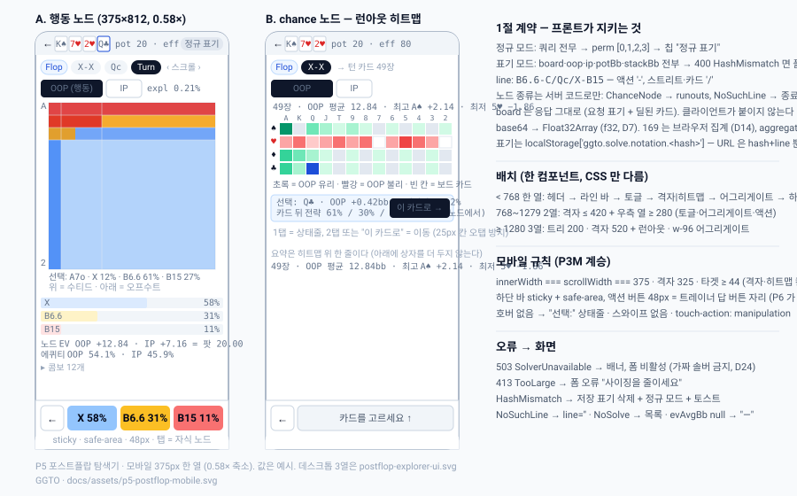
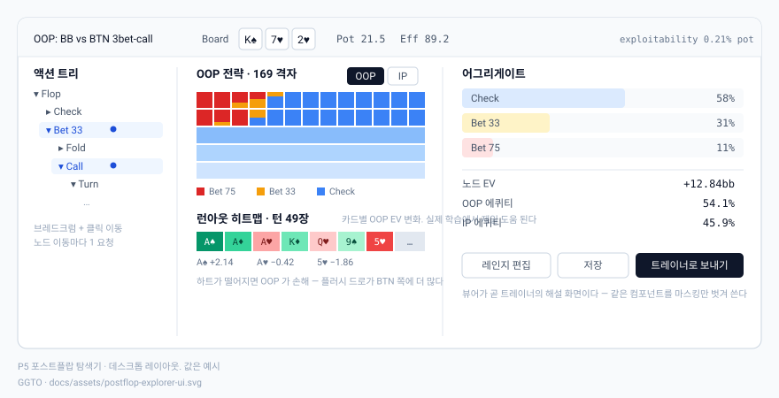

# P5 스펙 — 포스트플랍 탐색 UI: 액션 트리 · 169 격자 · 런아웃 히트맵 · OOP/IP · 어그리게이트 (모바일 우선)

작성: ggto-architect, 2026-09-16 (P4 R2 APPROVED 직후). 대상: ggto-dev.
전제: `DESIGN.md` 2절(계층)·3.3·5.3·5.4, `docs/specs/P4.md` 5.4·5.5·7절 (R2 개정본), `docs/specs/P3M.md` 3·4·5·8절, `docs/DECISIONS.md` D3·D4·D7·D13·D14·D18·D20·D24·D25, `docs/reviews/P4-round2.md`.
**시작 조건: P4 APPROVED — 충족** (`docs/reviews/P4-round2.md`, 2026-09-16).

**이 문서가 정하는 것**: P4 가 만든 `node`/`runouts` 계약을 프론트가 **어떻게 소비하는가** (1절이 그 계약의 클라이언트 측 규정이다). P4 가 만들지 않은 것 중 P5 가 만드는 것은 **프론트뿐**이다 — 서버·솔버 변경은 1.6 의 `ChanceNode` 코드 하나와 12절 이월 항목뿐이다.





## 0. 목표와 완료 그림

`npm run build:solver && npm run build && npm start` 뒤 휴대폰(375×812) 에서:

1. **목록** `/solve`: `GET /api/solves` 의 행이 **카드 목록**으로 (보드 카드 3~5장 슈트 색, 스트리트, `pot 20 / eff 80`, 프리셋 이름, `expl 0.21%`, `4.9MB`, `2시간 전`). 카드를 탭하면 탐색기가 **정규 표기**로 열린다 (`perm` 항등, 헤더에 `정규 표기` 칩). 카드의 `삭제` (44px, 확인 시트) 는 `DELETE /api/solves/:hash`.
2. **새 솔브** (목록 상단 `+ 새 솔브` → 전폭 폼): 보드·OOP·IP·팟·스택·프리셋·목표 정확도. `솔브` 탭 → `POST /api/solve` (`confirm` 없이) → 확인 시트 **"예상 메모리 2.1GB · 약 40초 · 캐시 없음"** (캐시가 있으면 `cached` 로 즉시 3번) → `실행` → `POST` (`confirm:true`) → SSE 진행 바 `iter 200/… · expl 1.23% · 42%` + `취소` → `done` → 탐색기가 **사용자 표기**로 열린다 (쿼리 첨부, 헤더 칩 없음).
3. **탐색기** `/solve?hash=…&line=…`: 헤더(보드 카드 = 요청 표기 + 라인에서 딜된 카드, 팟, 스택, expl) → 라인 바 (세그먼트 브레드크럼) → 169 격자 (행동 플레이어 전략 레이어, 325px) → **하단 고정 바 = 다음 액션 버튼들** (`X 58% · B6.6 31% · B15 11%`, 각 ≥ 48px) — 탭하면 그 노드로. 스트리트가 닫히는 노드(chance)에서는 격자 자리에 **런아웃 히트맵** (49/48 카드, 탭하면 그 카드를 딜한 노드로). `OOP | IP` 토글이 격자의 레인지(도달·에퀴티)를 바꾼다. 어그리게이트 패널 (액션 빈도 막대, `evAvgBb`, 에퀴티) 은 격자 아래.
4. **Rust 없는 PC**: `/solve` 가 `503 SolverUnavailable` 을 받으면 페이지 상단에 `이 PC 에는 솔버가 없습니다 (npm run build:solver)` 한 줄, 목록·폼은 비활성. `/`·`/charts`·`/trainer` 는 그대로 (D24). **가짜 솔버로 떨어지지 않는다.**
5. **데스크톱 (≥ 1280)** 은 DESIGN 5.4 의 3열 (좌 트리 · 중앙 격자+런아웃 · 우 어그리게이트+액션). 태블릿 (768~1279) 은 2열. 한 컴포넌트 트리, 배치만 CSS (P3M 원칙).

**만들지 않는 것**: 레인지 편집기 (기존 `RangeInput` 텍스트 입력만), 커스텀 사이징 폼 (프리셋 3개만 — P4 3.2), 런아웃 사전 솔브·배치, 트레이너 포스트플랍 스팟 (P6 — 단 `트레이너로 보내기` 버튼 **자리**는 만들지 않는다, P6 이 붙인다), 노드 비교·즐겨찾기, 멀티웨이, 라우터 라이브러리 (P2.md 1절 유지 — 경로는 `window.location.pathname` 분기 하나 추가).

## 1. `node` / `runouts` 계약 — 클라이언트 측 규정 (P4.md 7절 R2 를 프론트가 지키는 방법)

이 절이 P5 의 첫 절인 이유: P4 R1 에서 라우트가 **다른 게임의 순열로 200 을 답했고** (MAJOR 2), **턴 카드가 보드에서 사라졌다** (MAJOR 1). 둘 다 R2 에서 닫혔고 계약은 다음과 같다. 프론트는 이 계약 밖의 요청을 만들지 않는다.

### 1.1 두 조회 모드

| 모드 | 요청 | 응답 `perm` | 응답 `board`·`line`·1326 배열의 슈트 | 언제 |
|---|---|---|---|---|
| **정규** | `GET /api/solve/:hash/node?line=…` (설정 쿼리 **전무**) | `[0,1,2,3]` | 정규 보드 공간 (`2c7cKd` 류) | 목록에서 열 때, 표기를 모를 때, `HashMismatch` 폴백 |
| **표기** | `…?line=…&board=&oop=&ip=&potBb=&stackBb=[&sizings=&compressed=1&rakePct=&rakeCapBb=]` | 원본→정규 순열 (항등일 수도 있다) | 사용자가 보낸 표기 | 폼에서 솔브했을 때 (표기를 안다) |

- 다섯 파라미터 `board·oop·ip·potBb·stackBb` 는 **전부 또는 전무**다. 일부만 보내면 400 (R2 실측: 부분집합 30개 전부 400). `sizings` 는 프리셋 이름 (기본 `simple`), `compressed` 는 **문자 `1` 만** 참이다 (`true` 는 거짓으로 읽힌다 — 12절 MINOR), `rakePct`/`rakeCapBb` 는 레이크가 있을 때만.
- 서버는 쿼리에서 `configHash(buildConfig(query))` 를 다시 계산해 `:hash` 와 다르면 **400 `HashMismatch`** 다 (비용 +0.4ms/req, R2 실측). 같은 집합의 다른 레인지 텍스트(`TT+,AQs+` vs `AA-TT,AKs,AQs`)는 같은 해시라 200 이다. 보드 카드를 포함한 콤보를 레인지에 **추가**한 텍스트(`…,KsQs` on `Ks…`)는 원 레인지의 슈트 대칭이 깨져 **다른 해시**다 (400) — 캐시 미스이지 오답이 아니다 (P4 R1 한계 1·MINOR 12).
- **커스텀 사이징으로 만든 솔브** (CLI `--sizings-flop …`, 또는 P4 의 `POST` 가 현재 객체를 받아들이는 경로 — 12절 MINOR R2-1) 는 쿼리로 사이징을 표현할 수 없으므로 **정규 모드로만** 연다. `SolveListItem.sizings` 가 프리셋 이름(`simple|standard|river-heavy`) 이 아니면 (JSON 문자열이면) 탐색기는 표기 쿼리를 붙이지 않고 헤더 칩을 `정규 표기 · 커스텀 사이징` 으로 둔다.

### 1.2 표기의 출처와 보관 — `SolveNotation`

```ts
interface SolveNotation {           // web/src/lib/solveNotation.ts
  board: string;                    // 사용자가 폼에 친 그대로 ("Ks7h2h")
  oop: string; ip: string;          // 레인지 텍스트 그대로 (≤ 4000자)
  potBb: number; stackBb: number;
  sizings: SizingPresetName;
  compressed: boolean;
  rake: { mode: 'none' } | { mode: 'pot'; pct: number; capBb: number };
}
```

- **출처는 폼뿐이다.** 서버 행(`config_json`)은 정규 hex 라 표기를 되살릴 수 없고, 되살릴 필요도 없다 (정규 표기도 유효한 표기다 — P4 R1 판정).
- 보관: `localStorage['ggto.solve.notation.<hash>']` = `JSON.stringify(SolveNotation)`, 폼이 `POST` 응답의 `hash` 를 받는 순간 쓴다 (캐시 히트든 새 잡이든). URL 에는 **넣지 않는다** — 레인지 텍스트 2개가 최대 8KB 라 URL 상한을 넘고, 공유 URL 이 남의 브라우저에서 400 이 되는 것이 정규 모드로 열리는 것보다 나쁘다. URL 은 `?hash=&line=` 둘뿐이다 (D13: `URLSearchParams` 금지, `urlParam` 재사용).
- 탐색기는 열 때 `localStorage` 를 보고 있으면 표기 모드, 없으면 정규 모드. 헤더 칩 `정규 표기` 를 탭하면 **표기 입력 시트** (보드·OOP·IP·팟·스택·프리셋 — 폼과 같은 컴포넌트) 가 뜨고, 제출 시 `node` 를 표기 모드로 한 번 요청해 **200 이면 저장**, `HashMismatch` 면 `이 솔브의 게임이 아닙니다` 를 시트 안에 보여주고 저장하지 않는다. 서버가 검증하므로 클라이언트는 해시를 계산하지 않는다 (`@ggto/solver` 는 `node:` 의존이라 웹에 못 들어온다 — 2절).
- **응답의 `perm` 이 진실이다.** 클라이언트는 자기가 표기 모드로 요청했다는 사실이 아니라 `perm !== [0,1,2,3]` 또는 쿼리 첨부 여부가 아니라, **응답에 `perm` 항등이고 요청에 쿼리를 붙이지 않았을 때만** `정규 표기` 칩을 그린다 (표기 모드인데 순열이 우연히 항등인 경우가 있다 — `Ks7h2h` 가 정규형이 아닐 뿐 사용자의 다른 표기가 정규형과 같을 수 있다).

### 1.3 `line` 만들기 (D3 문법, P4.md 5.4)

세그먼트는 `/` 로 나뉘고, 액션 세그먼트 안의 토큰은 `-` 로 나뉘며, **카드 세그먼트**는 한 장(`Qc`) 이 세그먼트 하나다. 루트는 `''`.

```ts
// web/src/lib/solveLine.ts
childLine('', 'X')                 // 'X'
childLine('X', 'X')                // 'X-X'          (같은 스트리트: '-')
childLine('X-X', 'Qc')             // 'X-X/Qc'       (카드 세그먼트: '/')
childLine('X-X/Qc', 'X')           // 'X-X/Qc/X'     (카드 뒤 첫 액션: '/')
childLine('X-X/Qc/X', 'B15')       // 'X-X/Qc/X-B15'
segments('B6.6-C/Qc/X-B15')        // [{street:'flop', actions:['B6.6','C']}, {card:'Qc'}, {street:'turn', actions:['X','B15']}]
parentLine('X-X/Qc/X-B15')         // 'X-X/Qc/X'     (토큰 하나 뒤로)
parentLine('X-X/Qc')               // 'X-X'          (카드 세그먼트도 토큰 하나)
```

- 규칙: 마지막 세그먼트가 카드이거나 `line === ''` 이면 `/` 없이(루트) 또는 `/` 로 붙이고, 그 외 액션 토큰은 `-`, 카드 토큰은 항상 `/`. 카드 토큰 판별은 `@ggto/core` `parseCard` 성공 여부 (액션 토큰 `A` 와 카드 `Ah` 는 길이로 갈린다).
- 액션 토큰은 응답 `actions` 를 **그대로** 쓴다 (`X`·`C`·`F`·`A`·`B6.6`·`R15`). 클라이언트가 금액을 만들지 않는다 — 정규형이 아니면 `NoSuchLine` 이다.
- 프리플랍 `breadcrumbSeqs`(`ChartsPage`) 는 `-` 만 안다. **재사용하지 않는다** (카드 세그먼트 때문에). `solveLine.ts` 는 P6 가 `Solve{hash, line}` 스팟 키에 그대로 쓴다.

### 1.4 노드 종류와 요청 분기

| 라인의 노드 | `node` | `runouts` | 프론트 |
|---|---|---|---|
| 행동 노드 | 200 | 400 `NotChanceNode` | 격자 + 액션 바 |
| chance (스트리트 닫힘, 리버 전) | 400 **`ChanceNode`** (1.6) | 200 (49 또는 48 장) | 히트맵 + `카드를 고르세요` |
| 터미널 (폴드·리버 쇼다운·올인 뒤 리버) | 400 `NoSuchLine` | 400 | 액션 바에 `종료 노드 — 이전으로` |

- 클라이언트는 **노드 종류를 추측하지 않는다** (`X-X` 면 chance 라는 규칙을 코드에 넣지 않는다 — 올인 콜 뒤의 스트리트 등 예외가 있다). 자식으로 이동할 때 `node` 를 먼저 묻고 `ChanceNode` 면 `runouts` 로 바꾼다. TanStack 키가 다르므로 두 요청이 캐시된다.
- `runouts` 의 `cards[i].strategyRoot` 는 그 카드를 딜한 뒤 **행동 플레이어의 루트 액션 평균 전략**이고 액션 순서는 그 자식 노드의 `actions` 와 같다 — 히트맵 셀 탭 → `childLine(line, card)` → `node` 로 액션 이름을 받는다.

### 1.5 응답 소비 규칙

- **base64 → `Float32Array` 뷰** (D7): `web/src/lib/f32.ts` `decodeF32Rows(b64, rows)` — `atob` → `Uint8Array` → 4 바이트 정렬을 위해 **복사 한 번** → `new Float32Array(buf, i*1326*4, 1326)`. `Buffer` 없음 (브라우저). 길이가 `rows × 1326 × 4` 가 아니면 throw (조용히 잘린 배열로 그리지 않는다).
- **격자는 1326 에서 브라우저가 집계한다** (D14, P2 `chartGrid.ts` 의 `aggregateNode` 규칙 그대로 재사용). 응답의 `aggregate` 는 **대조용**이다: 8.1 의 테스트가 "브라우저 집계 == 서버 `aggregate`" 를 픽스처로 고정한다 (두 집계 규칙이 갈라지면 여기서 깨진다). 런타임에서 `aggregate` 는 어그리게이트 패널의 액션 빈도(도달 가중 평균 = `Σ_c reach[c]·strategy[a][c] / Σ_c reach[c]`) 에만 쓴다.
- `evAvgBb` 합 = `potChips/100` 을 **화면에 표시**한다 (`노드 EV OOP +12.84 · IP +7.16 = 팟 20.00`). 도달 질량 0 인 노드는 `evAvgBb` 가 `null` 로 올 수 있다 (P4 MINOR 11 — 12절에서 데몬을 고쳐 `[0,0]` + `reachable:false` 로 바꾼다; 그때까지 `null` 은 `—` 로 그린다. **NaN 을 그리지 않는다.**)
- `ev` 는 **행동 플레이어 기준** `stack_delta_from_node` (D25). 콤보 패널의 `EV` 열은 그 플레이어의 것이고, `OOP|IP` 토글이 행동 플레이어가 아닌 쪽이면 EV 열을 숨긴다 (상대 콤보별 EV 는 응답에 없다 — 있다고 꾸미지 않는다).
- 헤더의 보드는 응답 `board` 다 (요청 표기 + 딜된 카드, R1 MAJOR 1 수정). 클라이언트가 폼의 보드 문자열에 카드를 이어 붙이지 **않는다**.

### 1.6 P5 에서 유일하게 바꾸는 서버·데몬 계약

- `nodes.rs` `node_response`: chance 노드의 오류 코드를 `BadRequest` → **`ChanceNode`** 로 (메시지 그대로). `postflopCli.ts` 는 코드를 그대로 통과시키고, 라우트 `toHttp` 는 `ChanceNode` 를 400 에 넣는다. `SolverError` 코드 유니온에 추가. 테스트: `cargo test` 필드명 단언 하나 + 서버 라우트 테스트 (`FakeSolver` 가 `X-X` 에서 `ChanceNode` 를 던지도록 — 현재 가짜 트리는 chance 를 모른다, 8.1).
- 그 외 서버 변경은 12절 이월 항목에 한정한다. **`node`/`runouts` 응답 모양은 바꾸지 않는다.**

## 2. 계층 경계 (P4 2절에 추가)

- `web/src` 는 `@ggto/solver` 를 **import 하지 않는다** (`node:sqlite`·`child_process` 의존). 웹이 쓰는 타입은 `@ggto/protocol` 의 `Solve*` DTO 뿐이다. grep 게이트: `web/src` 에 `@ggto/solver` 문자열 없음.
- `web/src` 에 `postflop` 문자열 없음 (P4 2절 유지). 정규 보드를 **계산**하지 않는다 — 응답이 준 `board`·`perm` 을 표시할 뿐이다.
- 169 격자 하드코딩 금지 (D14) — 격자 셀은 1326 배열 집계에서만 나온다.
- 액션 문자열은 `@ggto/core` `parseActionSequence` 의 상위집합(카드 세그먼트) 이므로 `solveLine.ts` 는 core 의 토큰 정규식을 **가져다 쓰고** 카드 세그먼트만 덧붙인다. 새 문법을 만들지 않는다.

## 3. 화면 · 라우트

`App.tsx` 분기 하나 추가: `path === '/solve' || path.startsWith('/solve/')` → `SolvePage`. 헤더 내비 (`ChartsPage` 의 `href="/"`·`/trainer` 줄) 에 `Solve` 링크 추가 (44×44).

### 3.1 `/solve` — 목록 + 새 솔브 (`SolvePage`, `phase: 'list' | 'form' | 'running' | 'explore'`)

- 목록: `useSolves()` (`GET /api/solves`, `staleTime 10s`). `< md` 카드 (P3M 6.4 의 `AggRow` 카드 규칙), `≥ md` 표. 정렬 `lastUsedAt` 내림차순. 카드 탭 → `explore` (정규 모드, `line=''`). 삭제 버튼 → 확인 시트 → `DELETE` → 목록 무효화. 총량 줄 `4.9MB / 20GB`.
- 폼 (`SolveForm`): `RangeInput` 두 개 (OOP·IP, 기존 컴포넌트 — 파싱 결과 콤보 수를 옆에), 보드 입력 (`inputmode="text"`, 3~5장, `parseCards` 로 즉시 검증), 팟·스택 (`inputmode="decimal"`), 프리셋 `select` 전폭 (`simple | standard | river-heavy` — 라벨에 사이즈 목록을 병기), 목표 정확도 `select` (`0.5% · 0.3% · 0.1%`), `compressed` 토글은 **만들지 않는다** (P4 3.4-R: 채점 비적합, 기본 비압축). 제출 → 1.2 의 `SolveNotation` 을 만들어 두고 `POST` (`confirm` 없이).
- 확인 시트 (`EstimateSheet`): `estMemoryBytes` (GB 소수 1자리), `estSeconds` (초/분), `cached` 면 `캐시됨 — 바로 열기`. `413 TooLarge` 는 시트 대신 폼 아래 오류 (`사이징을 줄이세요`). `실행` (48px 전폭) → `POST confirm:true`.
- 진행 (`SolveProgress`): `EventSource('/api/solve/:jobId/events')`. `progress` → 바 + `iter · expl · pct`. `done` → `localStorage` 저장 → `explore`. `failed` → 오류 + `다시`. `취소` → `DELETE /api/solve/:jobId` → `cancelled` → 목록. 연결이 끊기면 (`onerror`) 3초 뒤 재연결 — 서버가 현재 상태를 먼저 보내므로 놓친 `done` 을 받는다 (P4.md 7절).

### 3.2 탐색기 (`SolveExplorer`) — 한 컴포넌트, 세 배치

한 열 (< 768, **기본 설계 대상**):

1. 헤더 `h-11`: `← 목록` (44×44) · 보드 카드 (응답 `board`, 각 24×32, 슈트 색 `palette.ts`) · `pot 20 · eff 80` · `expl 0.21%` · 칩 `정규 표기` (1.2). 넘치면 `truncate`.
2. 라인 바 (`LineBar`, `data-testid="line-bar"`): 세그먼트 칩 가로 스크롤 (`overflow-x-auto`, 세로 스크롤 금지). `Flop · X-X · Qc · X-B15` 처럼 스트리트 라벨 + 액션 + 카드. 칩 탭 = 그 접두 라인으로 이동 (`min-h-11`). 루트 칩 `Flop`.
3. 플레이어 토글 (`OOP | IP`, 44px, `data-testid="player-toggle"`): 격자에 어느 쪽 레인지를 그리는가. **행동 플레이어가 기본**이고 라인이 바뀌면 행동 플레이어로 되돌아온다. 행동 플레이어 쪽에서는 전략 레이어, 상대 쪽에서는 도달·에퀴티 레이어(전략 없음 — 1.5).
4. 격자: `ChartNodeView` 재사용 (P3M 3절 규칙: 325px, `compactLabels`, 상태줄 `선택: A7o`, 콤보 패널 접힘 + 아래 D20). `chance` 노드에서는 격자 대신 **런아웃 히트맵** (3.3).
5. 어그리게이트 (`AggregatePanel`): 액션별 막대 (`actionColors`, 빈도 %), `노드 EV OOP · IP · = 팟`, `에퀴티 OOP · IP` (도달 가중 평균 — `equity` 1326 을 `reach` 로 가중), 팟·스택.
6. **하단 고정 바** (`data-testid="action-bar"`, P3M 4절 규칙 그대로 — `sticky bottom-0`, 불투명, safe-area, ≥ 64px): 행동 노드에서는 `[←] [X 58%] [B6.6 31%] [B15 11%]` — `←` 는 44×44, 액션 버튼은 `flex-1`, 48px, 색 `actionColors`, 글자 `slate-950`. **탭 = 그 자식 노드로 이동** (이것이 트레이너의 답 버튼 자리와 같다 — P6 는 이 바를 마스킹해 출제한다). chance 노드에서는 `[←] [카드를 고르세요 ↑]` (비활성 안내). 터미널이면 `[←] [종료 노드]`. 액션이 5개를 넘으면 (프리셋 상 최대 = 사이즈 4 + X/C + F/A = 6) 두 줄 (`flex-wrap`, 각 44px).

2열 (768~1279): 왼쪽 격자 ≤ 420 + 오른쪽 열 ≥ 280 (토글 → 어그리게이트 → 액션 버튼 세로). 라인 바 위. 런아웃은 격자 아래 전폭. 하단 바 없음 (`hidden md:block` 으로 오른쪽 열의 같은 `ActionButtons`).

3열 (≥ 1280): 좌 200px **트리** (`LineTree`: 현재 라인의 조상 + 각 조상의 형제 액션 — 전체 트리를 미리 받지 않는다, 노드 이동마다 1 요청; DESIGN 5.4), 중앙 격자 520 + 아래 런아웃, 우 `w-96` 어그리게이트 + 액션 버튼. 기존 `postflop-explorer-ui.svg` 가 이 배치다.

### 3.3 런아웃 히트맵 (`RunoutHeatmap`, `data-testid="runouts"`)

- 격자 **13 열(랭크 A→2) × 4 행(♠♥♦♣)** = 52 칸, 보드/제외 카드는 빈 칸. 375px 에서 칸 = `(343 − 4×2) / 13 ≈ 25px` — 셀 안에 랭크만 (`A`), 슈트는 행 라벨. **탭 타겟이 25px 인 것은 격자 셀과 같은 예외** (P3M 4절) — 대신 탭하면 먼저 상태줄에 `Q♣ · OOP +2.14bb · 에퀴티 54%` 가 뜨고 **같은 칸을 다시 탭** 하거나 상태줄의 `이 카드로 →` (44px) 를 누르면 이동한다 (오탭으로 노드가 바뀌는 것을 막는다).
- 색: `evOop − mean(evOop)` 를 `[−max|d|, +max|d|]` 로 **대칭** 정규화, 초록(+)/빨강(−), 0 = 회색. OOP/IP 토글에 따라 `evIp` 로 바꾼다 (합이 팟이라 부호만 뒤집힌다 — 그래도 토글은 사용자 기대를 지킨다). 범례 한 줄 `초록 = OOP 에 유리`.
- 히트맵 위 요약: `49장 · OOP 평균 12.84bb · 최고 A♠ +2.14 · 최저 5♥ −1.86`.
- `strategyRoot` 는 셀 아래 미니 막대 (`≥ md` 에서만; 375 에서는 상태줄에 숫자로).

## 4. 데이터 흐름 (TanStack Query, P1.md 4.4 규칙 — 서버 데이터는 스토어에 두지 않는다)

```ts
// web/src/api/solve.ts (fetch), web/src/api/queries.ts (훅 추가)
useSolves()                                  // ['solves']
useSolveNode(hash, line, notation | null)    // ['solve-node', hash, line, notationKey]   notationKey = hash + JSON(notation)?? '' 
useSolveRunouts(hash, line, notation | null) // ['solve-runouts', hash, line, notationKey]
useSolveMutation()                           // POST (estimate / confirm)
```

- `staleTime` 5분 (솔브 결과는 불변 — 재솔브(REPLACE)는 같은 해시로 새 파일이지만 **같은 세션에서 재솔브하면 `queryClient.invalidateQueries(['solve-node', hash])`** 를 `done` 에서 부른다. P4 R1 MAJOR 3 의 프론트 판이다).
- `useSolveNode` 는 `ChanceNode` 오류를 **오류가 아니라 데이터**로 돌려준다: `{ kind: 'chance' } | { kind: 'node', node } | { kind: 'terminal' }` — 그래야 `retry` 가 돌지 않고 `useSolveRunouts` 가 `enabled: kind === 'chance'` 로 이어진다.
- 오류 매핑 (`ApiError.code`): `SolverUnavailable` → 페이지 배너 (0절 4). `HashMismatch` → 표기 시트 안 오류 (1.2) 또는 (열 때 `localStorage` 표기가 틀렸으면) `localStorage` 삭제 + 정규 모드 재요청 + 토스트 `저장된 표기가 이 솔브와 맞지 않아 정규 표기로 엽니다`. `NoSuchLine` → `line=''` 로 되돌리고 토스트. `NoSolve` (404) → 목록으로. `NotLoaded` (404, 파일 소실) → 목록 무효화 + 토스트.
- 응답 크기 ~150KB/노드. 노드 이동마다 1 요청 (DESIGN 5.3). 프리페치 없음 (P5). 브레드크럼 왕복은 캐시 적중.

UI 상태 (`store/ui.ts` 추가, 화면 상태만): `solveHash`, `solveLine`, `solvePlayer: 'oop'|'ip'|null`(null = 행동 플레이어), `solvePhase`, `runoutPick: string|null`(상태줄에 올린 카드). URL 동기화는 `ChartsPage` 의 `replaceState` 패턴 (`?hash=&line=`).

## 5. 모바일 우선 요구 (P3M 3·4·5절 계승 — 새 규칙 없음)

- 375×812: `innerWidth === scrollWidth === 375` (모든 phase: 목록·폼·확인 시트·진행·탐색기 행동 노드·chance 노드·터미널). 격자 325. 히트맵 전폭. 하단 바 `bottom ≤ innerHeight`, `top ≥ innerHeight × 0.6` (행동 노드).
- 터치 타겟: `< md` 또는 `pointer: coarse` 에서 모든 `button/a/input/select/label` ≥ 44×44 (격자 셀·히트맵 칸 예외 — 3.3 의 2단계 탭).
- 대비: `actionColors` 위 `slate-950` (P3M 5절 측정값 유지). 히트맵 초록/빨강 위 글자는 `slate-950`, 회색 칸은 `slate-700`.
- 호버 없음: 히트맵·격자 상태줄은 `선택:` 접두. 스와이프 없음. `touch-action: manipulation`.
- 데스크톱 회귀: `check:desktop` 1280×720 과 1500×1000 에서 3열이 세로 스크롤 없이 격자·어그리게이트·액션 버튼이 보인다 (런아웃은 스크롤 아래 허용).

## 6. 컴포넌트 목록 (파일 ≤ 300줄)

| 파일 | 역할 |
|---|---|
| `web/src/pages/SolvePage.tsx` | phase 분기, URL 동기화, 503 배너 |
| `web/src/components/solve/SolveList.tsx` | 카드/표, 삭제 시트 |
| `…/SolveForm.tsx` | 폼 + 표기 입력 시트 (같은 컴포넌트, `mode: 'new' | 'notation'`) |
| `…/EstimateSheet.tsx`, `SolveProgress.tsx` | 3.1 |
| `…/SolveExplorer.tsx` | 배치 3종, `useSolveNode`/`useSolveRunouts` 연결 |
| `…/LineBar.tsx`, `LineTree.tsx` | 1.3 세그먼트 → 칩/트리 |
| `…/ActionButtons.tsx` | 하단 바 / 우측 열 공용 (트레이너 `AnswerBar` 와 같은 CSS 규칙, 컴포넌트는 별도 — 채점 상태가 없다) |
| `…/AggregatePanel.tsx` | 3.2-5 |
| `…/RunoutHeatmap.tsx` | 3.3 |
| `web/src/lib/solveLine.ts`, `f32.ts`, `solveNotation.ts`, `runoutScale.ts` | 순수 함수 — jsdom 없이 테스트 |
| `web/src/api/solve.ts` | fetch 5개 (`solves`, `node`, `runouts`, `post`, `delete`) + 쿼리 문자열 조립 (`encodeURIComponent`, D13) |

`ChartNodeView`·`RangeGrid`·`ComboPanel`·`RangeInput`·`actionColors`·`gridSizeFor`·`useContainerWidth` 는 **재사용**한다. `ChartNodeView` 에 필요한 prop 확장은 "EV 열 숨김" (`showEv: boolean`) 하나여야 한다 — 그 이상이면 스펙 개정.

## 7. 서버 · 솔버 변경 (1.6 + 12절만)

없다, 1.6 의 `ChanceNode` 와 12절의 P5 항목을 빼면. `GET /api/solves` 의 `SolveListItem.sizings` 가 `JSON.stringify(cfg.sizings)` 인 것은 그대로 두고 (프론트가 프리셋 표에서 역매핑해 이름을 찾고, 못 찾으면 `커스텀`), 12절 R2-1 이 `POST` 의 커스텀 객체를 막는다.

## 8. 테스트 · DoD

### 8.1 `web/test` (jsdom — 로직만)
- `solveLine.test.ts`: 1.3 의 표 전부 + `parentLine(childLine(l, t)) === l` 왕복 (액션·카드 토큰 100 조합 무작위) + `segments` 가 `B6.6` 을 `.` 에서 쪼개지 않는다 (D3 회귀) + 카드 세그먼트 뒤 첫 액션이 `/` 로 붙는다.
- `f32.test.ts`: 알려진 f32 4개(`[0, 1, −1.5, 3.4e38]`) 를 little-endian base64 로 만든 픽스처 → 디코드 값 일치; 길이 불일치 throw; 3 rows 분할 오프셋.
- `solveNotation.test.ts`: 저장/복원 왕복, 손상된 JSON → null, 쿼리 문자열 조립이 `+` 를 `%2B` 로 (D13), `compressed:true` → `compressed=1`.
- `runoutScale.test.ts`: 대칭 정규화 (`[+2, −1]` → max 2, `−1` 이 −0.5), 전부 0 이면 회색.
- **집계 대조** `solveAggregate.test.ts`: `packages/solver` 의 `toNodeResponse` 로 만든 **픽스처 JSON** (`web/test/fixtures/solve-node.json`, 생성 스크립트 `packages/solver/scripts/make-web-fixture.mjs` — 커밋된 파일) 을 브라우저 집계 함수에 넣어 `aggregate.strategy/ev/reach` 와 `1e-6` 안에서 같다. 픽스처는 **3-cycle perm** 으로 만든다 (R1 MAJOR 6 의 교훈 — involution 은 방향을 못 잡는다).
- `SolveExplorer.test.tsx`: `ChanceNode` 응답 → 히트맵 렌더 + 하단 바 `카드를 고르세요`; 행동 노드 → 액션 버튼 n개 = `actions.length`, 탭 → `line` 이 `childLine` 결과; `HashMismatch` (열 때) → `localStorage` 삭제 + 정규 모드 재요청 (fetch 모킹 2회 호출 단언); `evAvgBb: null` → `—`; 상대 플레이어 토글 → EV 열 없음; `perm` 항등 + 쿼리 없음일 때만 `정규 표기` 칩.
- `SolvePage.test.tsx`: 503 → 배너 + 폼 비활성 + 다른 페이지 링크 존재; `TooLarge` 413 → 폼 오류; `cached:true` → 진행 화면 없이 `explore`.
- D8 문구 게이트 유지 (트레이너 테스트 3건은 건드리지 않는다).
- grep 게이트: `web/src` 에 `@ggto/solver`·`postflop` 없음; 169 하드코딩 없음 (D14 게이트 기존 것).

### 8.2 서버·데몬
- `cargo test`: chance 노드 `node` → 코드 `ChanceNode` (필드명 단언). 서버 `solve.test.ts`: `FakeSolver` 가 `X-X`(플랍)·`X-X/Qc/X-X` 에서 `ChanceNode` → 라우트 400 `ChanceNode`.
- 12절 P5 항목 각각의 테스트 (표에 적었다).

### 8.3 `npm run check:mobile` / `check:desktop` 추가 페이지
- `/solve` 목록 (행 ≥ 1 — **실제 바이너리로 작은 턴 스팟을 먼저 솔브**한다: `tools/shots/lib/solve-seed.mjs` 가 `GGTO_SOLVER_BIN` 이 있으면 `POST /api/solve` 로 `Ks7h2hQc` simple 100 iter 를 만들고, 없으면 `SKIP solve pages (no solver binary)` 를 **한 줄 찍고 exit 0** — 가짜 솔버로 대체하지 않는다, D24), 폼, 탐색기 루트(행동), `X-X`(chance, 히트맵), `X-X/9d`(리버 행동), 터미널.
- 375: `innerWidth/scrollWidth === 375`, 하단 바 위치·높이, 타겟 ≥ 44, 히트맵 52칸 폭 합 ≤ 343. 태블릿 3폭 (768/800/829) 2열 겹침 0 프레임 (P3M R2 게이트 재사용). 데스크톱 2 해상도 3열.
- 스크린샷은 `tools/shots/out/` (P4 12절 규칙), 리뷰에 `--publish`.

### 8.4 Definition of Done
1. `npm run ci` exit 0 (Rust 없이) **그리고** `npm run ci:solver` exit 0. fresh clone `clone → install → seed → ci` exit 0 (리뷰어).
2. 0절 1~5 시나리오를 **휴대폰 실기기 또는 Browser 도구 `mobile` 프리셋**으로 찍은 스크린샷 6장 (`docs/reviews/assets/p5-*.png`).
3. `check:mobile`·`check:desktop` exit 0, 8.3 의 SKIP 줄이 개발 PC 에서는 나오지 않는다.
4. 8.1 테스트 존재, 이름에 절 번호. 집계 대조 픽스처가 3-cycle 이라는 것을 픽스처 파일 머리에 적는다.
5. 12절 표의 P5 항목 전부 닫힘 (각 항목의 테스트 이름 표).
6. 새 npm 의존성 0. `web/src` 에 `@ggto/solver` 없음.
7. 11절 DESIGN/DECISIONS 갱신. 다이어그램 SVG (D18) — `p5-postflop-mobile.svg` 는 구현과 다르면 갱신.
8. 잔여 프로세스 0 (`ggto-solver-cli`, 7791/7777) — 보고에 `netstat` 한 줄.

## 9. 벤치 (공유 하네스, 기존 규칙)

- `web` 번들 크기 증가 ≤ 60KB gzip (히트맵·트리는 캔버스가 아니라 DOM 이라 작아야 한다). 기존 `bench` 스위트에 `decodeF32Rows ×1000` (예산 50ms — 150KB 디코드가 프레임을 막지 않는다) 과 `aggregate 1326→169 ×1000` (P2 예산 그대로).
- 노드 이동 체감: `node` 요청 → 격자 페인트 < 100ms (로컬, 캐시 적중 데몬). `performance.mark` 로 `check:desktop` 이 한 번 잰다 (게이트 아님, 기록).

## 10. 문서 규칙

D18 그대로. 이 문서의 두 다이어그램: `docs/assets/p5-postflop-mobile.svg` (신규, 375 한 열 — 행동 노드 / chance 노드 두 프레임), `docs/assets/postflop-explorer-ui.svg` (데스크톱, R2 에서 헤더 칩·`line` 문법을 D3 로 갱신).

## 11. DESIGN / DECISIONS 갱신 (개발 에이전트가 한다, 리뷰 대상)

- `DESIGN.md` 5.4: "좌/중앙/우/하단" 을 **"모바일 한 열 (헤더 → 라인 바 → 격자|히트맵 → 어그리게이트 → 하단 액션 바), ≥ 1280 에서 3열"** 로. 5.3 예시에 `perm` 필드. 8절 로드맵 P5 행 "완료 조건: `check:mobile` 에 `/solve` 5 화면 포함, exit 0".
- `DECISIONS.md`: **D26** 표기(`SolveNotation`)는 클라이언트 `localStorage` 에만 — 서버 행은 정규 hex 뿐이고 URL 은 `hash+line` 뿐 (1.2 의 이유). **D27** 노드 종류는 서버 코드(`ChanceNode`/`NoSuchLine`) 로만 판별, 클라이언트 추측 금지 (1.4). **D28** 압축 솔브(`compressed:true`) 는 **채점에 쓰지 않는다** (P4.md 3.4-R R2 실측 — 플랍에서 수렴 후에도 비압축 대비 콤보별 EV 차 max 0.22bb, 23/102 쌍 > 0.05bb).

## 12. P4 이월 항목 배치 (R1 MINOR 12 + R2 MINOR 4)

| 출처 | 항목 | 배치 | 어떻게 / 테스트 |
|---|---|---|---|
| R1 MINOR 1 | `core/isomorphism.ts` 미사용 import | **P5** | 삭제. lint |
| R1 MINOR 2 | DESIGN 3.3 `.` 문법 | **R2 에서 닫힘** | — |
| R1 MINOR 3 | `queue.ts` failed 경로 `.part` 잔류 | **P5** | `#run` catch 에서 `rmSync(outPath,{force:true})`. 테스트: Stalled 뒤 `.part` 없음 |
| R1 MINOR 4 | 같은 해시 큐/실행 중 `confirm:true` 재요청이 estimate 프로세스 하나 더 | **P5** (폼 더블탭이 정확히 이 경로다) | `queue.byHash(hash)` 먼저 → 기존 잡 `jobId` 반환. 테스트: 두 번째 POST 가 같은 `jobId`, `estimateCalls` 1 |
| R1 MINOR 5 | 취소 500ms 미보장 (큰 플랍) | **P5** (취소 버튼이 생긴다) | `cancel` 응답 500ms 없으면 kill. 통합 테스트: 플랍 wide 스팟 kill 경로 |
| R1 MINOR 6 | 4.2 문구 (`evictFor` 가 인덱스 반영 전) | **P5** 문서 | P4.md 4.2 한 줄 |
| R1 MINOR 7 | 해시에 solver id 없음 | **P5** (P6 가 `Solve{hash,line}` 키를 저장하기 전에) | 정규 JSON `v: 2` + `solver` 필드. 테스트: id 바꾸면 해시 갈라짐. 기존 캐시는 `repair()` 가 `v:1` 행을 지운다 (개발용 캐시뿐) |
| R1 MINOR 8 | 콜드 스타트 벤치 4.9MB | **P6** | 플랍 322MB 로 |
| R1 MINOR 9 | 소문자 액션 뮤턴트 | **P5** | `assertCanonicalLine('x')` throw 테스트 |
| R1 MINOR 10 | 스펙 3.5 "`cargo test` 가 evprobe" 문구 | **P5** 문서 | P4.md 3.5 |
| R1 MINOR 11 | 도달 0 노드 `evAvgBb` NaN → `null` | **P5** (UI 가 그린다) | 데몬: `[0,0]` + `reachable:false`. 프론트 `—`. 테스트: cargo + 라우트 |
| R1 MINOR 12 | 24 순열 결합 최소 대표 | **P6** | 캐시 효율만 |
| **R2 MINOR 1** | `POST /api/solve` 가 커스텀 `sizings` 객체를 받는다 (P4.md 3.2 "API 는 프리셋만" 위반) | **P5** | 라우트에서 `isSizingPreset` 아니면 400 `OutOfRange`. 테스트: 객체 → 400. CLI 는 그대로 (1.1 의 정규 모드) |
| **R2 MINOR 2** | `compressed=true` 쿼리가 거짓으로 읽힌다 | **P5** | `1`·`true` 참, `0`·`false`·없음 거짓, 그 외 400. 테스트 |
| **R2 MINOR 3** | `sizings=standard` 만 있는 쿼리가 "쿼리 없음" 으로 200 | **P5** | 다섯 파라미터 외의 설정 파라미터만 있어도 400 (같은 규칙). 테스트 |
| **R2 MINOR 4** | `Solver.invalidate` 훅이 fire-and-forget (순서 미보장) | **수용, 문서만** | P4.md 5.1 에 이미 적혀 있다. 정답 보증은 stamp. 추가 조치 없음 |

## 13. 리뷰어가 추가로 돌릴 것 (미리 알려준다)

- Browser 도구 `mobile` 프리셋으로 0절 1~3 을 직접: 폼 → 확인 시트 → 진행 → 탐색기. 하단 바 탭으로 `X` → `X-X`(히트맵) → `Qc` 2단계 탭 → `X-X/Qc` 노드의 헤더 보드가 **4장**이고 `line-bar` 가 `Flop · X-X · Qc · Turn` 인지.
- 목록에서 연 탐색기(정규 모드)의 `정규 표기` 칩 → 표기 시트에 `Kd7s2s` 표기 입력 → 200 → 헤더 보드가 `Kd7s2s`, `AsKs` 셀의 EV 가 정규 모드의 대응 셀과 같은지 (R2 route2 (g) 의 UI 판).
- 표기 시트에 다른 게임 → `HashMismatch` 문구, `localStorage` 에 저장 안 됨.
- 픽스처 집계 대조 테스트에 `inv = perm` 뮤턴트를 심어 죽는지 (3-cycle 픽스처 요구의 이유).
- `evAvgBb` 합 = 팟 표시가 실제 데몬 응답에서 `20.00 = 20.00` 인지, 도달 0 라인 (`B15-R40-C` 류 희귀 라인) 에서 `—` 인지.
- `check:mobile` 을 `GGTO_SOLVER_BIN` 없이 돌려 `SKIP` 한 줄 + exit 0, 있으면 5 화면 PASS.
- 잔여 프로세스·포트.
