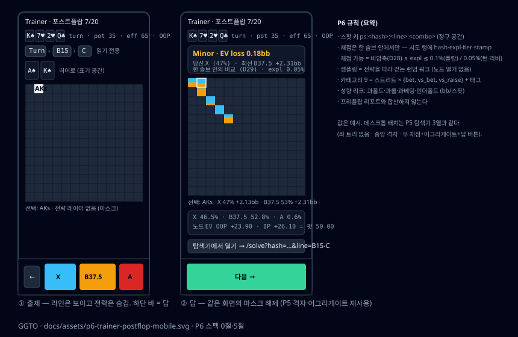

# P6 스펙 — 트레이너 v2: 포스트플랍 스팟 (한 솔브 안에서만 채점 · 랜덤 워크 샘플링 · 성향 리크)

작성: ggto-architect, 2026-09-16 (P5 R1 APPROVED 직후). 대상: ggto-dev.
전제: `docs/specs/P3.md` 3·5·6절 (스팟 키·채점·SRS·리포트), `docs/specs/P4.md` 3.4-R·5.4, `docs/specs/P5.md` 1·3.2·4절, `docs/reviews/P4-round2.md` 3절, `docs/reviews/P5-round1.md`, `docs/DECISIONS.md` D8·D20·D25·D26·D27·D28.
**시작 조건: P5 APPROVED — 충족** (`docs/reviews/P5-round1.md`).

**착수 순서에 관한 주의**: `docs/GAPS.md`(사용자 작성, `baba47b`)는 P7(6-max 프리플랍 생성기)·P8(게임 타입 분리)을 **P6 보다 먼저** 하자고 적고 있다. 이 문서는 P6 의 내용을 정하는 것이지 순서를 정하는 것이 아니다. P6 는 P7·P8 에 의존하지 않는다 (솔브 결과와 `@ggto/trainer` 만 쓴다). 순서는 사용자가 정한다.



## 0. 목표와 완료 그림

`npm run build:solver && npm run build && npm start` 뒤 휴대폰(375×812)에서:

1. `/trainer` 세션 폼에 **`프리플랍 | 포스트플랍`** 탭. 포스트플랍 탭은 `GET /api/trainer/solves` 가 준 **채점 가능 솔브** 목록(보드 카드·스트리트·`expl`)에서 고른다 (기본 전부). 채점 불가 솔브(압축·정확도 미달, 3.3)는 회색으로 `채점 불가 — expl 0.49% > 0.05%` 이유가 붙는다. 솔버 없는 PC 는 탭이 비활성 (`이 PC 에는 솔버가 없습니다`), 프리플랍 탭은 그대로 (D24).
2. 세션 시작 → 첫 스팟: 헤더 `Ks7h2hQc · turn · pot 35 · eff 65 · OOP`, 히어로 카드 `A♠ K♠`, 라인 바 `Turn › B15 › C` … 아니, **라인 바는 마스킹하지 않는다** — 지금까지의 액션은 문제의 일부다. 격자는 P5 탐색기의 `ChartNodeView` 를 `masked` 로 (히어로 클래스만 강조), **하단 고정 바 = P5 `ActionButtons` 의 자리**에 답 버튼 (`X · B37.5 · A`, 빈도 숨김). 탭 = 답.
3. 답 → 같은 화면에서 마스크 해제: 전략 레이어 + 콤보 패널(히어로 콤보 행 강조) + 채점 박스 `Minor · EV loss 0.18bb · 당신 X (47%) · 최선 B37.5 +2.31bb` + **어그리게이트 패널** (P5 `AggregatePanel`) + `탐색기에서 열기 →` (P5 딥링크 `?hash=&line=`). 저빈도 액션이라도 EV loss < 0.05bb 면 `Perfect` (D8).
4. 20문제 끝 → 세션 리포트: 프리플랍과 **분리된** 포스트플랍 총합(EV loss, bb/100, verdict 분포), 카테고리(3.4)·스트리트·솔브별 분해, **성향** (`과폴드 +0.21bb/스팟 · 12회`). 30d 리포트에 같은 분해 + 리크.
5. 같은 스팟 키가 SRS 로 다시 나오면 **같은 솔브(같은 파일)** 로 채점된다. 그 사이 재솔브(REPLACE)로 파일이 바뀌었으면 시도 행에 `basisChanged` 가 남고 리포트가 그 시도를 리크 계산에서 **뺀다** (3.2).

**만들지 않는 것**: 솔브 만들기 (P5 폼이 한다 — 트레이너는 있는 것만 쓴다), 런아웃 문제 ("어느 카드가 좋은가" — 답이 액션이 아니다), 멀티웨이, 사이징 자유 입력 (답 후보는 노드의 `actions` 뿐), 프리플랍 트레이너 변경 (P3 코드 경로는 그대로 — 스팟 키 접두로 갈린다), 노드 열거 RPC (3.5 의 랜덤 워크가 대신한다).

## 1. 채점 근거 — P4 R2 가 남긴 사실이 설계를 정한다

`docs/reviews/P4-round2.md` 3절 (`evloss.mjs`, 턴 `Ks7h2hQc`):

| 비교 | maxΔ(evloss) | Perfect(≤0.05bb) 뒤집힘 | 최적 액션 바뀜 |
|---|---|---|---|
| 비압축 0.1% vs 비압축 0.05% (같은 게임, 두 솔브) | **0.257bb** | **2/60** | 3/30 콤보 |

콤보별 EV loss 가 **솔브 사이에서** 0.26bb 까지 흔들린다. 그러므로:

- **채점 임계 0.05bb 는 한 솔브 안의 비교에서만 유효하다.** 스팟은 `(hash, line, combo)` 로 식별되고 채점은 그 해시의 **지금 파일** 로 한다. 두 솔브의 EV 를 섞어 비교하는 계산은 어디에도 없다 (리포트의 평균은 각 시도의 `evLossBb` 를 더할 뿐이다 — 그것은 "그 시도가 그 솔브 안에서 잃은 값" 이다).
- 시도 행은 **채점 근거를 함께 저장**한다: `solve_hash`, `solve_exploitability`, `solve_iterations`, `solve_file_stamp` (`bytes:mtimeMs`). 같은 키의 나중 시도가 다른 stamp 면 `basis_changed = 1` (3.2).
- **채점 가능 조건** (3.3): `compressed = 0` (D28) **그리고** `exploitability ≤ 0.1%`(플랍 솔브) / `≤ 0.05%`(턴·리버 솔브). 플랍 0.1% 는 P4 R2 표에서 기준 대비 0.060bb 안이라 임계와 같은 자릿수다. 턴은 0.1% 가 0.241bb 로 임계의 5배이므로 0.05% 를 요구한다.
- **P6 첫 주에 확정할 것 (3.3-R)**: 턴 0.05% 가 충분한지는 아직 측정이 없다 (R2 의 턴 기준이 0.05% 였다). `evloss.mjs` 를 턴 `0.05% vs 0.02%`, 리버 솔브 `0.05% vs 0.02%` 로 다시 돌려 maxΔ(evloss) 와 Perfect 뒤집힘을 표로 적고, 뒤집힘이 60쌍 중 2 를 넘으면 상한을 0.02% 로 낮춘다. 결과를 이 절 아래 **3.3-R** 로 적는다 (P4 3.5-R 형식). 표가 없으면 리뷰에서 BLOCKED 다.

## 2. 계층 경계 (P3 2절 + P5 2절에 추가)

- `@ggto/trainer` 는 `@ggto/solver` 를 **import 하지 않는다**. 솔브 결과는 `SolveSource` 인터페이스(4.1) 뒤에 있고 서버가 `PostflopSolverCli` + `SolveCache` 로 구현한다. 테스트는 `FakeSolveSource` (결정적 가짜 트리 — `FakeSolver` 의 `fakeNode` 를 **재사용**, 새로 만들지 않는다).
- 169 로 계산하는 함수 없음 (D4). 카테고리·채점·샘플링 전부 1326.
- `web/src` 는 여전히 `@ggto/solver` 없음. 트레이너 답 화면은 P5 컴포넌트(`ChartNodeView`·`ActionButtons`·`AggregatePanel`·`LineBar`·`BoardCards`)를 **재사용**한다. 새 격자·새 액션 바 금지.
- `line` 문자열은 P5 `solveLine.ts` 의 규칙 그대로 (D3). 서버가 `assertCanonicalLine` 으로 다시 검증한다.

## 3. 도메인 정의

### 3.1 스팟 키 (P3 3.1 의 `ps:` 예약 해제)

```
ps:<hash 64hex>:<line>:<combo>        예: ps:ff5a…e70:B15-C/2d:AsKs
```

- `line` 은 D3 정규형 (`/`·`-`·`.` 포함). `:` 는 line 에 나올 수 없으므로 구분자로 안전하다 (테스트: `assertCanonicalLine` 이 `:` 를 거부).
- `combo` 는 P3 규약 `formatCombo` (hi>lo, `AsKs`). **정규 보드 공간**이다 — 솔브의 해시가 정규 게임을 가리키므로 키도 정규 공간이다. 화면은 P5 1.2 의 `SolveNotation`(localStorage) 이 있으면 표기 모드로 그리고, 히어로 카드도 응답의 `perm` 역순열로 표기 공간에서 보여준다 (P5 `BoardCards` 규칙). 기록에는 정규 콤보만 저장한다.
- `parseSpotKey` 가 `pf:`/`ps:` 를 갈라 `{ kind: 'preflop', … } | { kind: 'postflop', hash, line, combo }` 를 준다. 왕복 항등 테스트 + 거부 목록(비정규 line `b33.c`, 콤보 `KhAs`, hash 63자).

### 3.2 스팟과 시도 (P3 `Spot` 에 판 추가)

```ts
export interface PostflopSpot {
  kind: 'postflop';
  key: string;
  hash: string; line: string;
  street: 'flop' | 'turn' | 'river';
  board: string;                 // 응답 board (정규 공간, 딜된 카드 포함)
  hero: 'oop' | 'ip';            // = node.player
  potChips: number; stacksChips: [number, number];
  actions: readonly string[];
  combo: ComboIndex;             // 정규 공간
  category: PostflopCategory;    // 3.4
  tags: readonly SpotTag[];      // 3.4
  gradedBy: 'ev';                // 포스트플랍은 항상 EV 채점 — frequency 폴백 없음 (솔브는 항상 EV 를 준다)
  basis: SolveBasis;
}
export interface SolveBasis { hash: string; exploitability: number; iterations: number; fileStamp: string; }
```

- 시도 행(4.2 스키마)에 `basis` 네 값을 저장한다. **`basisChanged`**: 같은 `spot_key` 의 직전 시도와 `fileStamp` 가 다르면 1. 리포트는 `basis_changed = 1` 인 시도를 **평균·리크에서 뺀다** (개수는 `basisChanged` 로 따로 센다) — 두 솔브의 값을 섞지 않는다 (1절).
- 채점은 P3 3.3 그대로: `best = max_a ev[a][c]`, `evLossBb = max(0, best − ev[chosen][c])`, 임계 0.05/0.3/1.0. **`grade()` 함수는 P3 것을 그대로 쓴다** — 입력이 1326 행이면 프리플랍/포스트플랍 구분이 없다. 새 채점기를 만들지 않는다.
- 혼합 판정 `mixed(c)` 도 P3 3.4 그대로.

### 3.3 채점 가능 솔브 (`isGradable(row)`)

```
gradable = !row.compressed
        && row.exploitability <= (row.street === 'flop' ? 0.1 : 0.05)
        && row.evBasis === 'stack_delta_from_node'
        && row.solver === <현재 SOLVER_ID>
```

- 이유는 1절. `solver` 가 다르면 (엔진 교체) `.bin` 은 캐시가 `repair()` 로 지우지만, 지워지기 전 한 번 보일 수 있으므로 여기서도 막는다.
- `GET /api/trainer/solves` 가 목록 행마다 `{ …SolveListItem, gradable, reason: string | null }` 을 준다. `reason` 은 사람 문장 (`압축 솔브 (D28)`, `expl 0.49% > 0.05%`). 폼이 그대로 보여준다.

### 3.3-R (P6 첫 주에 개발 에이전트가 채운다)

| 스팟 | 비교 (기준 = 비압축 0.02%) | maxΔ(evloss) | Perfect 뒤집힘 | 최적 액션 바뀜 |
|---|---|---|---|---|
| 턴 `Ks7h2hQc` | 비압축 0.05% | | | |
| 리버 (턴 솔브의 `X-X/9d` 가 아니라 **리버 보드 솔브** `Ks7h2hQc9d`) | 비압축 0.05% | | | |

판정 규칙은 1절. 표와 판정을 여기 적고 3.3 의 상수를 그에 맞춘다.

### 3.4 카테고리 (`postflopCategoryOf(line, startStreet)`) 와 태그

라인의 **마지막 스트리트 세그먼트**만 본다 (P5 `segments`). `facing` = 그 세그먼트에서 히어로 직전 상대 액션:

| 스트리트 × 상황 | 카테고리 |
|---|---|
| 세그먼트에 베팅 없음 (히어로가 첫 결정 또는 상대가 `X`) | `flop_bet` / `turn_bet` / `river_bet` |
| 상대 `B*` 를 마주함 | `flop_vs_bet` / `turn_vs_bet` / `river_vs_bet` |
| 상대 `R*` 또는 `A` 를 마주함 | `flop_vs_raise` / `turn_vs_raise` / `river_vs_raise` |

9개 문자열의 union `PostflopCategory`. P3 의 `Category` 와 **합치지 않는다** (DB CHECK 목록은 둘의 합집합, 타입은 별개 — 리포트가 섞지 않도록). 이름을 `cbet`·`barrel` 로 하지 않는 이유: 솔브에는 프리플랍 어그레서 정보가 없다 — "c-bet" 은 이 데이터에서 정의할 수 없는 말이다. 대신 **태그**로 말한다:

| 태그 | 조건 |
|---|---|
| `after_bet` | 히어로가 **직전 스트리트**에서 `B*`/`R*` 를 했다 (배럴 자리) |
| `after_check` | 히어로가 직전 스트리트에서 `X` 로 끝났다 (딜레이드/프로브 자리) |
| `bluff_spot` | `river_bet` 이고 히어로 콤보의 `equity` < 0.35 |
| `value_spot` | `river_bet` 이고 `equity` ≥ 0.65 |
| `mixed` | P3 3.4 |

태그는 `attempt.tags` (JSON 배열) 로 저장, 리포트가 태그별 분해를 낸다 (`bluff_spot` 의 평균 EV loss = "리버 블러프 리크").

### 3.5 샘플링 — 트리 열거 없이 **전략을 따라 걷는 랜덤 워크**

데몬에는 노드 열거 RPC 가 없고 만들지 않는다 (0절). 대신 도달 가중 샘플링을 **정의 그대로** 구현한다: 루트에서 두 플레이어의 콤보를 뽑고, 각 노드에서 행동 플레이어의 콤보 전략으로 액션을 뽑고, chance 에서 카드를 균등하게 뽑는다. 이 워크가 노드 `n` 에 도달할 확률이 곧 reach 다.

```
sampleSpot(source, hash, rng, hero: 'oop'|'ip'|null):
  root = source.node(hash, '')
  (cO, cI) = 루트 reach[0], reach[1] 에서 서로 카드가 겹치지 않게 뽑는다 (거절 샘플링, ≤ 200회)
  line = ''; street = root.street
  loop:
    r = source.node(hash, line)
    if r.kind == 'terminal': return null            (리버 쇼다운·폴드 — 다시 뽑는다)
    if r.kind == 'chance':
        card = rng 로 (보드 ∪ cO ∪ cI) 밖의 카드 균등 → line = childLine(line, card); continue
    actor = r.node.player; c = actor == 'oop' ? cO : cI
    if (hero == null || actor == hero) && rng() < STOP_P: return spot(r.node, c)   (이 노드를 문제로)
    a = r.node.strategy[·][c] 로 뽑는다 (합이 1 이 아니면 정규화; 전부 0 이면 return null)
    line = childLine(line, a)
```

- `STOP_P = 0.5`: 깊이 분포가 기하급수라 플랍 루트만 나오지 않는다. 결과의 노드 분포는 `reach(n) × 0.5 × (1−0.5)^(hero 결정 수)` — 실전 빈도에 얕은 노드 편향을 곱한 것이다. **테스트는 비례 관계**: 가짜 트리에서 10만 회 워크 → 루트 : `X` : `X-X/Qc` 의 빈도가 `1 : 0.5·P(X) : 0.25·P(X)·P(X|X)…` 와 ±3% (P3 5.2 규칙과 같은 방식).
- **난이도·리크 가중**은 P3 5.2 의 `w2 (mixedMass)`·`w4 (leak)` 를 **거절 샘플링**으로 얹는다: 후보 스팟을 뽑은 뒤 `accept = w2·w4 / max(w2·w4)` 로 받아들인다. 노드 열거가 없으니 정규화 상수는 상한(`w2 ≤ 1.5`, `w4 ≤ 3`)으로 대신한다.
- `hero`: 세션 옵션 `hero: 'oop' | 'ip' | 'both'` (기본 `both`). `both` 면 행동 플레이어가 곧 히어로다.
- 결정성: P3 5.3-R 의 `mix(seed, index)` 규칙 그대로. 같은 시드·같은 캐시 상태 → 같은 스팟 열 (테스트: `FakeSolveSource` 로 시드 1·2·5000 의 교집합 ≤ 5).
- 워크 한 번은 `node` 요청 ≤ 12 (깊이 상한 12; 넘으면 버린다). 캐시 적중 데몬에서 0.6ms/요청 (P4 벤치) — 문제당 < 10ms.
- SRS 삽입은 P3 5.3 그대로 — `ps:` 키도 같은 `srs_state` 표.

## 4. 인터페이스 · 스키마

### 4.1 `SolveSource` (`@ggto/trainer`)

```ts
export interface SolveSource {
  listGradable(): SolveBasisRow[];                       // 3.3 통과 행 (+ 전체 목록은 서버가 따로 준다)
  node(hash: string, line: string): Promise<SolveNodeResult>;   // P5 `SolveNodeResult` 와 같은 모양 (node | chance | terminal)
  basis(hash: string): SolveBasis | null;                // 지금 파일의 stamp
}
```

서버 구현 `SolverSolveSource`: `SolveCache.list()` + `solver.open(hash, path)` 핸들 + `statSync` 로 stamp. `@ggto/solver` 의 `CanonicalNode` 를 그대로 넘긴다 (정규 공간 — 트레이너는 순열을 모른다).

### 4.2 스키마 (`user_version = 2`, 마이그레이션 `1 → 2`)

```sql
ALTER TABLE attempt ADD COLUMN solve_hash TEXT;              -- ps: 만
ALTER TABLE attempt ADD COLUMN solve_exploitability REAL;
ALTER TABLE attempt ADD COLUMN solve_iterations INTEGER;
ALTER TABLE attempt ADD COLUMN solve_file_stamp TEXT;
ALTER TABLE attempt ADD COLUMN basis_changed INTEGER NOT NULL DEFAULT 0 CHECK (basis_changed IN (0,1));
ALTER TABLE attempt ADD COLUMN tags TEXT NOT NULL DEFAULT '[]';
-- category CHECK 목록에 3.4 의 9개 추가 (SQLite 는 CHECK 변경이 안 되므로 테이블 재생성 마이그레이션)
CREATE INDEX idx_attempt_solve ON attempt(solve_hash, created_at);
```

- 마이그레이션 테스트: v1 DB 에 프리플랍 시도 50행 → `migrate()` → 행 보존, `user_version 2`, 새 열 기본값, 두 번 돌려도 멱등.
- `trainer_session.filter` JSON 에 `{ kind: 'preflop' | 'postflop', hashes?: string[], categories?: …, hero?: … }`.

### 4.3 서버 API (`routes/trainer.ts` 확장, `@ggto/protocol`)

| 메서드/경로 | 변경 |
|---|---|
| `GET /api/trainer/solves` | 신규. 3.3 의 `{ solves: (SolveListItemDto & { gradable, reason })[] }`. 솔버 없으면 503 (D24) |
| `POST /api/trainer/session` | `kind: 'postflop'` + `hashes` + `hero`. `gradable` 아닌 해시가 오면 400 `NotGradable` (이유 포함) |
| `GET /api/trainer/next` | `spot` 이 `PostflopSpotDto` (3.2 — `strategy`·`ev`·`reach` **없음**, P3 규칙) |
| `POST /api/trainer/answer` | 응답 `{ grade, node: SolveNodeResponse }` — P5 `node` 응답과 **같은 모양** (base64 1326, `aggregate`, `perm`). 표기 쿼리는 받지 않는다 — 정규 공간으로 주고 화면이 localStorage 표기로 뒤집는다 (P5 1.2 규칙: 서버는 표기를 모른다). 채점 시 `basis` 를 다시 읽어 stamp 가 스팟 발급 때와 다르면 **400 `BasisChanged`** (그 사이 재솔브) — 시도를 기록하지 않고 다음 스팟으로 |
| `GET /api/trainer/report` | `ReportDto` 에 `postflop: { totals, byCategory, byStreet, bySolve, byTag, tendencies, basisChanged }` 추가. 프리플랍 `totals` 와 **합산하지 않는다** |

### 4.4 성향 (`tendencies`)

시도마다 `chosenKind ∈ {fold, passive(X/C), aggressive(B/R/A)}` 와 최선 `bestKind`. 30d/세션 집계:

```
overFold  = Σ [chosen=fold ∧ best≠fold] evLoss / n      (과폴드가 잃은 bb/스팟)
overCall  = Σ [chosen=passive ∧ best=aggressive] evLoss / n
overBet   = Σ [chosen=aggressive ∧ best=passive] evLoss / n
underFold = Σ [chosen≠fold ∧ best=fold] evLoss / n
```

각각 `{ bbPerSpot, count }`. 리포트는 `bbPerSpot ≥ 0.05` 이고 `count ≥ 10` 인 것만 **리크**로 부른다 (P3 6절 리크 규칙과 같은 문턱 정신). `basis_changed = 1` 시도는 제외.

## 5. 화면 (`TrainerPage` 확장 — 한 컴포넌트 트리, P3M 규칙)

- 세션 폼: `프리플랍 | 포스트플랍` 탭 (44px). 포스트플랍: 솔브 카드 목록 (P5 `SolveList` 의 카드 **재사용**, 삭제 버튼 없이, 체크박스 44px), `히어로 OOP | IP | 둘 다`, 문제 수.
- 출제 화면 (375): 헤더(`BoardCards` + `pot · eff · 스트리트`) → `LineBar` (읽기 전용 — 칩 탭 없음, `aria-disabled`) → 히어로 카드 (`HeroCards`, 표기 공간) → `ChartNodeView masked` (히어로 클래스 강조, 325px) → **하단 고정 바** = `ActionButtons` 에 `mode: 'answer'` prop 하나 추가 (빈도 숨김, `onPick` = 답). 이것이 P5.md 3.2-6 이 예약한 자리다.
- 답 화면: 같은 트리에서 `masked=false`, `AggregatePanel`, `GradeBox`(P3 재사용), 콤보 패널은 접힘 + 히어로 콤보 행 강조 (D20), `탐색기에서 열기 →` (`/solve?hash=&line=`), `다음` 48px.
- 리포트: P3 `ReportPanel` 에 `포스트플랍` 섹션 — 카테고리·스트리트·태그·성향 카드 (P3M 6.4 카드 규칙). 프리플랍 섹션과 시각적으로 분리 (제목 + 구분선).
- 375 게이트: 출제·답·리포트 3 화면 `scrollWidth 375`, 하단 바 `top ≥ 0.6·H`, 44px. 태블릿 3폭 겹침 0 (P5 MINOR 4 의 게이트를 여기서 같이 닫는다). 데스크톱 1280/1500: 답 화면에서 격자·채점 박스·어그리게이트가 스크롤 0 안.

## 6. 데이터 흐름

- TanStack 키 `['trainer','next',sessionId,index]` 그대로. 답 응답의 `node` 는 `['solve-node', hash, line, notationKey]` 에 **`setQueryData`** 로 넣어 `탐색기에서 열기` 가 캐시 적중이 되게 한다 — 정규 공간 응답이므로 `notationKey = ''` 키에만 넣는다 (표기 키에 넣으면 거짓 데이터다).
- 히어로 카드·보드의 표기 변환은 `perm` 역순열로 화면에서 (`@ggto/core` `applyPermToCard`·`invertPerm` — 웹에 이미 있다).

## 7. 테스트 · DoD

### 7.1 `packages/trainer/test`
- `spotKey.test`: `ps:` 왕복 100 조합 (line 8종 × combo), 거부 6종, `pf:` 회귀 유지.
- `postflopCategory.test`: 3.4 표 9행 + 태그 5종을 라인 문자열로 손으로 박는다 (`X-B15` → `flop_vs_bet`, `B15-R37.5` → `flop_vs_raise`, `X-X/Qc` → `turn_bet`+`after_check`, `B15-C/Qc` → `turn_bet`+`after_bet`).
- `walk.test`: `FakeSolveSource` 10만 워크 → 노드 빈도 비례 (3.5), 카드 제거 (히어로·상대·보드 카드가 딜되지 않음), 터미널 재시도, 깊이 상한, 결정성 (시드 교집합).
- `grade` 재사용 확인: 포스트플랍 노드 픽스처(P5 `web/test/fixtures/solve-node.json` 의 정규 배열을 **재사용**)로 P3 `grade()` 호출 → 손으로 계산한 evLoss 1e-6.
- `basis.test`: stamp 가 바뀐 두 번째 시도 `basis_changed = 1`, 리포트 평균에서 제외, `basisChanged` 카운트.
- `tendencies.test`: 4.4 네 식을 손으로 만든 8 시도로.
- `migrate.test`: v1 → v2 (4.2).
- **실데이터 성질 게이트** (P3 3.5 의 포스트플랍 판, `GGTO_SOLVER_INTEGRATION=1`): 실제 턴 솔브(비압축 0.05%) 의 워크 200 스팟에서 `strategy[a][c] ≥ 0.01` 인 모든 `(a, c)` 에 대해 `max_a' ev − ev[a] < 0.05bb` 인 비율 ≥ 95% 를 기록하고, 3.3-R 표와 함께 리뷰에 보고 (게이트는 90%).

### 7.2 서버
- `trainer.test`: `GET /api/trainer/solves` 의 `gradable/reason` (압축 행·0.49% 행·정상 행), `POST session kind:postflop` 400 `NotGradable`, `answer` 의 `BasisChanged` (파일을 바꿔치기해 stamp 변경), `report.postflop` 가 프리플랍과 합산되지 않음.
- `FakeSolver` 기반 (Rust 없이 `ci`). 통합(`ci:solver`)에서 실제 솔브 하나로 세션 5문제 end-to-end.

### 7.3 `web/test`
- `TrainerPage` 포스트플랍: 출제 화면에 전략 없음(마스크), 하단 바 = `actions`, 답 → `Perfect` 저빈도 케이스 (D8), `탐색기에서 열기` href, 표기 localStorage 가 있으면 히어로 카드가 표기 공간.
- P5 MINOR 3 의 테스트 4종 (12절).
- `SolveProgress.test` (P5 UNCERTAIN 2): `EventSource` 모킹 — progress → 바 폭, done → `onDone`, onerror → 3초 재연결.

### 7.4 Definition of Done
1. `npm run ci` exit 0 (Rust 없이), `npm run ci:solver` exit 0, fresh clone exit 0.
2. **3.3-R 표** 가 채워져 있고 3.3 상수가 그 표를 따른다. 표 없으면 BLOCKED.
3. `check:mobile` 에 트레이너 포스트플랍 3 화면 + 태블릿 3폭 `/solve`·`/trainer` 겹침 0. `check:desktop` 2 해상도.
4. 스크린샷 `docs/reviews/assets/p6-*.png` 6장 (폼·출제·답(저빈도 Perfect)·세션 리포트·30d 성향·데스크톱).
5. 12절 P5 이월 전부 닫힘 (테스트 이름 표).
6. 새 npm 의존성 0. `@ggto/trainer` 에 `@ggto/solver` 없음 (grep 게이트).
7. DESIGN 6절(트레이너)·8절 로드맵 P6 행, DECISIONS **D29** (스팟은 한 솔브 안에서만 채점 — 1절 근거), **D30** (샘플링은 랜덤 워크 — 노드 열거 RPC 없음). 다이어그램 `docs/assets/p6-trainer-postflop-mobile.svg` 는 구현과 다르면 갱신 (D18).
8. 잔여 프로세스 0.

## 8. 벤치

- `packages/trainer/bench`: `sampleSpot` ×1000 (`FakeSolveSource`, 예산 500ms), `postflopCategoryOf` ×10만 (50ms).
- 통합: 실제 데몬에서 문제 1개 발급 p99 < 50ms (워크 ≤ 12 요청).

## 9. 리뷰어가 추가로 돌릴 것

- 실제 턴 솔브로 세션 10문제를 휴대폰 프리셋에서 끝까지: 저빈도 액션 Perfect 장면, `탐색기에서 열기` 가 같은 노드·같은 값.
- 세션 중 같은 해시를 재솔브(REPLACE, 다른 목표 정확도) → 다음 답이 `BasisChanged` 로 거절되고 리포트 `basisChanged` 가 1 증가하는지.
- 워크 샘플의 노드 분포를 `FakeSolveSource` 와 실제 솔브 둘 다에서 10만 회 세어 3.5 의 식과 대조.
- 3.3-R 표를 `evloss.mjs` 로 재현.
- 뮤턴트: `grade` 에 빈도 채점 끼워 넣기(D8), `basis_changed` 시도를 평균에 넣기, 워크에서 카드 제거 빼기, 카테고리 `facing` 을 마지막이 아닌 첫 액션으로 읽기.

## 10. 문서 규칙

D18 그대로. `docs/assets/p6-trainer-postflop-mobile.svg` (출제 / 답 두 프레임, 375). P3 의 트레이너 다이어그램은 손대지 않는다.

## 11. DESIGN / DECISIONS 갱신 (개발 에이전트, 리뷰 대상)

- DESIGN 6.5 "출제 → 해설은 같은 화면의 마스크 해제" 에 포스트플랍 문장 추가 (P5 탐색기 컴포넌트 재사용, 하단 바가 답 버튼).
- DECISIONS D29·D30 (7.4-7). D27 문구 정정 (12절 MINOR 11).

## 12. P5 이월 (R1 MINOR 12 + UNCERTAIN 2)

| 출처 | 항목 | 배치 | 어떻게 / 테스트 |
|---|---|---|---|
| MINOR 1 | 터미널·부재 라인 딥링크의 `Flop` 라벨·보드 없음 | **P6** (트레이너의 `탐색기에서 열기` 가 딥링크다) | `SolveExplorer` 가 `summary.street`·`boardCanonical` 폴백. 테스트: 터미널 응답만 주고 `Turn` 라벨 |
| MINOR 2 | 문법 위반 라인이 `종료 노드` | **P6** | `isActionToken`/`isCardToken` 로 `잘못된 라인 — 루트로` 구분. 테스트 |
| MINOR 3 | 테스트 공백 4 | **P6 첫 커밋** | `actionFrequencies` 가중값 픽스처, 표기 모드 칩 없음, `symmetricScale([-2,1])`, `displayReach` |
| MINOR 4 | 태블릿 `/solve` 게이트 | **P6** (5절과 함께) | `mobile.mjs` 3폭 |
| MINOR 5 | 막힌 콤보 `+0.00bb` | **P6** (답 화면 콤보 패널이 같은 컴포넌트) | reach 0 행 제외 또는 `막힘`. 테스트 |
| MINOR 6 | 파일 길이 | **P6** | 표기 시트 훅 분리 |
| MINOR 7 | `decodeF32Rows` 헤드룸 | **P6** | `Uint8Array.fromBase64` 가 있으면 사용, 없으면 현행. 벤치 예산 근거 한 줄 |
| MINOR 8 | 실행 중 잡의 `약 1초` | **P6** | `status === 'running'` 분기 |
| MINOR 9 | 2열 런아웃 위치 문구 | **문서만** | P5.md 3.2 문구 |
| MINOR 10 | `streetOfBoard` | **P6** | `runouts` 응답에 `street` 추가 (데몬 한 줄) → 프론트 제거 |
| MINOR 11 | D27 문구 | **문서만** | |
| MINOR 12 | `LineTree` 딥링크 `…` | **P6** | 조상 프리페치 ≤ 8 (딥링크 시 1회). 테스트: 요청 수 |
| UNCERTAIN 1 | 태블릿 coarse 44px | MINOR 4 로 | |
| UNCERTAIN 2 | `SolveProgress` 테스트 | **P6 첫 커밋** | 7.3 |
