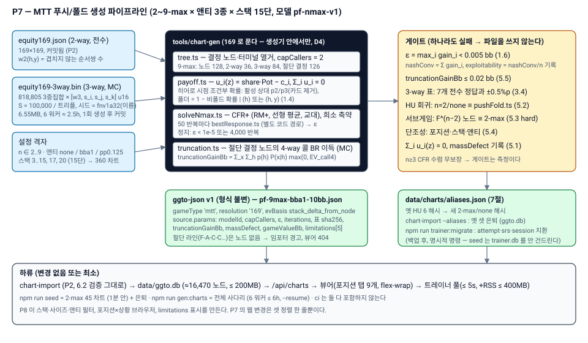

# P7 스펙 — 프리플랍 생성기 확장: MTT 푸시/폴드 2~9-max × 앤티 3종 × 스택 사다리

작성: ggto-architect, 2026-09-17. 대상: ggto-dev.
전제: `docs/GAPS.md`(범위 확정: MTT 전용, D29), `docs/specs/P2.md` 3.3·5·6·7.1·13절, `docs/specs/P3.md` 3·5절, `docs/DECISIONS.md` D4·D8·D13·D15·D16·D17·D18·D30~D37.
**착수 순서**: P7 → P8 → P6. `docs/specs/P6.md` 는 그대로 두고 P8 뒤에 쓴다.
**시작 조건: P5 APPROVED — 충족.**



## 0. 목표와 완료 그림

`npm run seed && npm run gen:charts && npm run build && npm start` 뒤:

1. `/charts` 의 차트셋 목록에 **`2-max (HU) … 9-max`** 푸시/폴드 차트가 **앤티 3종 (없음 / 전원 0.125bb / BB 앤티 1bb) × 스택 15단 (3~20bb)** 으로 들어 있다 (전부 `game_type='mtt'`). 9-max 차트를 열면 포지션 탭 9개(`UTG UTG1 UTG2 LJ HJ CO BTN SB BB`)가 뜨고, 라인 `F-F-F-F-F-F-A` 를 따라가면 SB 잼을 마주한 BB 노드가 열린다. 라인 `F-A-C-C` 는 **노드가 없다** (콜러 상한, 1.1) — 404 `MissingNode`, 화면은 "이 라인은 차트에 없습니다" 를 보여준다 (P2 뷰어 기존 동작).
2. 모든 차트의 `source.params.epsilonBb < 0.005` 이고 `mixedLossBb < 0.01` — **모델 안에서 정확한 ε-균형** (1.6; 모델은 각 플레이어의 믿음 모델이고 제로섬이 아니다 — 1.4-3). 9-max 10bb BB앤티 차트가 이 PC(6코어) 에서 **15분 안에** 생성된다 (9절, R1).
3. `2-max (HU) push/fold {5,8,10,12,15,20}bb, no ante` 6개가 옛 `HU push/fold Nbb (generated)` 6개를 **대체**하고, `npm run trainer:migrate` 가 기존 트레이너 기록·SRS 를 새 `content_hash` 로 옮긴다 (7절). 리포트의 "(사라진 차트 …)" 가 사라진다.
4. `/trainer` 는 그대로 동작한다 — 풀이 360 차트셋·약 16,500 노드로 커져도 세션 생성 ≤ 5초 (8절). 카테고리는 `open`·`vs_jam` 뿐이다 (푸시/폴드 모델의 필연 — P8 이 "vs jam + caller" 를 나눈다).
5. `npm run ci` 는 Rust 없이 exit 0 (D24). `tools/chart-gen` 테스트에 3-way 표 게이트(3.4)·n-max 성질 게이트(5절)·HU 회귀(5.2)가 들어 있다.

**만들지 않는 것 (범위 밖, 각각 근거)**:
- **림프 · 미니레이즈 · 3bet-jam 모델** — D30. 올인이 아닌 액션이 하나라도 들어가면 (a) 플랫콜을 허용해 포스트플랍 팟이 생기거나 (b) 플랫콜을 금지해 레이즈-폴드 가치를 과대평가하는 모델이 된다. (a) 는 포스트플랍 EV 모델이 필요하고 (P9 취소 사유와 동일), (b) 는 알려진 왜곡을 "정확" 이라 표기하게 된다. 둘 다 1.6 의 게이트를 지킬 수 없다. **P7b** 로 분리한다 (10절).
- **ICM** — 칩 EV 만. 10절의 한계 표기가 이를 사용자에게 알린다.
- **4-way 이상 올인 라인** — D31. 콜러 2명(3-way 쇼다운)까지. 절단이 만드는 편차를 측정해 파일에 적는다 (1.4, 5.5).
- **폴드 레인지의 카드 번칭(bunching)** — D33. HRC 도 기본 모드에서 무시하는 근사이며 (HRC 블로그 "Visualizing the bunching effect": 7.5bb SB 오픈 레인지의 약 24% 가 번칭 반영 시 손실로 뒤집힌다고 보고), 이 한계를 `limitations` 에 적는다. P7b 후보.
- **UI 재설계** — P8. P7 의 웹 변경은 8절 두 줄뿐이다.
- **불균등 스택** — 전원 동일 (P0 `PreflopConfig.stack`). D36 의 스택 규약을 따른다.

---

## 1. 모델 `pf-nmax-v1` (전부 고정 — 이 절이 "무엇을 정확히 푸는가" 의 정의다)

### 1.1 게임

- 플레이어 `n ∈ {2..9}`, 포지션 순서 = `tablePositions(n)` (2.1). 블라인드 SB 0.5 / BB 1. 레이크 없음.
- 각 플레이어는 **한 번만** 행동한다. 아직 잼이 없으면 `{F, A}`, 잼을 마주하면 `{F, C}`. 스택이 같으므로 잼 뒤의 `A` 는 상태 기계가 거부하고 `C` 만 합법이다 (D10).
- **콜러 상한 `capCallers = 2`**: 잼에 콜이 2명 붙은 뒤의 플레이어는 결정 노드가 없다 (강제 폴드, 확률 1). 그 라인은 파일에 노드가 없고 임포터의 "트리 폐쇄성 경고" 로만 나타난다 (P2 6.2-6 — 거부가 아니다). `n ≤ 3` 은 상한이 걸리지 않는다.
- 터미널: (i) 전원 폴드 → BB 가 걷는다, (ii) 잼 + 전원 폴드, (iii) 잼 + 콜 1 (2-way 쇼다운), (iv) 잼 + 콜 2 (3-way 쇼다운).

트리 크기 (직접 열거, `docs/assets/p7-pushfold-tree-cap.svg`):

| n | 결정 노드 | 2-way 터미널 | 3-way 터미널 | 잼-전원폴드 | 절단된 결정 노드 (잼+콜2 뒤 다음 액터) | 제거된 4-way+ 터미널 |
|---|---|---|---|---|---|---|
| 2 | 2 | 1 | 0 | 1 | 0 | 0 |
| 3 | 6 | 3 | 1 | 2 | 0 | 0 |
| 4 | 13 | 6 | 4 | 3 | 1 | 1 |
| 5 | 24 | 10 | 10 | 4 | 5 | 6 |
| 6 | 40 | 15 | 20 | 5 | 15 | 22 |
| 7 | 62 | 21 | 35 | 6 | 35 | 64 |
| 8 | 91 | 28 | 56 | 7 | 70 | 163 |
| 9 | 128 | 36 | 84 | 8 | 126 | 382 |

포지션별 결정 노드 수 (n=9): `[1, 2, 4, 7, 11, 16, 22, 29, 36]`. 테스트가 이 표를 고정한다 (`tree.test.ts`).

### 1.2 앤티 3종과 스택 규약 (D36)

`PreflopConfig.ante` 는 P0 형식 그대로다. 프리셋 ID 와 값:

| ID | `config.ante` | 앤티 팟 `A` | 비고 |
|---|---|---|---|
| `none` | `{mode:'none'}` | 0 | HU 시드와 같은 모델. FT HU·초반 레벨 |
| `bba1` | `{mode:'bb_ante', amount: 1}` | 1 | **온라인 MTT 표준** (BB 가 앤티 1bb 를 대신 낸다). 테이블 사이즈와 무관하게 1bb |
| `pp0.125` | `{mode:'per_player', amount: 0.125}` | 0.125·n | 전원 앤티 (100/200/25). 9-max 1.125, 6-max 0.75 |

- **`stack` = 앤티를 낸 뒤, 포스팅한 블라인드를 포함한 인핸드 스택. 전원 동일.** 즉 `bba1` 10bb 차트의 BB 는 핸드 시작 전 11bb 였고 나머지는 10bb 였다; `pp0.125` 는 전원 10.125bb 였다. 상태 기계의 의미(`contrib ≤ stack`, 앤티는 `antePot` 으로만) 와 일치하며 core 를 바꾸지 않는다. 이 문장을 `source.params.stackConvention` 에 그대로 적는다.
- 자기 앤티 `ante_i`: `pp` 는 전원 0.125, `bba1` 은 BB 만 1, `none` 은 0. 폴드 기준점 계산에서 상쇄되므로 EV 에는 안 나타나고 게임값(1.7)에만 쓰인다.

### 1.3 지불 (한 판 전체 기준, 플레이어 i)

터미널 z 에서 올인 집합 `J` (잼 + 콜러, `|J| ∈ {1,2,3}`), 폴더 집합 `F`, 블라인드 `b_i` (SB 0.5, BB 1, 그 외 0):

```
Pot(z)  = A + Σ_{f∈F} b_f + |J|·S
u_i(z)  = share_i · Pot(z) − c_i(z)
c_i(z)  = ante_i + (i∈J ? S : b_i)
share_i = i∉J ? 0 : |J|=1 ? 1 : |J|=2 ? eq2(h_i; h_j) : eq3(h_i; h_j, h_k)
```
전원 폴드 → BB: `Pot = A + 0.5 + 1`, `share_BB = 1`. 모든 터미널에서 **Σ_i u_i(z) = 0 이 정확히 성립**해야 한다 (share 의 합 = 1, 3.2 의 정규화). 테스트: 임의 터미널·임의 핸드 조합에서 `|Σ u| < 1e-12`.

**노드 기준 EV (P2 3.3, `evBasis: 'stack_delta_from_node'`)**: `EV_a(h) = E[u_i(z) | h, x, a] − u_i(fold now)`, `u_i(fold now) = −(ante_i + b_i)`. 따라서 `EV_F ≡ 0`, 잼/콜은 `E[share·Pot] − S + b_i`. n=2 에서 P2 7.1 의 `2S·eq − (S − 0.5)` 와 같다.

### 1.4 확률 모델 — "히어로 시점 조건부 트리" (D33)

각 플레이어 i 의 시점에서, i 의 핸드 클래스 `h` 가 주어졌을 때 터미널 z 의 확률 `P(z | h, x, a)` 를 아래 규칙으로 정의한다. i 의 EV·후회·BR·게임값은 전부 이 확률로 계산한다.

기호: `n_h` = 클래스 h 의 콤보 수, `w2(h,y)` = 서로 겹치지 않는 (h,y) 콤보 순서쌍 수 (P2 7.1 `pairCounts`, Σ = 1326·1225), `w3(h,y,c)` = 서로 겹치지 않는 순서 3쌍 수 (Σ_{ordered} = 1326·1225·1128 = 1,832,266,800), `p2(y|h) = w2(h,y)/(n_h·1225)`, `p3(y,c|h) = w3(h,y,c)/(n_h·1225·1128)`.

1. **활성 상대 (J∖{i}) 의 핸드**: 히어로와 **겹치지 않는 결합 사전분포** `p2`/`p3` 에 그 플레이어의 전략을 곱한다. 3-way 쇼다운은 `p3` 로 세 핸드의 상호 카드 제거를 정확히 반영한다.
2. **폴더 f 의 폴드 확률 = 1 − (폴드가 아닌 액션 확률)** — 보수(complement) 규칙. 그 액션 확률은 f 의 결정 시점에 경로상 **먼저 나온 활성 핸드**를 조건으로 한다:
   - 앞선 활성 상대가 없으면 `P(f non-fold | h) = Σ_y p2(y|h)·σ_f(non-fold | y)` — 169 벡터, 노드당 169² 연산.
   - 앞선 활성 상대 y 가 하나 있으면 `P(f non-fold | h, y) = Σ_c [w3(h,y,c)/(w2(h,y)·1128)]·σ_f(non-fold | c)` — 169² 행렬, 노드당 169³ 연산. **반복마다 폴더 노드당 한 번** 계산해 두고 모든 터미널이 공유한다.
   - 앞선 활성 상대가 둘이면 (히어로 + 잼 + 콜 1 뒤에 앉은 폴더) 두 번째를 **버리고** `(h, y)` 로 조건한다 (`w4` 가 없다).
   - 상한에 걸린 강제 폴드는 확률 1.
   - **폴더들은 그 조건 아래서 서로 독립이다**: 터미널 확률은 폴더 인자들의 **곱**이다. 이것이 D33 "번칭 무시" 의 정확한 의미다 — 폴더 f 의 핸드는 다른 폴더의 핸드에도, (f 가 잼보다 먼저 폴드했다면) 잼한 사람의 핸드에도 조건 걸리지 않는다. 잼 **뒤** 폴더만 `(h, y)` 로 조건되므로 그 쌍에 한해 정확한 결합이다.
3. **이 모델은 공통 결합분포에서 유도되지 않는다 (R1 정정).** 규칙 2 의 곱은 히어로마다 다른 인수분해이고, 어떤 하나의 `(h_0..h_{n−1})` 결합분포도 모든 히어로의 인수분해를 동시에 만족하지 않는다. 결과:
   - `Σ_i u_i(σ) ≠ 0` — **n=3 에서도** 그렇다. 실측 (R1): 3-max bba1 10bb **3.07e-2bb**, none 1.56e-2; 4-max 1.9~6.3e-2; 9-max none 10bb 7.4e-2. R0 의 "n=3 근사 없음 → 정확히 0" 은 틀린 주장이었다 (주변화 항등 `Σ_c w3 = 1128·w2` 는 질량 보존을 증명하지 결합분포의 존재를 증명하지 않는다).
   - `massDefect = max_{x,a,h} |Σ_z P(z|h,x,a) − 1|` 는 보수 곱이 항상 정확히 합 1 이라 **모든 n 에서 항등적으로 0** 이다 (파일 97개 전부 ≈ 1e-15). 근사의 크기를 재지 못한다. **구현 버그 검출용으로만** 남긴다 (`< 1e-9`). EV 는 여전히 `Σ_z P(z|h,x,a)` 로 나눠 정규화한다.
   - 근사의 크기는 **정확 모델이 계산 가능한 n=3 에서 오라클로 잰다** (5.1(b')): 세 핸드의 진짜 결합 `p3(y,c|h)` 로 모든 터미널 확률·도달확률·EV 를 계산하는 모델은 제로섬이고 w3 만 필요하다. 그 모델에서 출하 전략의 착취가능액 `epsilonExact3Bb` 를 구한다. 실측 (R1, 10bb): bba1 **2.65e-4bb**, none **2.23e-4bb** — 모델 안 ε(5e-7)의 500배지만 게이트 0.005 의 1/19. 클래스 EV 차이 최대 0.052bb (72o·Q8o 류, 결정에서 먼 핸드). 잼 뒤 폴더만 있는 서브트리(`A`·`A-F`·`A-C`)는 차이 0.
   - **w3 결합으로 n=3 만 정확히 풀지 않는 이유**: n≥4 는 w4 가 없어 같은 방식이 불가능하고, w3 를 부분적으로 끼워 넣는 어떤 방식(앵커 선택)도 터미널마다 다른 만큼의 번칭을 포함하는 또 다른 비일관 모델이 된다. 테이블 사이즈마다 다른 의미의 차트를 섞지 않는다. 5.3 의 서브게임 동형(전원 폴드 뒤 = 작은 게임)은 이 모델의 성질이고 번칭 모델에서는 성립하지 않는다.
4. **폴더의 카드 제거 = 활성 핸드 기준만.** 폴더의 폴드 레인지가 남은 덱을 바꾸는 효과(번칭)는 없다. HRC 기본 열거 모드와 같은 가정이다.

n=2 에서 이 모델은 `tools/chart-gen/src/pushFold.ts` 의 HU 모델과 **동일**하다 (BB 폴드 = 1 − `w`-가중 콜). 5.2 의 회귀 게이트가 그 사실을 실측으로 고정한다. n=2 는 폴더가 없어 규칙 3 의 비일관성도 없다 (`sumGameValueBb` ≈ 1e-16).

### 1.5 왜 169 로 풀어도 되는가

n 이 몇이든 프리플랍에는 보드가 없고 슈트 순열은 게임의 자기동형이다 (P2 README 논증 그대로). 같은 클래스의 콤보는 전략적으로 동치이므로 169 정보집합 해 = 1326 해. 결과는 `resolution:'169'` 로 쓰고 임포터가 1326 으로 전개한다 (D4: 런타임 경로에 169 계산 없음 — 생성기 안에서만).

### 1.6 정확도 정의와 게이트 (n-player NashConv)

플레이어 i 의 **이득** `gain_i = u_i(BR_i, σ_{−i}) − u_i(σ)` (bb/핸드). 각 플레이어는 히스토리마다 한 번만 행동하므로

```
gain_i = Σ_h p(h) Σ_{x ∈ X_i} P(x | h) · [ max(0, EV_A|C(h)) − σ_i(A|C | h) · EV_A|C(h) ]
```
(`P(x|h)` = 경로상 상대 액션 확률의 곱, 1.4 규칙; `EV_F = 0`). n=2 에서 `pushFold.ts` 의 `sbGain/bbGain` 과 같다.

- `nashConvBb = Σ_i gain_i` (OpenSpiel `nash_conv` 정의), `exploitabilityBb = nashConvBb / n` (OpenSpiel: 2인 상수합에서 착취가능액 = NashConv/n — 기존 HU 필드와 호환), **`epsilonBb = max_i gain_i`**.
- **게이트: `epsilonBb < 0.005 bb`** (ε-균형의 정의 그대로 — 어느 플레이어도 0.005bb 이상 못 얻는다). NashConv/n 은 기록만 한다. n=2 에서는 두 값이 같은 자릿수다 (실측 HU 5,000 반복: ε 6e-8~1.5e-7).
- n ≥ 3 에서 CFR 은 수렴이 보장되지 않는다 (2인 제로섬 성질이 없다). **그래서 게이트는 이론이 아니라 측정이다** — 4절의 정지 규칙에서 예산 안에 게이트를 못 넘으면 그 차트는 **생성 실패**로 보고한다 (조용히 낮은 품질을 내보내지 않는다, D24 정신).
- **혼합 손실 `mixedLossBb`** (P3.md 3.5 를 생성기로 옮긴 것): 빈도 ≥ 0.01 로 플레이되는 액션의 EV 손실 최대. ε 은 도달확률 가중이라 이것을 못 본다 — 오버콜 노드 `A-C` 에서 AJs 빈도 1.1%·EV −0.057bb 의 ε 기여는 2.8e-8 이다. 게이트 `mixedLossBb < 0.01` (P3 의 값 그대로).
- **스냅-검증 (R1)**: CFR+ 평균 전략에는 지배된 액션의 잔여 질량이 남고, 근사무차별 핸드는 계속 질량을 받아 1%p 아래로 내려가는 데 수천 반복이 든다 (실측 4-max none 8bb: `A-C-F` A9s 빈도 300→1200 반복에 0.47→0.03). 진짜 균형에서 손실 > 0 인 액션의 빈도는 0 이므로 이 잔여 빈도는 정보가 아니라 평균화의 산물이다. **반복으로 없애지 않고 출하 전략을 만든다**: 정지 뒤 BR 의 EV 로 손실 ≥ `MIXED_LOSS_TARGET_BB`(0.005) 인 액션을 **빈도와 무관하게** 0 으로 (그 노드·클래스는 순수 BR 액션) 놓고 BR 을 다시 돈다; 위반이 없을 때까지 ≤ 5 라운드. 마지막 BR 의 EV 가 파일의 EV 다. **게이트(ε, mixedLoss)는 출하 전략에 건다.** 실측: 스냅으로 ε 이 오르지 않는다 (4-max none 13bb 4000 반복 3.69e-7 → 3.69e-7, mixedLoss 0.057 → 0.0003; 4-max none 8bb 600 반복 6.97e-6 → 3.27e-6, 0.057 → 0.0043, 2 라운드). 문헌의 purification/thresholding (Ganzfried & Sandholm 2012) 이다. 5 라운드 안에 위반이 안 없어지면 `FAILED`.
- 균형의 비유일성: n ≥ 3 에서는 서로 다른 균형이 다른 게임값을 가질 수 있다. 그래서 5.3 의 서브게임 일관성 게이트는 **2인 서브게임(SB-vs-BB)에서만 hard** 이고 3인 이상은 보고 항목이다.

### 1.7 게임값 진단

`u_i(σ)` (한 판 전체 기준, bb/핸드) 를 포지션별로 `source.params.gameValueBb` 에 적고 `sumGameValueBb = Σ_i u_i` 를 적는다. **0 이 아니다** (1.4-3 — 공통 결합분포가 없다). 값은 모델 비일관성의 크기이고 기록 항목이다. `|Σ| > 0.3bb` 면 리뷰에서 UNCERTAIN (실측 최대 n=9 none 10bb 0.074 — 그보다 훨씬 크면 버그를 의심한다).

---

## 2. 모듈 · 파일 · 시그니처

### 2.1 `@ggto/preflop` (한 함수 추가)

```ts
/** 액션 순서. 2: [SB,BB] … 9: [UTG,UTG1,UTG2,LJ,HJ,CO,BTN,SB,BB]. n ∉ 2..9 → RangeError */
export function tablePositions(n: number): readonly string[];
```

| n | positions |
|---|---|
| 2 | `SB BB` |
| 3 | `BTN SB BB` |
| 4 | `CO BTN SB BB` |
| 5 | `UTG CO BTN SB BB` |
| 6 | `UTG HJ CO BTN SB BB` (P2 4절 예시와 동일) |
| 7 | `UTG LJ HJ CO BTN SB BB` |
| 8 | `UTG UTG1 LJ HJ CO BTN SB BB` |
| 9 | `UTG UTG1 UTG2 LJ HJ CO BTN SB BB` |

**`+` 를 쓰지 않는다** (`UTG+1` 금지, D37): 포지션 이름은 `?pos=` 쿼리에 들어가고 `+` 는 D13 의 사고를 낸 문자다. 상태 기계는 이름을 불투명 문자열로만 쓰므로 core 는 무관하다.

### 2.2 `tools/chart-gen/src` (기존 `pushFold.ts`·`chart.ts`·`exactEquity.ts`·`genEquity.ts` 는 남긴다)

| 파일 | 역할 | 핵심 시그니처 |
|---|---|---|
| `tree.ts` | 1.1 트리 열거 | `buildTree(n, capCallers): PushFoldTree` — `nodes: TreeNode[]` (`seq`, `actor`, `kind:'open'\|'facing'`, `actions:['F','A']\|['F','C']`, `children`), `terminals: Terminal[]` (`J: number[]`(순서 유지: 잼, 콜1, 콜2), `F: number[]`, `foldersBefore/Between/After`), `truncated: TruncatedNode[]` (`seq`, `actor`, `J`) |
| `equity3.ts` | 3-way 표 로더 | `loadEquity3(binPath, metaPath): Equity3` — `{ meta, share: Float32Array /*169³, share[h*169²+y*169+c] = eq3(h;y,c)*/, w3: Float32Array /*169³*/ }`, `multisetIndex(i,j,k)`, 검증(3.3) |
| `genEquity3.ts` | 3-way 표 생성 CLI | 3.2 |
| `payoff.ts` | 1.3 지불·1.2 앤티 | `anteOf(preset)`, `potOf(terminal, config)`, `payoffMatrices(tree, config, eq2, eq3): TerminalPayoff[]` — 터미널·활성 플레이어별 `share·Pot − c` 텐서(2-way 169², 3-way 169³, **Float64Array**, 생성기 내부 — D7 은 전송·저장 컨테이너에만 적용) |
| `solveNmax.ts` | 4절 CFR+ | `solveNmax(tree, config, tables, opts): NmaxResult` — `nodes[k] = { strategy: Float64Array(169) /*비폴드 빈도*/, ev: Float64Array(169) /*비폴드 EV, 노드 기준*/ }`, `epsilonBb`, `nashConvBb`, `exploitabilityBb`, `gainsBb: number[]`, `gameValueBb: number[]`, `sumGameValueBb`, `massDefect`, `iterations` |
| `bestResponse.ts` | 1.6 | `bestResponse(tree, config, tables, strategy): { gains: number[], values: number[], massDefect: number }` — 솔버와 **다른 코드 경로** (P2 13절이 요구한 독립 재계산을 생성기 안에 둔다). 솔버는 이 함수를 정지 판정과 최종 기록에 쓴다 |
| `truncation.ts` | 5.5 절단 이득 | `truncationGain(tree, config, strategy, rng, samples): { totalBb, byPlayerBb: number[], byNode: {seq, gainBb}[] }` |
| `chartNmax.ts` | ggto-json 문서 | `nmaxChart(input): { doc: GgtoJson; solve: NmaxResult; truncation }` (6절) |
| `legacy.ts` | 7절 | `LEGACY_HU_HASHES: Record<5\|8\|10\|12\|15\|20, string>` (7.1 의 여섯 값 그대로) |
| `main.ts` | CLI | 9.1 |

계층: `@ggto/core` 무변경. `tools/chart-gen` 만 169 로 계산한다 (1.5). `Float64Array` 는 생성기 내부 연산 전용이고 파일·DB·API 에는 나오지 않는다 (D7 grep 게이트는 `packages/*`·`web` 대상 — `tools/chart-gen` 은 이미 예외다).

---

## 3. 3-way 에퀴티 표 `tools/chart-gen/data/equity169-3way.bin` (+ `.json` 메타)

### 3.1 왜 몬테카를로인가 (D32) — 직접 잰 비용

- 클래스 3중집합 수 = C(171,3) = **818,805**. 각 항목은 세 클래스의 팟 지분(합 1) + `w3`.
- **전수는 불가능**: 대표 콤보 하나를 고정하고 (b,c) 궤도 대표 × C(46,5) 보드 전수 — 실측 3~8초/트리플 (`core.evaluate7` 약 6천만/s) → 818,805 × 5s ≈ **1,100 코어시간**. 보드 정규형(134,459) 단위 텐서 누적으로 바꿔도 클래스쌍 겹침 보정 때문에 ≥ 1e13 연산이다.
- **MC**: 순진한 구현(Set 할당) 0.65M 샘플/s/코어 실측. 샘플 S=100,000/트리플 → 8.2e10 샘플. 타입 배열·비트마스크로 **≥ 1.5M/s/워커** 를 요구한다 (3.5 벤치) → 6 워커 **≈ 2.5시간**. 한 번 만들고 커밋한다 (2-way `equity169.json` 과 같은 지위).
- 정밀도: 지분 p 의 표준오차 `√(p(1−p)/S) ≤ 0.16%p`. 3-way 노드 EV 에 미치는 잡음은 `Pot × SE / √N_eff` — 20bb 9-max (Pot ≈ 62bb, 상대 클래스쌍 유효 수 ≥ 30) 에서 **≤ 0.02bb**, P3 Perfect 임계 0.05 의 절반 이하. 2-way 는 여전히 전수 표다.

### 3.2 생성 (`node tools/chart-gen/dist/genEquity3.js [--samples 100000] [--workers 6] [--out …]`)

트리플 `(i ≤ j ≤ k)` 마다 (클래스 인덱스 = `CLASS_KEYS` 순서):
1. `rng = createRng(fnv1a32("<Ki>|<Kj>|<Kk>"))` (이름은 `CLASS_KEYS[i]` 등, `pairSeed` 와 같은 FNV-1a 32).
2. 샘플 s = 1..S: 클래스 i,j,k 의 콤보 목록에서 각각 `rng.nextInt(len)` 로 하나씩 (이 순서로) 뽑고, 여섯 장이 서로 다르지 않으면 **버리고 다시** (S 에 세지 않는다). 보드는 남은 46장에서 `rng.nextInt(52)` 거절 샘플링으로 5장 (뽑힌 순서 고정). `evaluate7` 세 번, 최고값 동률 t 명이 각 1/t.
3. 지분 → u16 (`round(share·65535)`). **같은 클래스가 둘 이상이면 그 지분들을 평균으로 대칭화**한 뒤 양자화한다 (i=j=k 는 정확히 21845 씩). `w3` 는 정확히 센다 (콤보 3중 루프, ≤ 1728).
4. 레코드 = `[w3, share_i, share_j, share_k]` u16 LE 4개, 오프셋 = `multisetIndex(i,j,k)·8`, `multisetIndex = C(i,1) + C(j+1,2) + C(k+2,3)` (colex, 0..818,804 전단사 — 검증 완료). 파일 크기 **6,550,440 B**.
5. 샤딩은 `multisetIndex mod workers`. 결과는 워커 수와 무관 (트리플 단위 시드).
6. 메타 `equity169-3way.json`: `{ format:'ggto-equity169-3way', version:1, samples, seedRule, samplerVersion:1, coreVersion, tripleCount:818805, encoding:'u16le x4 [w3, share_i, share_j, share_k], multiset colex index', sha256 /*bin 파일*/, elapsedSec, workers }`. `sha256` 는 `bin` 바이트의 해시. `generatedAt` 은 넣지 않는다 (차트 `source.params` 로 흘러 들어가면 해시가 흔들린다).

### 3.3 로더 검증 (`loadEquity3`, 전부 throw)

format/version, 크기 = 818,805·8, 각 레코드 `|share 합 − 65535| ≤ 2`, `w3 ≤ 1728`, **Σ_{ordered} w3 = 1,832,266,800** (다중도: 세 클래스 서로 다름 6, 둘 같음 3, 셋 같음 1), i=j=k 레코드 지분 세 값 동일, sha256 일치. 메모리 전개: `share` 169³ Float32Array(19.6MB) — 로드 시 각 트리플의 세 지분을 **합으로 나눠 정확히 1** 로 만든 뒤 순서쌍 6개(또는 3/1) 위치에 복사, `w3` 도 169³ Float32Array.

### 3.4 게이트 — 알려진 정답값 (내가 전수로 계산했다, `exact3way.mjs`: 대표 고정·(b,c) 궤도·C(46,5) 전수)

| 트리플 | 정확 지분 (순서대로) | 비고 |
|---|---|---|
| AA / KK / QQ | **0.669793 / 0.177457 / 0.152749** | |
| AKo / AQo / KQo | **0.718424 / 0.200983 / 0.080592** | 카드 겹침 많음 |
| T9s / 76s / A2o | **0.398541 / 0.296689 / 0.304770** | |
| JJ / AKs / 87s | **0.411396 / 0.389735 / 0.198870** | |
| QQ / AKo / AKo | **0.654286 / 0.172857 / 0.172857** | 같은 클래스 둘 → 대칭 |
| AA / AA / KK | **0.397850 / 0.397850 / 0.204300** | 같은 클래스 둘 |
| 72o / 72o / 72o | **1/3 / 1/3 / 1/3** | 대칭 — 표에서 정확히 21845 |

- 표 값은 위 7개와 **±0.5%p** 안 (S=100k 의 3.3σ; 내가 시드 3개로 돌린 100k MC 는 정확값 대비 최대 편차 0.24%p 였다).
- `test/equity3.test.ts` (기본): 로더 검증 전부 + 7개 대조 + `multisetIndex` 전단사 + `AA/AA/KK` 를 브루트포스(위 스크립트 방식, ≈1s)로 재계산해 표와 ±0.5%p. `test:slow`: 나머지 6개 브루트포스 재계산 (≈20s).
- 표를 재생성하면 (core 평가기 변경 시에만) 바이트 동일해야 한다 — 테스트: 트리플 3개를 `--samples 100000` 으로 인프로세스 재계산해 파일 레코드와 일치.

### 3.5 벤치 `tools/chart-gen/bench/equity3.mjs` (공유 하네스)

`AA/KK/QQ` 1M 샘플 처리량. 예산 **≥ 1.5M 샘플/s** (단일 워커). 미달이면 최적화 전에 S 를 줄이지 않는다; 최적화 뒤에도 미달이면 **S = 50,000** 으로 낮추고 메타에 적는다 (3.1 의 EV 잡음 한계가 0.03bb 로 오른다 — 이 절과 10절의 문장을 고친다).

---

## 4. 솔버 (`solveNmax`)

### 4.1 알고리즘

CFR+ (regret matching+, 선형 가중 평균, 교대 갱신 — `pushFold.ts` 와 같은 변종). 노드 = (포지션, 히스토리), 정보집합 = 노드 × 169. 각 플레이어가 한 번만 행동하므로 **재귀 없이** 노드마다 직접 EV 를 평가한다:

```
반복 t:
  플레이어 i = 0..n−1 (교대):
    1. 폴더 행렬 갱신: i 가 아닌 모든 노드 f 에 대해 P_f^{nf}(h) (169) 와 P_f^{nf}(h,y) (169²)   — 1.4 규칙 2
    2. i 의 각 노드 x, 각 h: EV_nf(h) = Σ_{z ∈ subtree(x, nf)} P(z|h,x,nf)·[u_i(z) − u_i(fold)] / Σ_z P(z|h,x,nf)
       - 2-way 터미널: 169² 축약 (상대 벡터 σ·p2, 폴더 인자는 (h) 또는 (h,y) 별로 곱)
       - 3-way 터미널: 169³ 축약 — σ_j(y)·[Π 폴더(h,y)]·Σ_c w3·σ_k(c)·payoff(h,y,c)
       - **희소 축약**: σ_j(y)=0 인 y, σ_k(c)=0 인 c 는 건너뛴다 (RM+ 가 정확한 0 을 만든다). 초반 조밀 반복 뒤 10~50배 빨라진다
    3. RM+ 갱신 (2액션, `updateRegrets` 재사용 가능), 평균 전략 가중 t
  100 반복부터 50 반복마다 bestResponse(평균 전략) → epsilon
  정지: epsilon < 1e-5  또는  t = 4000        (mixedLoss 는 정지 조건이 아니다 — R1)
스냅-검증 (1.6): 손실 ≥ 0.005 인 액션 → 빈도 0; bestResponse 재계산; 위반 0 까지 ≤ 5 라운드
결과: 출하 전략의 epsilon < 0.005 이고 mixedLoss < 0.01 이면 성공,
      아니면 throw ExploitabilityGateError(설정, epsilon, mixedLoss, iterations)  — 메시지에 두 값을 구분해 적는다
```

- 실측 근거 (HU, `huconv.mjs`): 500 반복 ε ≈ 4e-6, 200 반복 ≈ 2~3e-5, 5,000 반복 ≈ 7e-8. 목표 1e-5 는 게이트의 1/500 이다.
- 반복당 비용 (9-max, 조밀): 3-way 축약 84×3 = 252 회 × 4.8M + 폴더 행렬 128 × 4.8M ≈ **1.8 GFMA** ≈ 1~2초. 희소화 뒤 0.1초 급. 예산은 9절.
- **결정성**: 단일 스레드, 합산 순서 고정, 정지 규칙·스냅 결정적 → 같은 입력(표 2개 + 설정) 은 바이트 동일 출력. `iterations` 는 실제 돌린 값을, `epsilonPreSnapBb`·`snappedActions`·`snapRounds` 는 스냅 전 ε·스냅한 (노드, 클래스) 수·라운드 수를 적는다.
- 실측 ε 곡선 (R1, 9-max none 10bb): 300 반복 9.6e-5, 600 반복 3.6e-5 (ε ∝ t^−1.4) → 1e-5 는 ≈ 1,500 반복. 0.41s/반복 (희소, 단독 실행) 이므로 ≈ 10~11 분. 4-max: 600 반복 ≈ 7e-6.
- BR(`bestResponse.ts`) 은 솔버의 EV 루프를 **호출하지 않는다** — 텐서를 다시 축약하는 별도 구현 (조밀, 반복마다 ~2초). 같은 값을 두 경로로 얻는 것이 P2 13절의 독립 재계산 요구다.

### 4.2 출력 (노드마다)

- `strategy[h] = [1 − p, p]` (p = 비폴드 평균 빈도), `ev[h] = [0, EV_nf(h)]` (6자리 반올림, `chart.ts` 의 `round`/`sig` 재사용).
- 절단된 결정 노드는 **출력하지 않는다** (1.1).
- `bbCallEv` 의 도달 불가 예외(`pushFold.ts`)와 같은 규칙: 어떤 노드의 도달 확률 `Σ_h p(h)P(x|h)` 가 0 이면 throw (균형에서는 일어나지 않는다 — AA 는 항상 잼·콜).

---

## 5. 성질 게이트 (테스트가 고정한다 — 이름에 절 번호)

### 5.1 모델 (`model.test.ts` + `exact3model.test.ts`, n=3·4, 계산 가벼움 — 300 반복 `allowGateFailure`, 수렴 품질은 여기서 재지 않는다)
- (a) 모든 터미널·핸드에서 `Σ_i u_i(z) = 0` (`< 1e-12`).
- (b) n=3 에서 `massDefect < 1e-9` (버그 검출 — 항등 0 이어야 한다), `sumGameValueBb` **출력** (게이트 아님, 1.7).
- (b') **정확 모델 오라클 (R1)**: `src/exact3.ts` — n=3 전용, 세 핸드 결합 `p3(y,c|h) = w3(h,y,c)/(n_h·1225·1128)` 로 모든 터미널 확률·도달확률·EV 를 계산하는 **솔버·BR 과 별개의 조밀 평가기** (노드당 169³, ≈ 0.2s). `chartNmax.ts` 가 n=3 차트에 `source.params.epsilonExact3Bb` 를 적는다. 테스트: (i) 오라클 자체가 제로섬 — `Σ_i u_i(σ)` 와 질량 결함 모두 `< 1e-9`; (ii) n=3 {none, bba1, pp0.125} × 10bb 의 **출하 전략**을 오라클로 채점한 `epsilonExact3Bb < 1e-3` (실측 R1: bba1 2.65e-4, none 2.23e-4 — 4배 여유, 게이트의 1/5); (iii) 클래스 EV L∞ (모델 vs 오라클, 같은 전략) 출력 (실측 0.045~0.052). `test:slow`: 스택 {5, 20} 추가.
- (c) n=4 에서 `massDefect < 1e-9`, `sumGameValueBb` 출력.
- (d) 트리 표 (1.1) 일치.

### 5.2 HU 회귀 (`nmax.test.ts` — 새 솔버 n=2/none vs 기존 `pushFold.ts`, P2 13절 (R2) 판정 그대로)
스택 {5,8,10,12,15,20}: (a) 기존 해의 전략을 새 `bestResponse` 에 넣은 ε < 1e-5 이고 그 역도 성립; (b) 두 해의 L∞ ≥ 0.02 인 클래스는 모두 `|EV| < 1e-3` (무차별), 그 외 L∞ < 0.02; (c) 1326 가중 집계 잼%·콜% 차 < 0.2%p; (d) 게임값(SB) 차 < 1e-4, 클래스 EV L∞ < 1e-3. 기준값 (기존 파일에서 읽음, 테스트에 상수로):

| 스택 | SB 잼 % | BB 콜 % | AA 잼 EV (bb) |
|---|---|---|---|
| 5 | 71.49 | 62.07 | 2.993790 |
| 8 | 61.86 | 44.97 | 3.400210 |
| 10 | 58.28 | 37.38 | 3.477902 |
| 12 | 53.24 | 33.03 | 3.587459 |
| 15 | 45.66 | 28.55 | 3.718465 |
| 20 | 40.22 | 21.72 | 3.734893 |

### 5.3 서브게임 일관성 (`subgame.test.ts`)
`none` 과 `bba1` 에서는 앞선 폴드가 팟을 바꾸지 않으므로 **"k명이 폴드하고 남은 (n−k)명" 서브게임은 (n−k)-max 루트와 동형**이다 (`pp` 는 폴더의 앤티가 남아 동형이 아니다).
- (a) **hard**: n ∈ {3..9}, 앤티 ∈ {none, bba1}, 스택 ∈ {5,10,20}: 전원 폴드 뒤 SB 노드(`F^{n−2}`)·BB 노드(`F^{n−2}-A`) 의 전략·EV 가 같은 앤티·스택의 2-max 차트와 5.2 판정으로 일치 (2인 제로섬 서브게임 — 값이 유일하다).
- (b) **report**: `F^{k}` 노드(첫 액터, 뒤에 n−k−1 명) 의 집계 잼% 와 (n−k)-max 루트의 집계 잼% 차이를 표로 출력. 차이 > 1%p 면 리뷰 UNCERTAIN (3인 이상 균형 비유일성 때문에 게이트가 아니다).
- **배치 (R1)**: `ci` (`npm test`) 는 **n=3 만** 돈다 (3-max 는 ε-정지로 ≈ 15s/설정 × 6). n ∈ {4..9} 는 `test/slow/subgame.test.ts` (`test:slow`). `vitest` 의 `testTimeout` 은 동기 CPU 루프를 끊지 못하므로 예산은 타임아웃이 아니라 **테스트 선택**으로 지킨다: chart-gen `test` 벽시계 **≤ 5 분**.

### 5.4 단조성·상식 (`test/slow/nmax.test.ts` — **`test:slow` (R1)**, n ∈ {6, 9}, bba1, 스택 {5, 10, 15})
- (a) AA: 모든 노드에서 비폴드 100%.
- (b) 오픈(첫 액터) 잼 집계 % 가 **포지션이 늦을수록 단조 비감소** (UTG → SB).
- (c) 같은 노드에서 스택이 줄수록 잼 집계 % 단조 비감소 (P2 7.1 (b) 의 확장).
- (d) 같은 (n, 스택, 노드) 에서 `bba1` 잼 집계 % > `none` (앤티가 레인지를 넓힌다). `pp0.125` 도 > `none`.
- (e) 20bb 9-max UTG 72o 잼 0%.
- (f) EV 와 전략 일관성: 비폴드 EV > 1e-3 → 빈도 1, < −1e-3 → 0 (P2 7.1 게이트 재사용).
- (g) 결정성: 같은 입력 두 번 → 바이트 동일.

### 5.5 절단 이득 (`truncation.ts`, n ≥ 4 차트마다 실행해 파일에 기록)
절단된 결정 노드 x (잼 + 콜 2, 다음 액터 i) 마다, 모델 밖 액션 "콜" 의 best-response 이득:
```
gain_x = Σ_h p(h) · P(x | h) · max(0, EV_call4(h))
EV_call4(h): 잼·콜1·콜2 의 핸드를 그 노드 도달 분포(전략 × p3, h 와 서로 겹치지 않게 거절 샘플링)에서 뽑고 보드 5장, evaluate7 ×4 → share·Pot(4-way) − S + b_i.  샘플 2,000 / (x, h), rng = createRng(fnv1a32(chartId + seq))
```
`truncationGainBb = Σ_x gain_x`, `byPlayerBb`. 의미: 4-way 라인을 허용한 게임에서 어떤 플레이어가 **첫 번째 절단 결정에서** 얻을 수 있는 이득의 상한 (이후 플레이어의 2차 반응은 포함하지 않는다 — 10절에 명시). 5.6 의 표에 전부 적는다. **`truncationGainBb > 0.02bb` 인 차트는 출하하지 않는다** (`gen:charts` 가 `--allow-truncation-over` 없이는 그 파일을 쓰지 않고 목록에 남긴다). 예상: 9-max ≤ 5bb `pp`/`bba1` 에서 경계 근처 — 실측이 답이다.

### 5.6 외부 sanity (게이트 아님 — 리뷰 보고 항목)
pokercoaching.com 의 "9-handed, 10bb, no ante, Nash" 순수전략 차트 (출처 표기·모델 불명이라 D15 상 데이터로 쓰지 않는다; 근사 참고만): HJ(뒤 4명) 20.06%, BTN(뒤 2명) 33.03%, SB 60.48% (내가 `parseRange` 로 센 1326 가중 %). 5.3 의 동형으로 각각 5-max·3-max·2-max `none` 10bb 루트 집계 잼% 와 비교해 표로 적는다. 2-max 는 우리 58.28% (혼합 포함) — 순수화 차트가 2%p 넓은 것이 정상 범위다. 3-max·5-max 가 ±5%p 를 벗어나면 UNCERTAIN.

---

## 6. 차트 문서 (`ggto-json` v1, 형식 변경 없음)

```jsonc
{
  "format": "ggto-json", "version": 1,
  "name": "9-max push/fold 10bb, BB ante 1bb (generated)",     // 2-max 는 "2-max (HU) push/fold 10bb, no ante (generated)"
  "gameType": "mtt",
  "config": { "positions": [...tablePositions(9)], "blinds": [{"pos":"SB","amount":0.5},{"pos":"BB","amount":1}], "ante": {"mode":"bb_ante","amount":1}, "stack": 10 },
  "rake": {"mode":"none"}, "resolution": "169", "evBasis": "stack_delta_from_node",
  "source": {
    "kind": "generated", "name": "ggto chart-gen push-fold nmax", "version": "0.2.0", "license": "self",
    "params": {
      "modelId": "pf-nmax-v1", "tableSize": 9, "antePreset": "bba1", "stack": 10, "capCallers": 2,
      "model": "n-max push/fold: no jam yet → {F,A}; facing jam → {F,C}; at most 2 callers per jam (4-way+ lines removed); each player acts once; folders' fold prob = 1 − non-fold prob conditioned on hero (+ first active opponent) hand; no card bunching from folded ranges; equal in-hand stacks; chip EV, no ICM, no rake",
      "stackConvention": "stack = in-hand chips incl. posted blind, after ante; equal for all players",
      "algorithm": "CFR+ (regret matching+, linear averaging, alternating updates); stop at epsilon < 1e-5 or 4000 iterations; then snap actions losing >= 0.005 bb to zero and re-verify with best response (<= 5 rounds)",
      "iterations": 850, "epsilonPreSnapBb": 7.9e-6, "snappedActions": 3, "snapRounds": 1,
      "equityTable": "equity169.json@sha256:…", "equitySamples": null,
      "equityTable3": "equity169-3way.bin@sha256:…", "equity3Samples": 100000,
      "epsilonBb": 8.1e-6, "mixedLossBb": 0.0031, "nashConvBb": 2.3e-5, "exploitabilityBb": 2.6e-6,
      "gainsBb": {"UTG": 1.2e-6, …}, "gameValueBb": {"UTG": -0.031, …, "BB": -0.512}, "sumGameValueBb": 0.074, "massDefect": 1e-15,
      "epsilonExact3Bb": null,   // n=3 차트에만 숫자 (5.1(b')), 그 외 null
      "truncationGainBb": 0.0031, "truncationByPlayerBb": {"BB": 0.0022, …}, "truncationSamples": 2000,
      "limitations": ["chip EV only: ICM not modeled — bubble and final-table decisions differ", "push/fold only: no limp, no min-raise", "at most 2 callers per jam", "no card bunching from folded ranges", "opponents' folds are modeled independently given the hero's hand (no common joint distribution); player values do not sum to zero by sumGameValueBb", "equal in-hand stacks"]
    }
  },
  "nodes": [ /* 1.1 의 결정 노드 전부, seq 사전순, actions [F,A] 또는 [F,C] */ ]
}
```
- 파일명 `pf-<n>max-<antePreset>-<stack>bb.json` (예 `pf-9max-bba1-10bb.json`). 모든 숫자는 `chart.ts` 규칙(6자리, 미세값은 유효숫자 4). **시각·경로·호스트명은 어디에도 넣지 않는다** (해시 결정성).
- `limitations` 는 P8 이 UI 에 그대로 띄우는 문장이다 (GAPS "근사 차트를 정확한 것처럼 표기 금지"). 문장을 여기서 확정했으니 코드에서 바꾸지 않는다.
- 임포터 변경 없음. 검증은 P2 6.2 그대로 통과해야 한다 (`isApplicable` 이 잼 뒤 `C` 만 허용하는 것과 일치).

---

## 7. 기존 HU 시드 6개의 대체와 트레이너 기록 마이그레이션 (D35)

### 7.1 대체
옛 파일(`gameType:'cash'`, `name:"HU push/fold Nbb (generated)"`, CFR+ 5,000 고정) 은 새 `2-max (HU) … no ante` 로 대체된다. 해시는 반드시 바뀐다 (name·gameType·params 가 다르다) — **바이트 동일 재현을 요구하지 않는다**. 대신 5.2 가 **같은 균형**임을 고정한다. 옛 해시 (현 `data/ggto.db` 에서 읽음, `legacy.ts` 상수):

| 스택 | 옛 `content_hash` |
|---|---|
| 5 | `f30fc450bfae6d6bb29ea856579f691d05bd13ba5dbae2fe6aa8bd7c30ef901a` |
| 8 | `67311975c98989352bec536386c6133fcae4576d962b0f04e5a9952161a81ba3` |
| 10 | `deb0595b69da343cd7cbee5fbeb3d1868e9a9e261deba729cebf953cdde13dfe` |
| 12 | `d646c8a23df475c032e15b65a0ca9c68223c530a745a1c4623be9fe17519dead` |
| 15 | `5622f2ee2b7fa68bb0ace527172364cb559a78e1bc8fd40c6dbf50b1ddb449fa` |
| 20 | `9e09d8de1135f84ea55de8cba7129c7e04b4395b9d0c0bda057f69a628fffbad` |

- `main.ts` 가 2-max/none/{5,8,10,12,15,20} 을 쓸 때 `data/charts/aliases.json` 을 함께 쓴다: `{ format:'ggto-aliases', version:1, aliases:[{ from:<옛>, to:<새>, reason:'P7: same model and stack, regenerated as mtt 2-max' }] }`.
- `tools/chart-import --aliases <file>`: 모든 파일 임포트 뒤, `to` 가 DB 에 있고 `from` 이 DB 에 있으면 `from` 셋을 `deleteSet` (은퇴). 출력 한 줄 `RETIRED <from8> -> <to8>`. `npm run seed` 가 이 플래그를 쓴다.
- **`seed` 는 `trainer.db` 를 건드리지 않는다** (D16). 은퇴 뒤 트레이너 리포트는 옛 해시를 "(사라진 차트 f30fc450)" 로 보여준다 — 그것이 마이그레이션을 돌리라는 신호다. 서버 기동 로그에 힌트 한 줄: `attempt 142건이 은퇴한 차트를 참조합니다 — npm run trainer:migrate` (attempt 의 해시가 ggto.db 에 없고 aliases.json 의 `from` 에 있을 때만).

### 7.2 `npm run trainer:migrate` (`tools/trainer-migrate/`, `@ggto/trainer` 의 `applyAliases` 호출)
1. `data/trainer.db` 를 `data/trainer.db.bak-<ISO시각>` 으로 복사 (파일 복사 — 가장 단순하고 되돌리기 확실하다).
2. 스키마 `user_version` 1 → **2**: `CREATE TABLE hash_alias (from_hash TEXT PRIMARY KEY, to_hash TEXT NOT NULL, applied_at INTEGER NOT NULL)`. `migrate()` 는 1→2 를 이 DDL 로 올린다 (P3 `migrate` 규칙 확장: 0→DDL 전체, 1→2 추가, 2→통과).
3. 단일 트랜잭션, alias 마다 (`hash_alias` 에 이미 있으면 건너뜀):
   - `UPDATE attempt SET content_hash = :to, spot_key = 'pf:' || :to || substr(spot_key, 68) WHERE content_hash = :from` (`'pf:'`(3) + 64 = 67 → 68번째부터가 `:<seq>:<combo>`).
   - `srs_state`: 같은 치환. **PK 충돌** (사용자가 마이그레이션 전에 새 차트로 같은 스팟을 이미 풀었을 때): `updated_at` 이 늦은 행을 남기고 다른 행을 지운다. 지운 수를 출력한다.
   - `trainer_session.filter` (JSON, `contentHashes`) 와 `pending_key` 도 치환.
   - `INSERT INTO hash_alias`.
4. 출력: alias 별 `attempt N행, srs M행(충돌 K), session S행`. 두 번 돌리면 전부 0.
- 테스트 (`packages/trainer/test/migrate.test.ts`): 고정 fixture(옛 해시 3개, attempt 10행, srs 6행 중 1 충돌, session filter 1) → 결과 행 검증 + 멱등 + 스키마 버전 2 + `migrate()` 가 v1 파일을 v2 로 올린 뒤 기존 테스트 전부 통과.

---

## 8. 트레이너·웹 (P7 최소 변경 — 나머지는 P8)

- **풀 예산**: 전체 사다리(360 셋, ≈16,470 노드) 로 `collectPool` — 세션 생성 **≤ 5초**, 서버 RSS 증가 **≤ 400MB** (`packages/trainer/bench/perf.mjs` 에 항목 추가, 공유 하네스). 초과하면 `PoolNode.cumulative` 를 **첫 추첨 때 만들도록 지연**한다 (Float64 10.6KB/노드가 절반이다). 이 두 값을 리뷰에 첨부.
- `web/src/pages/ChartsPage.tsx` 의 셋 `<select>`: `(positions.length, antePreset 순서 none→bba1→pp, stack)` 로 정렬 (클라이언트, 메타에 다 있다). 옵션 텍스트는 `name` 그대로.
- 포지션 탭 9개는 기존 `flex-wrap` 으로 375px 에서 두 줄이 된다 — 허용 (P3M 44px 규칙 유지). `check:mobile` 에 9-max 차트 페이지 1장 추가 (`docs/reviews/assets/P7-9max-mobile.png`).
- 트레이너 세션 폼의 셋 목록이 360개가 되는 것은 **알고 넘어간다** (P8 이 스택·사이즈·앤티 필터로 바꾼다). 기본값(전체) 그대로.
- 카테고리 union 변경 없음. `vs_jam` 이 "잼 + 콜러" 를 포함한다 — P8 이 `state.allIn.size` 로 나눈다.

---

## 9. CLI · 스크립트 · 비용

### 9.1 CLI
```
node tools/chart-gen/dist/main.js --out data/charts [--sizes 2,3,…,9] [--antes none,bba1,pp0.125] [--stacks 3,4,5,6,7,8,9,10,11,12,13,14,15,17,20] [--workers 6] [--resume] [--allow-truncation-over]
```
- 기본 `--sizes 2..9 --antes 전부 --stacks 전부` (사다리 **360** 차트). `--resume`: 같은 이름의 파일이 있으면 건너뛴다 (결정적이므로 안전). 워커는 차트 단위 `fork` (`genEquity.ts` 패턴), 차트 안은 단일 스레드.
- 차트마다 한 줄: `pf-9max-bba1-10bb.json  eps=8.1e-6 it=850 trunc=0.0031bb 312s`. 끝에 표 (11절 DoD 3 의 표 = 이 출력).
- 게이트 실패(ε ≥ 0.005 @4000) 는 파일을 쓰지 않고 `FAILED` 로 목록에 남긴다. exit 코드 1.

### 9.2 루트 스크립트
- `seed` = `main.js --sizes 2 --out data/charts` (45 차트, 2-max 는 1초 미만/차트) `&& chart-import --db data/ggto.db data/charts --aliases data/charts/aliases.json`. **`seed` 는 계속 1분 안**이다.
- **`gen:charts`** = `main.js --resume --workers <cpu> --out data/charts && chart-import … --aliases …` — 전체 사다리. 사용자가 새 PC 에서 한 번 돌린다 (HANDOFF 2절에 한 줄 추가).
- `gen:equity3` = 3.2.
- `trainer:migrate` = 7.2.
- `ci` 는 바뀌지 않는다 (`seed`·`gen:*` 를 포함하지 않는다).

### 9.3 예산 (이 PC: 6코어 16GB, `bench/nmax.mjs`, 공유 하네스)

| 항목 | 예산 | 근거 |
|---|---|---|
| 3-way 표 생성 (S=100k, 6 워커) | ≤ 3 h 벽시계 | 3.1 |
| 9-max bba1 10bb 한 차트 (단일 워커, 절단 측정 포함) | **≤ 15 min** (R1: 10 → 15) | 실측 0.41s/반복 × ≈ 1,500 반복 (ε 1e-5, 4.1 곡선) + BR 30회 + 절단 |
| 6-max 한 차트 | ≤ 3 min | 3-way 터미널 20 |
| 2-max 한 차트 | ≤ 2 s | HU 5,000 반복이 0.35s |
| 전체 사다리 360 (6 워커) | ≤ 6 h 벽시계 | R1 외삽: 스택·앤티당 9-max 12 + 8-max 8 + 7-max 5 + 6-max 3 + 5-max 1.5 + 4-max 0.7 + 3-max 0.3 ≈ 30 min × 45 ≈ 23 코어시간 ≈ **4 h** |
| chart-gen `npm test` (`ci` 안) | ≤ 5 min 벽시계 | 5.3·5.4 의 n≥4 는 `test:slow` |
| `collectPool` 전체 사다리 | ≤ 5 s, +RSS ≤ 400MB | 8절 |
| `data/ggto.db` | ≤ 200MB | 노드 ≈ 16,470 × ≈ 5~8KB |

예산 초과 시 순서: (1) 희소 축약·타입 배열 최적화, (2) 스택 사다리에서 `11, 13, 14, 17` 제거 (11단, 264 차트), (3) 그래도 초과면 `--antes bba1` 만 DoD 로 하고 나머지는 옵션. **게이트(ε, mixedLoss, S, 절단 상한)는 건드리지 않는다.**

**순서 강제 (R1)**: 사다리 전에 벤치 차트 `9-max bba1 10bb` **한 장을 단독으로** 돌려 시간·반복·ε·`snappedActions` 를 보고한다. 15 분 초과면 즉시 폴백 (2) 를 적용하고 사다리를 돈다. (3) 은 그 뒤에도 6 h 를 넘길 때만. 사이즈는 2..9 전부 유지한다 — 실패의 원인이었던 `mixedLoss` 정지 규칙은 R1 에서 제거됐고 (1.6 스냅-검증), 재현한 실패 설정(4-max none 13bb, 3-max none 20bb)은 모두 통과한다.

---

## 10. 한계 명시 (사용자에게 보이는 문장 — 6절 `limitations` 와 같은 내용)

1. **칩 EV 기준이다. ICM 이 아니다.** 버블·파이널테이블·페이점프 근처에서는 콜 레인지가 훨씬 좁아지고 잼 레인지도 달라진다. ICM 은 별도 페이즈다.
2. **푸시/폴드 모델이다.** 림프·미니레이즈·레이즈-폴드가 없다. 12bb 이하에서는 실전과 가깝고, 15bb 이상에서는 "올인만 허용됐을 때의 최선" 이다. P7b(미정) 가 미니레이즈·림프를 **측정된 포스트플랍 EV 모델**과 함께 다룬다 — 그 전에는 넣지 않는다 (D30).
3. **잼에 콜은 최대 2명.** 4-way 이상 라인은 없고, 그로 인한 편차 상한이 `truncationGainBb` 다 (5.5, 2차 반응 미포함).
4. **번칭 없음.** 앞선 폴더들의 레인지가 덱을 바꾸는 효과를 무시한다 (HRC 기본 모드와 같다). 늦은 포지션의 넓은 오픈 레인지 경계는 실제보다 약간 넓게 나올 수 있다. 같은 이유로 각 플레이어의 EV 는 자기 시점의 믿음 모델로 계산되고 포지션별 게임값의 합이 정확히 0 이 아니다 (`sumGameValueBb`, 3-max 0.03bb · 9-max 0.15bb 급). 3-max 에서 정확한 3-핸드 모델과 비교하면 (R1 실측, 10bb) 차트의 착취가능액 < 0.001bb (`epsilonExact3Bb`), 집계 잼·콜 % 차이 ≤ 1.2%p, 결정이 뒤집히는 클래스는 |EV| < 0.03bb 의 무차별 대역뿐, 클래스 EV 는 최대 0.09bb 움직인다. **n ≥ 4 의 크기는 잴 수 없다** (폴더가 많을수록 커진다 — 하한이 3-max 값이다).
5. **스택 동일.** 실전의 불균등 스택은 유효 스택 기준으로 가장 가까운 차트를 고른다.

---

## 11. Definition of Done

1. `npm run ci` exit 0 (fresh clone 포함, Rust 없음, chart-gen `test` ≤ 5 분). `tools/chart-gen` 테스트: 3.4·5.1(a)(b)(b')(c)(d)·5.2·5.3(n=3) 이 `ci` 에, 5.3(n=4..9)·5.4 가 `test:slow` 에 절 번호로 존재. `packages/trainer/test/migrate.test.ts`. `ci` 출력 전문 + **`test:slow` 1회 실행 출력 전문** 첨부.
1b. (R1) 벤치 차트 `9-max bba1 10bb` 단독 실행 보고 (9.3 순서 강제) — 시간·반복·`epsilonPreSnapBb`·`epsilonBb`·`snappedActions`·`snapRounds`·`mixedLossBb`·`sumGameValueBb`. 폴백 적용 여부.
2. `tools/chart-gen/data/equity169-3way.bin` + `.json` 커밋 (S=100,000, 또는 3.5 의 폴백이면 그 사실과 벤치 수치). `gen:equity3` 로그(경과·워커·sha256) 첨부. 3.5 벤치 값 첨부.
3. **전체 사다리 생성 1회** (`gen:charts`) 의 표: 차트마다 `content_hash 앞 8자, ε, iterations, truncationGainBb, massDefect, sumGameValueBb, 초`. 실패·미출하 목록. 총 벽시계 시간. 리뷰어가 무작위 3개를 재생성해 **해시가 같은지** 본다.
4. 5.3 (b)·5.6 표 첨부.
5. `npm run seed` 를 **현재 `data/ggto.db`(옛 HU 6 셋 포함)** 에서 돌리면 45 셋 임포트 + `RETIRED` 6줄; **빈 `data/`** 에서는 45 셋 + `RETIRED` 0줄. 어느 쪽이든 두 번째 실행은 전부 `skipped`. `trainer:migrate` 를 현재 `data/trainer.db` 복사본에 돌린 출력 첨부 (attempt 142 / srs 96 이 대상이다).
6. 8절 풀 벤치 두 값. `check:mobile` 9-max 스크린샷.
7. 새 의존성 0. `package.json` 표. `HANDOFF.md` 2절에 `gen:charts` 줄.
8. `docs/GAPS.md`·`DESIGN.md` 2절 트리(새 파일)·8절 로드맵 P7 행, README 의 chart-gen 절 갱신. DECISIONS D30~D37 은 이 스펙과 함께 이미 적혀 있다 — 구현이 어긋나면 **결정을 고치지 말고 리뷰에 올려라**.

---

## 12. 리뷰어가 추가로 돌릴 것 (미리 알려준다)

- **독립 n-max 솔버** (리뷰어 스크래치, 다른 알고리즘 — 감쇠 fictitious play) 로 3-max·4-max·6-max 의 `none`/`bba1` 10bb 를 풀어 P2 13절 (R2) 기준으로 대조. 3-max 는 상한이 없어 모델이 완전히 같다.
- 3-way 표 무작위 20 트리플을 브루트포스(3.4 방식) 로 재계산 → ±0.5%p.
- 파일 전략을 리뷰어의 BR 로 평가한 ε < 1e-5 (파일 기록값과 같은 자릿수).
- `F-A-C-C` 류 절단 라인이 뷰어에서 404 로 처리되고 트레이너 풀에 없음을 실물로 확인.
- `trainer:migrate` 를 옛 DB 복사본에 두 번 돌려 두 번째가 전부 0 인지, 백업 파일이 생기는지.
- 9-max 차트 3개를 재생성해 해시 동일성.
- 1.4 규칙 2 의 (h,y) 행렬이 실제로 쓰였는지: n=4 에서 그 행렬을 (h) 벡터로 바꿔치기한 실험의 ε·EV 차이를 요구할 수 있다 (UNCERTAIN 처리용).

## 개정 이력
- R0 (2026-09-17): 초안.
- R1 (2026-09-17, `docs/reviews/P7-interim.md`): (1) 1.4-3 의 "n=3 근사 없음 · Σu = 0 · massDefect 가 근사를 잰다" 주장 철회 — 모델은 공통 결합분포가 아니며 `massDefect` 는 항등 0. n=3 정확 모델 오라클 `epsilonExact3Bb` (5.1(b'), 게이트 1e-3) 추가. 1.7·5.1·6절·10절 갱신, DECISIONS D33 근거 정정. (2) `mixedLoss` 를 정지 조건에서 제거하고 **스냅-검증** 후처리를 출하 전략에 적용 (1.6·4.1), `epsilonPreSnapBb`·`snappedActions`·`snapRounds` 기록. (3) 5.3 n≥4·5.4 를 `test:slow` 로, chart-gen `test` ≤ 5 분, 9-max 예산 15 분, 벤치 차트 단독 실행 후 폴백 판단 (9.3), DoD 1·1b. 3-way 표 상수 `1,832,266,800` (0f503a6 에서 정정).
